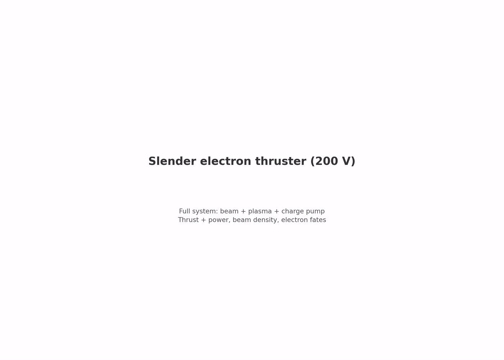
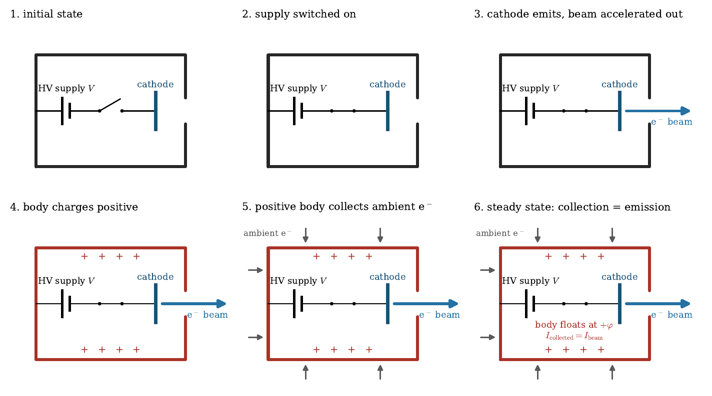
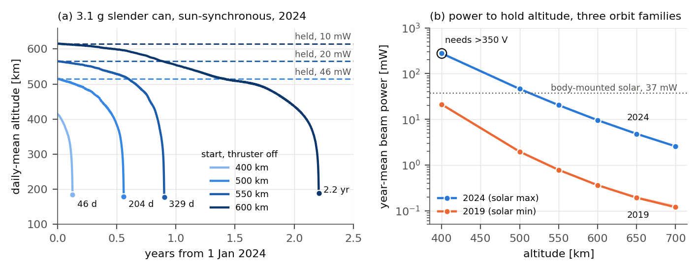
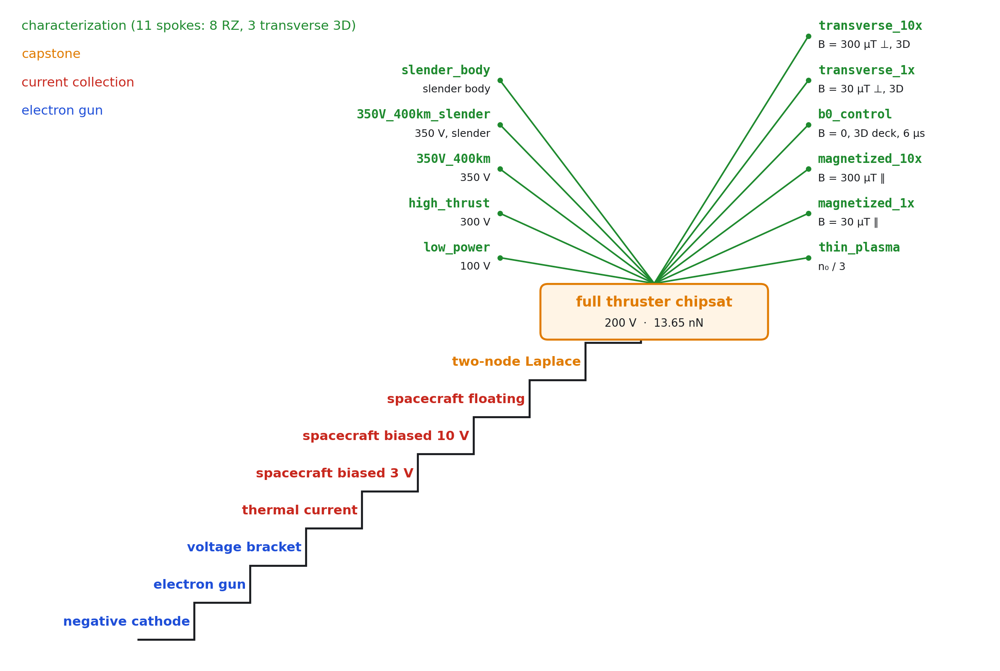

# Electron thruster

[](https://doi.org/10.5281/zenodo.22115923)

The idea is an electron thruster for LEO station keeping on small spacecraft.
It emits electrons from a cathode and lets the ionosphere return the current to the spacecraft body.

I validated the concept with full PIC simulations (WarpX) across a 9 stage ladder and 10 characterizations.
The simulations demonstrate feasibility for chip-scale spacecraft: a 3 g body that re-enters within weeks to a year without propulsion holds 500–700 km with this thruster on 2.5–48 mW near solar maximum and 0.1–2 mW near solar minimum, producing nanonewtons of thrust and refueling from the ionosphere.

The power tradeoff is ~200× worse than an ion thruster because electrons are much lighter, but at nanonewton scale the difference is 1 mW for an ion thruster vs 10–100 mW for this electron thruster.
The device is simple and cheap: a cathode, an aperture, and a high-voltage supply. It would enable station keeping for chip-scale spacecraft, where no other thruster fits, and it scales to cubesats at about a watt.



[Paper: 3-page concept paper](paper/main.tex) ([PDF](paper/main.pdf)). The long version, with the full ladder, characterization and CubeSat scaling, is in git history at commit `6af0807`; this README carries the same material.

## Motivation

Ion thrusters dominate electric propulsion, but they carry a tank, a feed system, a neutralizer, and a pressure vessel.
This hardware is expensive, takes up space, and is rarely justified on a cubesat.
This project emits electrons instead of ions and lets the ionosphere return the current.

The tradeoff is thrust per watt.
For any thruster, $F/P = 2\eta/v_e$: higher exhaust velocity means less thrust per watt.
Electrons are light, so $v_e$ is huge, and an electron beam carries ~200x less momentum per watt than a gridded ion thruster (~0.2 µN/W vs ~40 µN/W).
That gap follows from the equation, not from an engineering shortfall, and it disqualifies the concept at millinewton scale.

LEO drag at 400–700 km on a small spacecraft is nanonewtons, and at that scale the arithmetic changes: an electron beam needs 10–100 mW where an ion thruster would need ~1 mW. The power difference is negligible. What matters is that the electron version needs no tank, no neutralizer, no propellant, only two electrodes and an HV supply.

The goal is the lowest barrier to actually flying a thruster, for missions like drag compensation on small spacecraft, rather than the highest performance.

## How it works

### Components

1. A negative cathode. It emits and accelerates electrons out of the spacecraft.
   The escaping beam produces the thrust.
2. The spacecraft's own structure. It collects electrons back from the ionosphere.
   The skin is the second electrode.
3. An HV supply. It holds the cathode at a fixed voltage below the body, so collected electrons are re-emitted as the beam.

### Operation

1. The spacecraft floats in the ionospheric plasma.
2. The supply connects the body to the cathode; the cathode starts emitting.
3. The escaping beam charges the body positive.
4. The positive body attracts electrons from the ambient plasma.
5. Collection grows until it exactly balances emission.

The process settles into a steady state: the body floats at the potential φ where collected current equals emitted current.
That float is the operating point. There is no cycle, only a continuous equilibrium.



### How does the current return?

The escaping beam leaves the spacecraft positively charged.
That positive potential attracts electrons from the ambient ionospheric plasma onto the spacecraft's outer surface.
Collection grows until it exactly balances the emitted beam current, at which point the body floats at a steady potential φ.

No wire, no neutralizer, no propellant exchange: the ionosphere closes the circuit.
The only cost is the float potential φ, which takes a fraction of the supply voltage from the beam (the "float tax" $\varphi/V$).

### Why doesn't the beam come back?

The body charges positive, so why does it not recapture its own beam?
Energy asymmetry: the beam electrons carry 100–350 eV of kinetic energy, while the float potential is only 5–48 V.
They are too fast to recapture.
The ambient ionospheric electrons are thermal (~0.1 eV), so the same float potential easily collects them.

This asymmetry makes the circuit work: slow electrons get captured, fast electrons escape.
The [capstone simulation](pic_sims/ladder/capstone/2_chipsat_thruster) measures this directly: 98.4 % of beam electrons escape at the 200 V anchor ($\varphi$ = 17 V), and across the full [characterization campaign](pic_sims/characterization) the escape fraction $f_{\mathrm{esc}}$ stays at 96–99 %.

### Does the returning current cancel the thrust?

The collected electrons do land on the spacecraft and deposit momentum, so the question is quantitative, and the simulations measure it.
The per-step ledger separates the beam's reaction thrust $F_{\mathrm{beam}}$ from the net momentum deposited by everything landing on the craft ($F_{\mathrm{net}}$). At the 300 V point the measured ratio is 1 % ($|F_{\mathrm{net}}|/F_{\mathrm{beam}}$ = 0.0098), and the bound is gated in every committed run.
There is also a physics ceiling. At current balance the arriving electrons carry only ~$e\varphi$ of energy against the beam's exhaust energy, so even if every collected electron arrived directly astern the cancellation could not exceed $\sqrt{\varphi/\mathrm{KE}} \approx 40\,\%$. Isotropic arrival, the objection's own premise, brings it down to the measured percent level.

## Theory

The concept is a plain electrostatic accelerator.

Thrust: momentum flux of the escaping beam:
$$
F = \frac{I \sqrt{2 m_e \, \mathrm{KE}}}{e}
$$

Energy each electron actually leaves with:

$$
\mathrm{KE} = \kappa \, (V - \varphi)
$$

Jet power / electrical power:

$$
\eta = \kappa \, \frac{V - \varphi}{V} \cdot f_{\mathrm{esc}}
$$

Where:

| symbol | what it is | controlled by |
|---|---|---|
| $\kappa$ | exhaust energy over the drop, $\mathrm{KE}/e(V-\varphi)$ | where the simulated beam is launched (below); a real cathode gives $\kappa \approx 1$ |
| $\varphi$ | float potential | collecting area, body shape, plasma density |
| $\varphi/V$ | the float tax | fraction of supply voltage lost to current return |
| $f_{\mathrm{esc}}$ | beam fraction that clears the body | exit-aperture geometry |

### Control

1. The device measures its own thrust. $I$ and $\varphi$ are plain electrical measurements any microcontroller can take in flight.
   No thrust stand needed.
2. The control law is a two-line servo on the measured float. No ionosphere model, no lookup table.
   Density, temperature, day/night all collapse into where the body floats (`future_work/README.md`, the adaptive controller).

An STM32 is enough to control this thruster.

## Measured numbers

The simulations put numbers to the symbols for one design family: Ø10 mm body, gun at $I/I_{\mathrm{CL}} = 1.46$, one dayside plasma row.
Two constants describe every run across 100–350 V to ~1 %:

$$
F\,[\mathrm{nN}] = 3.2675 \cdot I\,[\mathrm{mA}] \cdot \sqrt{\mathrm{KE}\,[\mathrm{eV}]}
$$

$$
\mathrm{KE} = 0.8063 \, (V - \varphi)
$$

| run | $\varphi$ | $f_{\mathrm{esc}}$ | $\eta$ | $v_e$ (m/s) |
|---|---|---|---|---|
| 200 V anchor | 17.0 V | 98.4 % | **0.73** | $7.2 \times 10^6$ |
| slender ($L/r = 6$), 350 V | 14.0 V | 99.1 % | **0.77** | $9.8 \times 10^6$ |
| squat, 100–350 V | 5.4–48.3 V | 96–99 % | 0.68–0.74 | $5.2$–$9.2 \times 10^6$ |

Divergence factor: 0.97 (measured thrust slope vs ideal).

### Reading these numbers

These numbers characterize the simulated design, not the concept.
Each traces to a design parameter (see the theory table above); moving the parameter moves the number.

For example, $\kappa = 0.81$ is not gun physics but where the simulated beam is born. It is launched 2 cells (0.3 mm) above the cathode, where a vacuum field solve puts the potential 19 % of V above the cathode, so every electron misses that part of the drop. In every run at this loading the missing energy is 17–18 % of V, whatever the float, plasma density or field; the beam's own space charge lowers it slightly, and at 3–10× the loading (the U-curve runs) it shrinks to 12 %, the opposite of a space-charge depression. A real cathode emits at cathode potential and would give $\mathrm{KE} \approx e(V-\varphi)$: about 11 % more thrust at the same current and $\eta \approx 0.90$ instead of 0.73. The committed numbers keep the measured 0.81 and are conservative by that margin; a PIC confirmation is planned ([`future_work/CATHODE_LAUNCH_PLAN.md`](future_work/CATHODE_LAUNCH_PLAN.md)).
Similarly, the slender body already shows $\varphi$ dropping from 17 V to 4.4 V by changing geometry alone.

Outside the measured envelope (other gun loadings, geometries, plasmas), new runs are needed; `model/README.md` is the only sanctioned extrapolation and labels its outputs estimates.

The cathode is excluded: beam current is prescribed.
Flight thruster efficiencies include their full beam-production cost; this $\eta$ does not.

## Does it cancel drag?

Yes, from 500 km up, and the smaller the spacecraft the more it matters.
Without the thruster, a 3 g chip-scale body re-enters from 400 km in about 6 weeks and from 550 km within a year near solar maximum.
With it, the same body holds 500–700 km all year on 2.5–48 mW near solar maximum and 0.1–2 mW near solar minimum, and never drops more than 10 m below its target altitude.

Mission body and orbits:

- test body: the slender can of the PIC shape runs, Ø10 mm × 30 mm, 3.1 g (3U density), Cd = 2.2, flown axial: the thrust axis points along the velocity, which for a body this long is also the low-drag pose
- drag area: the ram cap plus free-molecular friction on the side wall (+37 %)
- orbits: circular at 400–700 km, near-equatorial (0.5°), ISS (51.6°) and sun-synchronous (10:30 node)
- solar activity: a year near solar maximum (2024) and a year near minimum (2019), NRLMSISE-00 with real F10.7/Ap, IRI-2020 plasma along the orbit
- two modes: station keeping (drag cancelled, so drag = thrust demand) and free fall (thruster off, until re-entry at 120 km or 5 years)



### Without the thruster

Ranges span the three orbit families. The 3U column is the same shape scaled ×10 (Ø10 cm × 30 cm, 4 kg).

| altitude | drag mean, 2024 | drag mean, 2019 | free fall 3 g, 2024 | free fall 3 g, 2019 | free fall 3U, 2024 |
|---|---|---|---|---|---|
| 400 km | 38–42 nN | 3.8–4.8 nN | **41–46 days** | 171–241 days | 1.0–1.1 yr |
| 500 km | 8.6–9.8 nN | 0.49–0.59 nN | **179–204 days** | 3.3–3.5 yr | > 5 yr |
| 550 km | 4.3–5.0 nN | 0.21–0.24 nN | **300–329 days** | 4.3–4.5 yr | > 5 yr |
| 600 km | 2.3–2.6 nN | 0.10–0.11 nN | 1.8–2.2 yr | > 5 yr | > 5 yr |
| 650 km | 1.2–1.4 nN | 0.05–0.06 nN | > 5 yr | > 5 yr | > 5 yr |
| 700 km | 0.66–0.77 nN | 0.03–0.04 nN | > 5 yr | > 5 yr | > 5 yr |

Solar activity moves drag 15–25×; inclination moves it about 10 % (inclined circular orbits fly 10–15 km higher on average over the oblate Earth).

### With the thruster: voltage-following mode

In flight the voltage can follow the drag. For every 5-minute point along the orbit, the model (`model/README.md` §3 and §4) picks the supply voltage that cancels that point's drag for the least beam power, with the floating potential solved from the plasma the orbit sees at that moment.
The max dip replays the same year with thrust capped at what the thruster delivers at 350 V (`model/altitude_hold.py`): whenever the craft falls behind it fires at full capability to climb back.

| altitude | mean power, 2024 | worst 5 min, 2024 | points above 350 V | float, median / 99th | max dip | mean power, 2019 |
|---|---|---|---|---|---|---|
| 400 km | 272–292 mW | 1.0–1.5 W | 44–47 % | 18–50 / 109–276 V | not held | 21 mW |
| 500 km | 46–48 mW | 235–316 mW | 0–2.5 % | 9–31 / 57–152 V | 9 m | 2.0 mW |
| 550 km | 20–21 mW | 120–169 mW | 0–1.1 % | 7–23 / 41–116 V | 4 m | 0.8 mW |
| 600 km | 9.6–9.9 mW | 61–96 mW | 0–0.4 % | 6–16 / 29–89 V | 2 m | 0.4 mW |
| 650 km | 4.8–5.0 mW | 33–53 mW | 0–0.2 % | 4–11 / 18–69 V | 1 m | 0.2 mW |
| 700 km | 2.5–2.7 mW | 18–30 mW | 0–0.1 % | 3–7 / 14–54 V | 1 m | 0.1 mW |

No voltage and no float value is a design limit in this model. The float costs drive voltage through KE = κ(V − φ), so a high float on a thin night-side or high-latitude plasma means more supply voltage and more power at that point, and every point of both years has an operating point. What 350 V marks is the end of the simulated envelope: above it the gun laws are extrapolated, and above a float of about 100 V no committed run has found an equilibrium. Neutral and plasma density fall together at night, so the demand drops where collection is weakest. Two parts of these numbers are extrapolations, flagged per row in the model output: the collection law below about 0.7× the simulated plasma density, which covers most night-side points (the one run off that density found the law conservative), and the calibration on 800 ns floats (limitation 1 below).

The slender body pays ~29 % more drag than the squat Ø10 × 5 mm can (its long side wall) but floats ~3× lower, because it has 3.5× the skin to collect from; the mission model uses its own collection prefactor, fitted to the two slender PIC runs. The squat can on the earlier equatorial 2024 orbit needs 8–39 mW at 500–600 km (`model/results/MISSION_SUMMARY.md`).

### Power demand

Power is the thruster's interface to the spacecraft: 2.5–48 mW at 500–700 km near solar maximum, 0.1–2 mW near minimum.
Where that power comes from is mission design, not part of the thruster, same as the cathode technology.
As a worked example, body-mounted cells on the slender can (30 % efficient, a third of the skin, 25 % illumination) supply about 37 mW orbit-averaged. Within that budget the orbit holds at 550–700 km near solar maximum (dips up to 1.2 km at 550 km) and at every altitude, 400 km included, near solar minimum; at 500 km near solar maximum the 46–48 mW demand exceeds it (`model/results/ALTITUDE_HOLD.md`).

### 400 km note

Near solar minimum 400 km is held for about 21 mW. Near solar maximum it is not held inside the simulated envelope: the drag peaks (119–128 nN) need 500–700 V by the gun laws, and even on average the capability at 350 V falls short (99–102 % duty).
At the PIC level the 350 V pair covers the mean demand of the earlier squat-can orbit:

1. The compact body delivered 40.48 nN at a 48.3 V float, a 14 % float tax on the 350 V drive (gated at 800 ns, still rising at run end).
2. The slender body delivered 43.33 nN at a 14.0 V float, a 4 % tax, with 34 V less of the drive spent on collection.

## Does it scale to cubesats?

The feasibility condition is scale-free: drag grows with the drag area, collection and body-mounted power grow with the skin area, and size cancels.
What remains is the shape, and a 3U flown end-on has the slender can's shape ratio.
Bigger bodies need proportionally more current and power:

| altitude | 3U power, 2024 (solar max) | 3U power, 2019 (solar min) | 3U margin vs body-mounted cells, 2024 |
|---|---|---|---|
| 500 km | ~4–5 W | ~0.2 W | 1.1× |
| 550 km | ~2 W | ~80 mW | 2.2× |
| 600 km | ~1 W | ~40 mW | 4.2× |
| 700 km | ~0.3 W | ~13 mW | - |

That is the watt class where electrospray and FEEP already fly, and above 500 km a 3U's free-fall lifetime already exceeds five years.
For a cubesat this is a propellantless option for altitude control; for a chip-scale body it decides whether the mission survives.
Mass never enters the thrust demand, only how fast a craft sinks while thrust falls short: at 500 km a 4 kg 3U sinks ~50 m/day with the thruster off, the 3 g can ~0.5 km/day.

These are estimates from an extrapolated collection law, not measurements, and the extrapolation crosses a regime boundary (limitation 3 below): a thin-sheath estimate puts the 3U float near 60 V at 500 km near solar maximum, which would drop that margin below one.
Details: `paper/SCALING_LAWS.md` §8c and `model/results/SCALE_ANALYSIS.md`.

## Simulations

Two simulation trees, one direction of flow:

- `orbit_sims/` computes what the mission demands (drag, plasma conditions).
- `pic_sims/` answers whether the device delivers it (full PIC, WarpX).



### PIC simulations: the ladder

The ladder builds from a vacuum electron gun up to the full floating thruster.
Each stage isolates one piece of physics and gates it against theory or a disclosed anchor.
All nine stages PASS.

Each stage links to its simulation directory:

| # | stage | validates | result |
|---|---|---|---|
| 1 | [`emitter.negative_cathode`](pic_sims/ladder/electron_gun/1_negative_cathode) | negative cathode emits and accelerates electrons toward a grounded body | 35 µV error on 100 V |
| 2 | [`emitter.holed_anode`](pic_sims/ladder/electron_gun/2_electron_gun) | aperture controls transmission | transmitted fraction 0.97, 0.90, 1.00 as predicted |
| 3 | [`emitter.voltage_bracket`](pic_sims/ladder/electron_gun/3_voltage_bracket) | transmission is voltage-independent | 0.006 pp spread over 200–300 V |
| 4 | [`collector.thermal`](pic_sims/ladder/current_collection/1_thermal) | PIC thermal current vs theory | within 1 % |
| 5 | [`collector.biased_3v`](pic_sims/ladder/current_collection/2_biased_3v) | OML collection at +3 V bias | 0.85 of ceiling (Laframboise) |
| 6 | [`collector.biased_10v`](pic_sims/ladder/current_collection/3_biased_10v) | larger sheath collects more current | 0.81 of ceiling, sheath 4.1 → 6.9 mm |
| 7 | [`collector.floating`](pic_sims/ladder/current_collection/4_floating) | unbiased body floats to theory | −0.251 V, inside two-model bracket |
| 8 | [`capstone.two_node_laplace`](pic_sims/ladder/capstone/1_two_node_laplace) | two potentials on one conductor | exact Laplace, 0.0 V violation |
| 9 | [`capstone.floating_body`](pic_sims/ladder/capstone/2_chipsat_thruster) | **full device** | φ = 17.0 V, $f_{\mathrm{esc}}$ = 98.4 %, **F = 13.65 nN** |

Full digest with every gate: [`pic_sims/ladder/LADDER_SUMMARY.md`](pic_sims/ladder/LADDER_SUMMARY.md).

### PIC simulations: characterization

Eight spokes off the 200 V anchor.
Each moves one physics axis and keeps everything else verbatim, except the last, which deliberately combines the two measured axes (voltage × geometry) to test that the laws compose.
All eight PASS their gates.

Each spoke links to its simulation directory:

| spoke | axis changed | $\varphi$ | $F$ | $f_{\mathrm{esc}}$ | KE (eV) | note |
|---|---|---|---|---|---|---|
| [`high_thrust`](pic_sims/characterization/high_thrust) | 300 V | 36.3 V | **30.13 nN** | 98.99 % | 210.1 | |
| [`low_power`](pic_sims/characterization/low_power) | 100 V | 5.4 V | 3.42 nN | 96.12 % | 77.2 | |
| [`350V_400km`](pic_sims/characterization/350V_400km) | 350 V | 48.3 V | **40.48 nN** | 99.11 % | 239.0 | 14 % float tax at 800 ns, still rising |
| [`350V_400km_slender`](pic_sims/characterization/350V_400km_slender) | 350 V + slender body | 14.0 V | **43.33 nN** | 99.14 % | 272.7 | voltage × geometry compose |
| [`slender_body`](pic_sims/characterization/slender_body) | L/r = 6 body | 4.4 V | 14.22 nN | 98.42 % | 159.7 | |
| [`thin_plasma`](pic_sims/characterization/thin_plasma) | density n₀/3 | 42.5 V | 12.39 nN | 99.13 % | 122.0 | settled at 2.4 µs; law conservative along density |
| [`magnetized_1x`](pic_sims/characterization/magnetized_1x) | axial B = 30 µT (1× LEO) | 17.2 V | 13.64 nN | 98.44 % | 147.3 | null: anchor unchanged |
| [`magnetized_10x`](pic_sims/characterization/magnetized_10x) | axial B = 300 µT | +33 V | −11 % | 98.32 % | 115.9 | collection tax from B field |

Details: [`pic_sims/characterization/README.md`](pic_sims/characterization/README.md).

### PIC simulations: the transverse field (3D)

The RZ decks can only hold an axial field, so the flight orientation, B
perpendicular to the beam, got its own Cartesian 3D deck: the same body
resolved at 1 mm cells in a ±60 mm box, the escaped beam prescribed at the
lid with the anchor's measured energy, and a thrust ledger that adds the
Lorentz force on every particle in flight (the exit flux alone under-reads
the emission reaction once the beam curls).

| run | B | settled $\varphi$ | $F$ | $f_{\mathrm{esc}}$ | outcome |
|---|---|---|---|---|---|
| control (3D, 6 µs) | 0 | 26.8 V | 13.91 nN | 99.8 % | closes on the anchor within 2 % |
| flight strength | 30 µT ⊥ | 29.4 V | 13.81 nN | 99.8 % | null: ΔF −0.8 %, Δφ +2.6 V |
| 10× flight | 300 µT ⊥ | no equilibrium | - | 98 % until abort | chokes through the 150 V ceiling |

Three results. The flight-orientation field leaves the operating point
alone: thrust and escape unchanged, a 2.6 V float tax, about 1 % of the
200 V drive. At 10× the return circuit cannot close and the device must fire
along the field, the mode the axial spokes validate. And the 6 µs runs
measure the settling the 800 ns campaign truncates: the float reaches
about half its settled value at 800 ns while thrust moves under 2 %.
Pre-registrations, gates and evidence:
[`pic_sims/characterization/magnetized_transverse/`](pic_sims/characterization/magnetized_transverse/).

### Numerical convergence (200 V anchor)

| axis | change | effect |
|---|---|---|
| particle count | ppc 16 → 32 | ≤ 0.05 % - **closed** |
| grid | dx 0.15 → 0.10 mm | F +4.0 %, KE +7.4 %, φ −1.8 % - **leading uncertainty, conservative in sign** |

### Orbit simulations

- TudatPy propagation with NRLMSISE-00 drag (real F10.7/Ap) and IRI-2020 plasma along the orbit.
- Station keeping: drag is cancelled exactly, so the per-row drag force is the thrust demand.
- Free fall: the same orbit with the thruster off, until re-entry or 5 years.
- Cases: the slender mission body at 400–700 km on three orbit families (near-equatorial, ISS, sun-synchronous), near solar maximum (2024) and minimum (2019), in both modes, plus a 3U-size body in free fall; the earlier squat-can cases (400 km axial and lateral, 500–600 km axial and lateral, 2024 equatorial).
- Deliverables: `station_keeping.csv` per case, every row carrying drag and `(n_e, Te, Ti)`; `free_fall.csv` per free-fall case.

This is a research repository with a working physics model, not a product.

## Limitations and open items

Ordered by how much they could change the answer.

1. Ion clock. Ions are 400 mₑ and every committed float is an 800 ns snapshot.
   The 3D field campaign settled its floats at 6 µs on that clock, at about twice the 800 ns reading, with thrust moving under 2 %.
   Real O⁺ settles roughly 9× slower; no run has reached that.
2. Only one plasma density measured. Every committed run uses the same dayside row; the density axis of the collection law is theory-only.
3. cubesat collection is a regime change. Committed runs sit at r/λ_D ≈ 2.5 (orbit-motion-limited); a cubesat is tens of Debye lengths across, where OML does not apply.
4. No attitude control in this repository, yet the mission cases assume a held pose.

## Repository map

| document | what it is |
|---|---|
| `paper/SCALING_LAWS.md` | the physics laws, measured constants, scaling to larger vehicles |
| `model/README.md` | the executable model, per-row operating point, mission table |
| `paper/NANONEWTON_THRUSTER_REVIEW.md` | the flight-proven sub-µN propulsion options, verified against primary sources |
| `future_work/README.md` | scope decision, deferred optimization work, open items |
| `pic_sims/ladder/LADDER_SUMMARY.md` | stage-by-stage verdicts |
| `lab_experiments/electron_gun/` | the bench experiment, with caveats |
| `SETUP.md` | reproducing everything |

## Author

Ricardo Sebastian Casimiro - [ORCID 0009-0008-5188-1326](https://orcid.org/0009-0008-5188-1326)

## License

[MIT](LICENSE)

## Citing

If you use this work, please cite:

```bibtex
@software{casimiro2026electron,
  author    = {Casimiro, Ricardo Sebastian},
  title     = {Electron thruster for LEO drag compensation},
  year      = {2026},
  doi       = {10.5281/zenodo.22115923},
  url       = {https://github.com/stm32f303ret6/electron_thruster},
}
```

## Acknowledgements

The PIC evidence was produced with [WarpX](https://blast-warpx.github.io) 26.05 (J.-L. Vay et al., *WarpX: An advanced Particle-In-Cell code*, [DOI:10.5281/zenodo.4571577](https://doi.org/10.5281/zenodo.4571577)), built on [AMReX](https://amrex-codes.github.io) (Zhang et al., JOSS 4(37), 1370, 2019).
Orbit propagation used [TudatPy](https://docs.tudat.space).

This research used the open-source particle-in-cell code WarpX. Primary WarpX contributors are with LBNL, LLNL, CEA-LIDYL, SLAC, DESY, CERN, Helion Energy, TAE Technologies, and Realta Fusion. We acknowledge all WarpX contributors.

## How to run

| tree | conda env |
|---|---|
| `orbit_sims/` | `tudat-sk` |
| `pic_sims/` | `warpx-cpu-mpich-dev` |

```bash
# orbit demand
conda activate tudat-sk
cd orbit_sims && python3 run_station_keeping.py 600km_station_keeping_chipsat

# PIC evidence
conda activate warpx-cpu-mpich-dev
cd pic_sims/ladder && python run_ladder.py --check
```

Tests in the warpx env need `PYTHONNOUSERSITE=1`.
