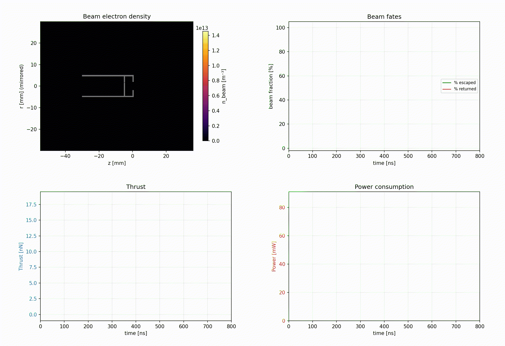
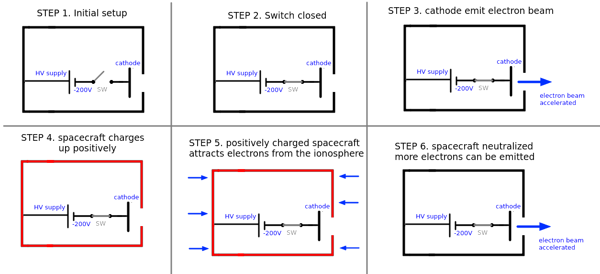
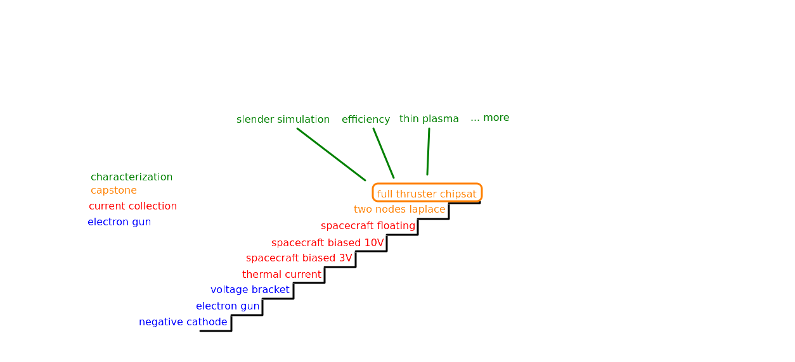

# Electron Thruster

An electron thruster for LEO drag compensation, with the ionosphere as the return circuit, validated with full PIC simulations and orbit-drag models.

The thruster accelerates electrons out of the spacecraft, the escaping beam produces the thrust.
The ionosphere returns the same current to the spacecraft surface, so the circuit closes with zero net mass flow, no tank, no feed system, no neutralizer.

This allows small spacecraft to carry cheap, simple propulsion enough to cancel drag, allowing missions like station-keeping (theoretically indefinite because there is no on-board propellant).



## Motivation

Ion thrusters dominate electric propulsion, but they carry a tank, a feed system, a neutralizer, and a pressure vessel.
This hardware is expensive, takes up space, and is rarely justified on a cubesat.
This project asks: what if you emit electrons instead of ions, and let the ionosphere return the current?

The tradeoff is thrust per watt.
For any thruster, $F/P = 2\eta/v_e$: higher exhaust velocity means less thrust per watt.
Electrons are light, so $v_e$ is huge, and an electron beam carries ~200x less momentum per watt than a gridded ion thruster (~0.2 µN/W vs ~40 µN/W).
That gap is not an engineering shortfall, it is this equation, and it is disqualifying at millinewton scale.

But LEO drag at 400–600 km on a small spacecraft is nanonewtons, and at that scale the arithmetic changes: an electron beam needs 10–100 mW where an ion thruster would need ~1 mW.
The power difference is negligible, what matters is that the electron version needs no tank, no neutralizer, no propellant.
Just two electrodes and an HV supply.

The goal is not the highest performance.
It is the **lowest barrier to actually flying a thruster**, enabling missions like drag compensation for small spacecraft.

## How it works

### Components

1. **A negative cathode**: emits and accelerates electrons out of the spacecraft.
   The escaping beam produces the thrust.
2. **The spacecraft's own structure**: collects electrons back from the ionosphere.
   The skin is the second electrode.
3. **An HV supply**: holds the cathode at a fixed voltage below the body, so collected electrons are re-emitted as the beam.

### Operation

1. The spacecraft floats in the ionospheric plasma.
2. The supply connects the body to the cathode; the cathode starts emitting.
3. The escaping beam charges the body positive.
4. The positive body attracts electrons from the ambient plasma.
5. Collection grows until it exactly balances emission.

The process settles into a steady state: the body floats at the potential **φ** where collected current equals emitted current.
That float **is** the operating point, there is no cycle, just a continuous equilibrium.



### How does the current return?

The escaping beam leaves the spacecraft positively charged.
That positive potential attracts electrons from the ambient ionospheric plasma onto the spacecraft's outer surface.
Collection grows until it exactly balances the emitted beam current, at which point the body floats at a steady potential **φ**.

No wire, no neutralizer, no propellant exchange: the ionosphere closes the circuit.
The only cost is the float potential **φ**, which steals a fraction of the supply voltage from the beam (the "float tax" $\varphi/V$).

### Why doesn't the beam come back?

The body charges positive, so why doesn't it recapture its own beam?
Energy asymmetry: the beam electrons carry 100–350 eV of kinetic energy, while the float potential is only 5–48 V.
They are too fast to recapture.
The ambient ionospheric electrons, by contrast, are thermal (~0.1 eV), so the same float potential easily collects them.

This asymmetry is what makes the circuit work: slow electrons get captured, fast electrons escape.
The [capstone simulation](pic_sims/ladder/capstone/2_chipsat_thruster) measures this directly: 98.4 % of beam electrons escape at the 200 V anchor ($\varphi$ = 17 V), and across the full [characterization campaign](pic_sims/characterization) the escape fraction $f_{\mathrm{esc}}$ stays at 96–99 %.

## Theory

The concept is a plain electrostatic accelerator.

Thrust: momentum flux of the escaping beam:
$$
F = \frac{I \sqrt{2 m_e \, \mathrm{KE}}}{e}
$$

Energy each electron actually leaves with:

$$
\mathrm{KE} = \kappa \, (V - \varphi)
$$

Jet power / electrical power:

$$
\eta = \kappa \, \frac{V - \varphi}{V} \cdot f_{\mathrm{esc}}
$$

Where:

| symbol | what it is | controlled by |
|---|---|---|
| $\kappa$ | gun energy transmission | gun loading ($I/I_{\mathrm{CL}}$) |
| $\varphi$ | float potential | collecting area, body shape, plasma density |
| $\varphi/V$ | the float tax | fraction of supply voltage lost to current return |
| $f_{\mathrm{esc}}$ | beam fraction that clears the body | exit-aperture geometry |

### Control

- **The device measures its own thrust.** $I$ and $\varphi$ are plain electrical measurements any microcontroller can take in flight.
  No thrust stand needed.
- **The control law is trivial.** A two-line servo on the measured float, no ionosphere model, no lookup table.
  Density, temperature, day/night all collapse into where the body floats (`model/MODEL.md` §2).

An STM32 is enough to control this thruster.

## Measured numbers

The simulations put numbers to the symbols for **one design family**: Ø10 mm body, gun at $I/I_{\mathrm{CL}} = 1.46$, one dayside plasma row.
Two constants describe every run across 100–350 V to ~1 %:

$$
F\,[\mathrm{nN}] = 3.2675 \cdot I\,[\mathrm{mA}] \cdot \sqrt{\mathrm{KE}\,[\mathrm{eV}]}
$$

$$
\mathrm{KE} = 0.8063 \, (V - \varphi)
$$

| run | $\varphi$ | $f_{\mathrm{esc}}$ | $\eta$ | $v_e$ (m/s) |
|---|---|---|---|---|
| 200 V anchor | 17.0 V | 98.4 % | **0.73** | $5.4 \times 10^6$ |
| slender ($L/r = 6$), 350 V | 14.0 V | 99.1 % | **0.77** | $9.7 \times 10^6$ |
| squat, 100–350 V | 5.4–48.3 V | 96–99 % | 0.67–0.74 | $5.2$–$9.8 \times 10^6$ |

Divergence factor: 0.97 (measured thrust slope vs ideal).

### Reading these numbers

These numbers characterize the simulated design, not the concept.
Each traces to a design parameter (see the theory table above); moving the parameter moves the number.

For example, $\kappa = 0.81$ reflects the space-charge depression of a single-aperture gun at $I/I_{\mathrm{CL}} = 1.46$; distributed emission (grid, array) reduces that depression and pushes $\kappa$ toward 1.
Similarly, the slender body already shows $\varphi$ dropping from 17 V to 4.4 V by changing geometry alone.

Outside the measured envelope (other gun loadings, geometries, plasmas), new runs are needed; `model/MODEL.md` is the only sanctioned extrapolation and labels its outputs estimates.

The cathode is excluded: beam current is *prescribed*, no flight cathode is selected (open risk 2).
Flight thruster efficiencies include their full beam-production cost, this $\eta$ does not.

## Does it cancel drag?

At 500–600 km, the thruster covers mean and max drag inside the tested envelope (≤ 350 V), consuming 7–31 mW.
At 400 km, the mean demand is covered but year-round and peak demands remain open: 400 km is a research target.

Against real 2024 drag (NRLMSISE-00, real F10.7/Ap, solar-cycle-25 maximum) for the anchor body:

- **Test body**: a cylinder, Ø10 mm × 5 mm height, 100 g, Cd = 2.2, the same geometry the PIC simulations use.
- **axial**: drag hits the cap side of the cylinder.
- **lateral**: drag hits the skin side of the cylinder.

### Fixed-voltage coverage

Running the thruster at one fixed voltage all year:

| altitude | drag mean | drag max | 13.65 nN (200 V) covers | 30.13 nN (300 V) covers |
|---|---|---|---|---|
| 400 km axial | 32.9 nN | 92.4 nN | — | — |
| 400 km lateral | 21.7 nN | 60.7 nN | — | mean |
| 500 km axial | 7.6 nN | 28.4 nN | mean | **mean and max** |
| 550 km axial | 3.9 nN | 16.3 nN | mean (max barely missed) | **mean and max** |
| 600 km axial | 2.0 nN | 9.6 nN | **mean and max** | **mean and max** |

### Voltage-following mode

In flight the voltage can follow the drag: for every point along the orbit, the model (`model/MODEL.md` §4) finds the lowest voltage that cancels that point's drag and computes what it costs:

| altitude | minimum voltage | mean power | inside the tested envelope (≤ 350 V)? |
|---|---|---|---|
| 600 km | 100 V | 6.8 mW | yes |
| 550 km | 104 V | 13.4 mW | yes |
| 500 km | 146 V | 31.3 mW | yes |
| 400 km lateral | 247 V | 116 mW | yes, see 400 km note below |
| 400 km axial | 304 V | 196 mW | yes, inside the extended 350 V envelope |

### Power demand

**Power is the thruster's interface to the spacecraft**: tens of mW at 500–600 km, ~100–200 mW at 400 km.
Where that power comes from is mission design, not part of the thruster, same as the cathode technology.
For context, typical small-spacecraft power:

- this geometry (femtosat class): ~10–30 mW from body-mounted solar cells, depending on coverage
- 1U CubeSat: ~1–2 W
- 3U CubeSat: ~5–10 W with body-mounted panels, more with deployables

Demand and supply both grow with area, so the ratio stays workable at CubeSat size: a 3U needs ~0.9 W at 600 km against a typical 5–10 W budget.

### 400 km note

The axial-pose demand is now inside the measured envelope, at both tested geometries.

- The compact body delivered 40.48 nN against the 32.9 nN mean demand (~81 % duty), but floats *on* the 50 V charging limit (48.3 V gated, still rising at run end).
- The slender body, the shape a real mission vehicle takes anyway, delivered **43.33 nN at a 14.0 V float**: the same demand covered at ~76 % duty with 3.6× margin on the charging limit.

What stays open at 400 km:

- Year-round duty is still 113 % for the compact shape (the model re-run at the 350 V cap, thin night-side plasma caps benign collection, the constraint the slender skin relieves).
- Drag maxima (92.4 nN) sit above any single operating point.
- ~150–200 mW mean power is mission design.
- The lateral-pose thrust-axis question is untouched.

## Does it scale to CubeSats?

The feasibility condition is close to scale-free: drag grows with the ram area, collection grows with the skin area, and they cancel.
Bigger bodies just need proportionally more current and power.
`SCALING_LAWS.md` §8 estimates a 3U CubeSat at:

| altitude | power |
|---|---|
| 600 km | ~0.9 W |
| 550 km | ~1.7 W |
| 500 km | ~3.4 W |

These estimates use the anchor's measured efficiency; the design levers in "Reading these numbers" (better $\kappa$, lower $\varphi$) would reduce them.
They are also **estimates from an extrapolated collection law, not measurements**, the extrapolation crosses a regime boundary (risk 4 below).

## What is validated?

| | |
|---|---|
| Simulation | nine-stage WarpX PIC validation ladder + eight characterization spokes, every stage gated against a pre-registered, hash-frozen acceptance policy |
| Hardware | one bench experiment, rough vacuum (4–5 Pa), qualitative only |
| Flight cathode | not selected: beam current is *prescribed* in every simulation |
| Magnetic field | field-aligned axis measured (tier M1); transverse B, the actual flight geometry, untested |
| Flight heritage | none |

Two simulation trees, one direction of flow:

- `orbit_sims/` computes **what the mission demands** (drag, plasma conditions).
- `pic_sims/` answers **whether the device delivers it** (full PIC, WarpX).

Conditions flow one way only: orbit CSV row → frozen `config.yaml` → PIC verdict.
The evidence can never move when the demand changes.



### PIC simulations: the ladder

The ladder builds from a vacuum electron gun up to the full floating thruster.
Each stage isolates one piece of physics and gates it against theory or a disclosed anchor.
All nine stages **PASS**.

Each stage links to its simulation directory:

| # | stage | validates | result |
|---|---|---|---|
| 1 | [`emitter.negative_cathode`](pic_sims/ladder/electron_gun/1_negative_cathode) | negative cathode emits and accelerates electrons toward a grounded body | 35 µV error on 100 V |
| 2 | [`emitter.holed_anode`](pic_sims/ladder/electron_gun/2_electron_gun) | aperture controls transmission | κ = 0.97, 0.90, 1.00 as predicted |
| 3 | [`emitter.voltage_bracket`](pic_sims/ladder/electron_gun/3_voltage_bracket) | transmission is voltage-independent | 0.006 pp spread over 200–300 V |
| 4 | [`collector.thermal`](pic_sims/ladder/current_collection/1_thermal) | PIC thermal current vs theory | within 1 % |
| 5 | [`collector.biased_3v`](pic_sims/ladder/current_collection/2_biased_3v) | OML collection at +3 V bias | 0.85 of ceiling (Laframboise) |
| 6 | [`collector.biased_10v`](pic_sims/ladder/current_collection/3_biased_10v) | larger sheath collects more current | 0.81 of ceiling, sheath 4.1 → 6.9 mm |
| 7 | [`collector.floating`](pic_sims/ladder/current_collection/4_floating) | unbiased body floats to theory | −0.251 V, inside two-model bracket |
| 8 | [`capstone.two_node_laplace`](pic_sims/ladder/capstone/1_two_node_laplace) | two potentials on one conductor | exact Laplace, 0.0 V violation |
| 9 | [`capstone.floating_body`](pic_sims/ladder/capstone/2_chipsat_thruster) | **full device** | φ = 17.0 V, $f_{\mathrm{esc}}$ = 98.4 %, **F = 13.65 nN** |

Full digest with every gate: [`pic_sims/ladder/LADDER_SUMMARY.md`](pic_sims/ladder/LADDER_SUMMARY.md).

### PIC simulations: characterization

Eight spokes off the 200 V anchor.
Each moves **one** physics axis and keeps everything else verbatim, except the last, which deliberately combines the two measured axes (voltage × geometry) to test that the laws compose.
All eight **PASS** their gates.

Each spoke links to its simulation directory:

| spoke | axis changed | $\varphi$ | $F$ | note |
|---|---|---|---|---|
| [`high_thrust`](pic_sims/characterization/high_thrust) | 300 V | 36.3 V | **30.13 nN** | |
| [`350V_400km`](pic_sims/characterization/350V_400km) | 350 V | 48.3 V | **40.48 nN** | on the 50 V charging limit |
| [`350V_400km_slender`](pic_sims/characterization/350V_400km_slender) | 350 V + slender body | 14.0 V | **43.33 nN** | voltage × geometry compose |
| [`low_power`](pic_sims/characterization/low_power) | 100 V | 5.4 V | 3.42 nN | |
| [`slender_body`](pic_sims/characterization/slender_body) | L/r = 6 body | 4.4 V | 14.22 nN | |
| [`thin_plasma`](pic_sims/characterization/thin_plasma) | density n₀/3 | > 31.6 V | — | float unsettled at run end |
| [`magnetized_1x`](pic_sims/characterization/magnetized_1x) | axial B = 30 µT (1× LEO) | 17.0 V | 13.65 nN | null: anchor unchanged |
| [`magnetized_10x`](pic_sims/characterization/magnetized_10x) | axial B = 300 µT | +33 V | −11 % | collection tax from B field |

Details: [`pic_sims/characterization/README.md`](pic_sims/characterization/README.md).

### Orbit simulations

- TudatPy propagation with NRLMSISE-00 drag (real 2024 F10.7/Ap) and IRI-2020 plasma along the orbit.
- Drag is cancelled exactly, so the per-row drag force **is** the thrust demand.
- Cases: 400 (axial + lateral), 500, 550, 600 km.
- Deliverable: `station_keeping.csv` per case, every row carries pose, drag, and `(n_e, Te, Ti)`.

This is a research repository with a working physics model, not a product.

## Open risks

Ordered by how much they could change the answer.

1. **Transverse magnetic field never simulated.** In LEO the geomagnetic field is roughly perpendicular to the thrust axis.
   The beam gyroradius (~1.4 m) is ~50× larger than the simulation domain (30 mm), so the committed runs cannot see where the exhaust momentum ends up once the beam gyrates.
   This could move the thrust in either direction.
   See `future_work/M2_TRANSVERSE_B.md`.
2. **No flight cathode chosen.** The bench emitter is a thermionic filament, and its heater alone uses ~10× more power than the entire thruster.
   Only a cold cathode (field emission) closes the power budget; its cost, lifetime, and atomic-oxygen tolerance are unaddressed.
3. **Only one plasma density measured.** Every committed run uses the same dayside row; the density axis of the collection law is theory-only.
4. **CubeSat collection is a regime change.** Committed runs sit at r/λ_D ≈ 2.5 (orbit-motion-limited); a CubeSat is tens of Debye lengths across, where OML does not apply.
5. **No attitude control in this repository**, yet the mission cases assume a held pose.

## Repository map

| document | what it is |
|---|---|
| `CAMPAIGN.md` | the 2026-08 campaign: what was measured, hypotheses and outcomes |
| `SCALING_LAWS.md` | the physics laws, measured constants, scaling to larger vehicles |
| `model/MODEL.md` | the executable model, control law, honest mission table |
| `THESIS.md` | the claim stated for a physics reviewer |
| `OPTIMISTIC_HYPOTHESES.md` | the upside cases, pre-registered and falsifiable |
| `pic_sims/ladder/LADDER_SUMMARY.md` | stage-by-stage verdicts |
| `lab_experiments/electron_gun/` | the bench experiment, with caveats |
| `SETUP.md` | reproducing everything |

## How to run

| tree | conda env |
|---|---|
| `orbit_sims/` | `tudat-sk` |
| `pic_sims/` | `warpx-cpu-mpich-dev` |

```bash
# orbit demand
conda activate tudat-sk
cd orbit_sims && python3 run_station_keeping.py 600km_station_keeping_chipsat

# PIC evidence
conda activate warpx-cpu-mpich-dev
cd pic_sims/ladder && python run_ladder.py --check
```

Note: tests in the warpx env need `PYTHONNOUSERSITE=1`.
