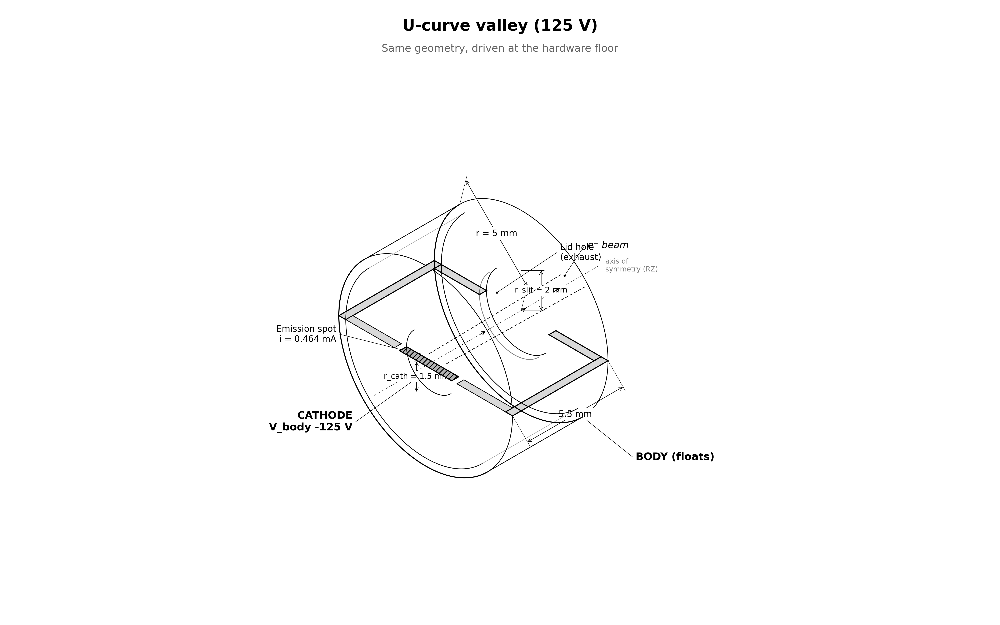

# capstone.ucurve_valley: fixed-thrust at 125 V

The candidate valley of the specific-power U-curve. Same system as
`floating_body` driven at 125 V with current commanded for the 200 V anchor's
measured thrust (13.65 nN).

## Setup



| | floating_body | this stage |
|---|---|---|
| `cathode_offset` | −200 V | **−125 V** |
| `i_beam` | 0.342 mA | **0.464 mA** |
| everything else | — | identical (CFL dt ~6.25 ps, ~128k steps) |

$I / I_{CL}(125\ \text{V}) = 4.0$ → 2.7× the validated emission ceiling.

### Hypotheses (pre-registered in `UCURVE_PLAN.md`)

| | H1 — calibrated laws | H2 — perveance tax |
|---|---|---|
| escape | ≥ 96% | degraded |
| φ_body | ~24.5 V | lower |
| delivered F | 13.65 nN | short |
| P/F | 4.25 mW/nN | above H1 |

## How the PIC works

Same engine as `floating_body`: deck, charge pump, reservoir, observer
identical. Only the drive point differs.

## What is gated

Escape, float and thrust are the measurement (reported, not required).
Required gates are the trust set only: current balance ≤ 5%, momentum
sanity, containment ≤ 1 V, scrape consistency ≤ 2% (×2).

## Commands

```bash
python simulation.py                    # ~5.5 h
python analyze.py --run outputs/<run-id> --policy acceptance.yaml
```

## Results (run `20260807T212500Z_3b73998e`, PASS, promoted)

| | measured | H1 said | H2 said |
|---|---|---|---|
| escape | **93.78%** | ≥ 96% | degraded ✓ |
| φ_body | **21.25 V** | 24.5 V | lower ✓ |
| delivered F | **13.09 nN** (−4.1%) | on demand | short ✓ |
| P/F at delivered F | **4.43 mW/nN** | 4.25 | above ✓ |

This is the measured valley of the curve: 4.79 (92.4 V) > 4.43 (here) <
5.01 (200 V). The onset of the tax is visible (escape below every frontier
point) but the demand is still met. See `../UCURVE_PLAN.md` amendment for the
campaign resolution.

## Limitations

- reduced ion mass (400 mₑ), electrostatic only, single grid/PPC/seed,
  finite-time equilibrium
- commanded current 2.7× outside validated envelope by design
