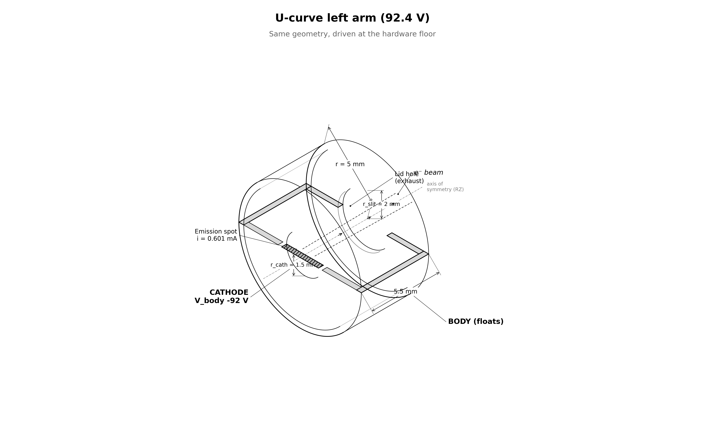

# capstone.ucurve_left_arm — fixed-thrust at 92.4 V

tests whether the U-curve has a left arm. same system as `floating_body` driven at **92.4 V** (*below the 100 V hardware floor on purpose*), with current commanded for 13.65 nN.

## setup



| | floating_body | this stage |
|---|---|---|
| `cathode_offset` | −200 V | **−92.4 V** |
| `i_beam` | 0.342 mA | **0.601 mA** |
| everything else | — | identical (CFL dt ~7.18 ps, ~111k steps) |

$I / I_{CL}(92.4\ \text{V}) = 8.2$ → 5.6× the validated emission ceiling.

### hypotheses (pre-registered in `UCURVE_PLAN.md`)

| | H1 — calibrated laws | H2 — perveance tax |
|---|---|---|
| escape | ≥ 96% | collapses |
| φ_body | ~32.5 V | low |
| delivered F | 13.65 nN | short, worse than 125 V |
| P/F vs 125 V | **below** (4.07 vs 4.25) | **above** — valley is right |

## how the pic works

same engine as `floating_body` — deck, charge pump, reservoir, observer identical. only the drive point differs.

## what is gated

same structure as `ucurve_valley`: trust set only (current balance ≤ 5%, momentum, containment ≤ 1 V, scrape consistency ≤ 2% ×2).

## commands

```bash
python simulation.py                    # ~4.8 h
python analyze.py --run outputs/<run-id> --policy acceptance.yaml
```

## results (run `20260808T023756Z_fc7f1ec6`, PASS, promoted)

| | measured | H1 said | H2 said |
|---|---|---|---|
| escape | **79.95%** | ≥ 96% | collapses ✓ |
| φ_body | 23.72 V | ~32.5 V | low ✓ |
| delivered F | **11.59 nN** (−15%) | on demand | short, worse than 125 V ✓ |
| P/F vs 125 V | **4.79 > 4.43 — above** | below | **above ✓ — H2 wins** |

the discriminator resolved: the left arm exists, the valley is right of here (~125 V), and the untaxed servo constant (2α+1)/α under-shoots V_opt (measured V/φ = 5.9 at the valley). F_net/F_beam rose to 0.30 — the self-scraped beam loading the body. see `../UCURVE_PLAN.md` amendment.

## limitations

- reduced ion mass (400 mₑ), electrostatic only, single grid/PPC/seed, finite-time equilibrium
- commanded current 5.6× outside validated envelope **by design**
