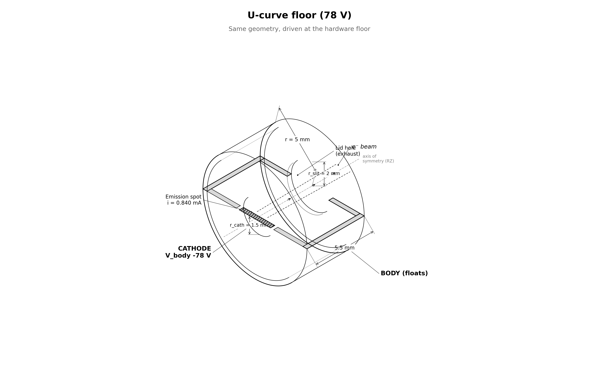

# capstone.ucurve_floor — no-go boundary at 78 V

maps the no-go wall of the fixed-thrust throttle curve — a **boundary demonstration**, not an operating point. same system as `floating_body` driven at **78 V** with current commanded for 13.65 nN.

## setup



| | floating_body | this stage |
|---|---|---|
| `cathode_offset` | −200 V | **−78 V** |
| `i_beam` | 0.342 mA | **0.840 mA** |
| everything else | — | identical (CFL dt ~7.75 ps, ~103k steps) |

$I / I_{CL}(78\ \text{V}) = 14.7$ → 10.1× the validated emission ceiling.

### hypotheses (pre-registered in `UCURVE_PLAN.md`)

| | H1 — calibrated laws (implausible) | H2 — beam-optics failure |
|---|---|---|
| escape | ≥ 96% | collapses |
| φ_body | 47.3 V, brushing benign limit | ~0 V |
| delivered F | 13.65 nN | far short |
| steady state | converges | possibly none |

## how the pic works

same engine as `floating_body` — deck, charge pump, reservoir, observer identical. only the drive point differs.

## what is gated

H2 predicts no steady state, so **even current balance is reported**. required gates are accounting-trust only: momentum sanity, containment ≤ 1 V, scrape consistency ≤ 2% (×2). a PASS with collapsed escape/thrust *is the finding*.

## commands

```bash
python simulation.py                    # ~4.4 h
python analyze.py --run outputs/<run-id> --policy acceptance.yaml
```

## results (run `20260808T070147Z_ea2cf8d9`, PASS, promoted)

| | measured | H1 said | H2 said |
|---|---|---|---|
| steady state | **forms** (balance 0.035) | converges | possibly none — refuted |
| escape | **57.43%** | ≥ 96% | collapses ✓ |
| φ_body | 23.84 V | 47.3 V | ~0 V — neither |
| delivered F | **10.38 nN** (−24%) | on demand | far short ✓ |

the wall has a third shape: a steady equilibrium forms but is starved — meeting the demand would take more current at still lower escape, so **the demand has no operating point at 78 V** (H2's operative claim). F_net/F_beam = 0.89: the self-scraped beam loads the body almost as hard as the exhaust pushes it. P/F = 6.31 mW/nN at what little is delivered. this is the no-go wall the 100 V hardware floor exists to avoid. see `../UCURVE_PLAN.md` amendment.

## limitations

- reduced ion mass (400 mₑ), electrostatic only, single grid/PPC/seed, finite-time equilibrium
- commanded current 10× outside validated envelope **by design**
