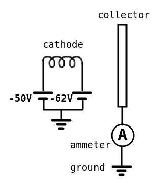
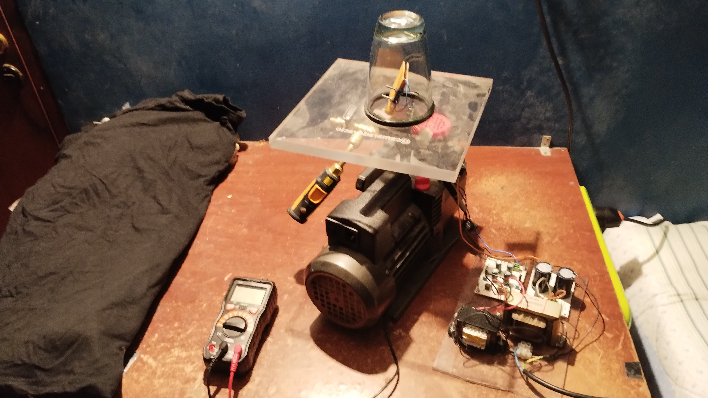
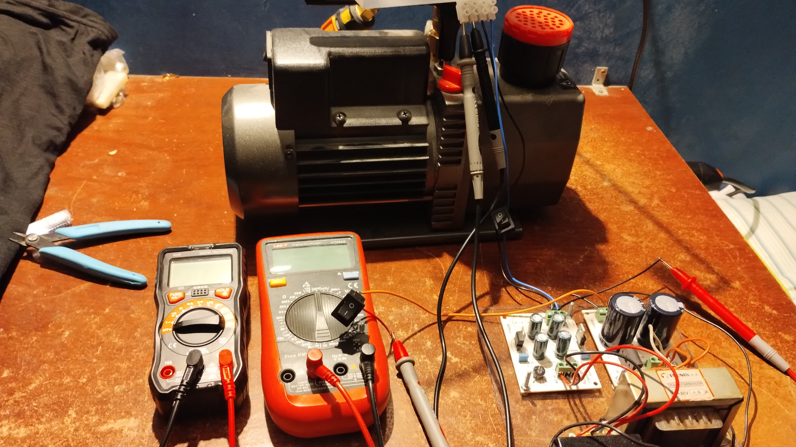
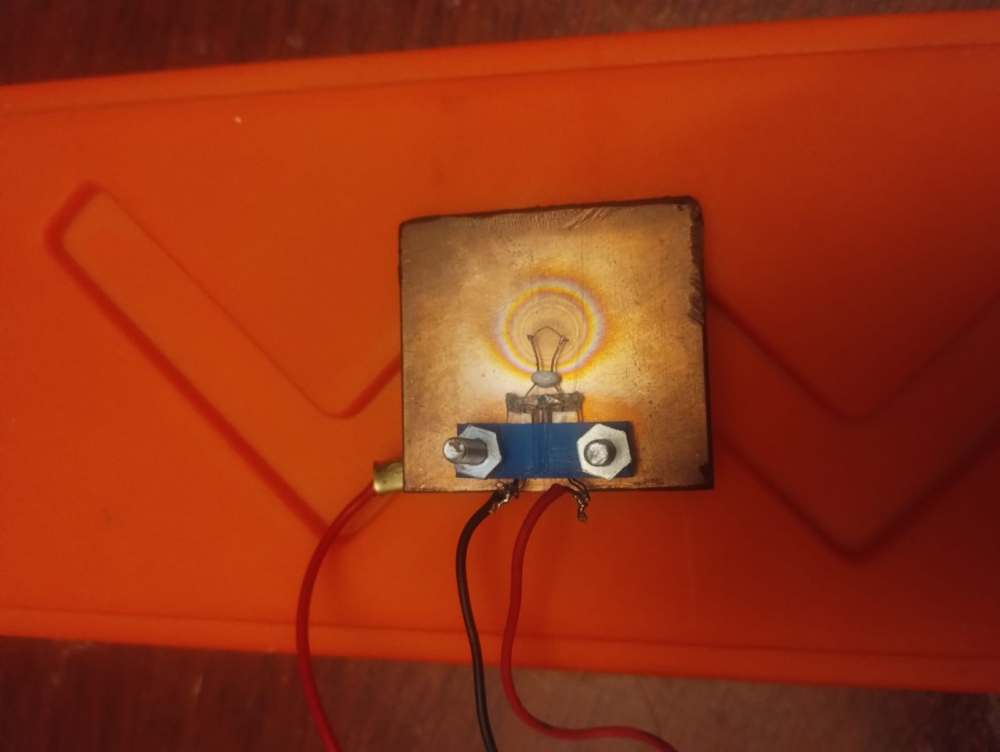
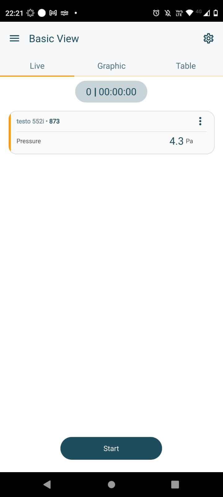
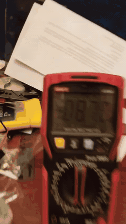

# Electron gun lab experiment — a negative cathode as emitter *and* accelerator

A benchtop hardware demonstration of the electrode topology this whole project
rests on: a cathode held at a **net negative potential** both emits electrons
and accelerates them away by electrostatic repulsion, toward a grounded
collector. It is the hardware counterpart of ladder step 1,
[`emitter.negative_cathode`](../../pic_sims/ladder/LADDER_SUMMARY.md)
(−100 V plane cathode, grounded collector, vacuum gap), run at −56 V in rough
vacuum on a table.

**Result: with the chamber at ≈ 4–5 Pa and the cathode biased at ≈ −56 V, the
grounded collector draws a steady ≈ 87 mA.** No current path exists except
electrons crossing the gap, so a non-zero ammeter reading means the cathode is
emitting *and* accelerating electrons onto the collector.

## Principle and circuit

- One filament terminal is held at **−50 V**, the other at **−62 V**, both
  referenced to mains earth.
- The **12 V difference** across the filament heats it, so it emits electrons
  thermionically [1–3].
- The filament's potential relative to earth spans −50 to −62 V (≈ **−56 V**
  at the midpoint). This net negative bias is what pushes the emitted
  electrons away from the cathode: they accelerate toward the least-negative
  surface in the chamber — the **collector plate at 0 V**.
- Collected electrons return to earth through the **ammeter**, so the meter
  reads exactly the current that made it across the gap. The collector stays
  at 0 V because it is earthed.

Supply wiring — two transformer (linear) supplies with isolated, floating
commons, one giving −50 V and one giving −12 V:

1. Tie the −50 V output to the common of the −12 V supply.
2. Tie the common of the −50 V supply to mains earth — the same earth the
   collector's ammeter returns to.
3. The filament terminals now sit at −50 V and −62 V with respect to earth.

## Apparatus

| part | implementation |
|---|---|
| cathode | filament of a W5W automotive bulb (12 V, 5 W [8]), glass envelope removed to expose the filament to vacuum |
| collector | copper plate, 4 × 4 cm, 5 mm thick |
| cathode–collector mount | 3D-printed holder; the bulb base press-fits in, two bolts fasten it to the plate (STL: [`assets/w5w_holder.stl`](assets/w5w_holder.stl)) |
| vacuum pump | two-stage rotary-vane pump (HVAC-service type, rated 50 micron ≈ 6.7 Pa) [7] |
| vacuum chamber | thick-walled glass tumbler, inverted on an acrylic base plate (3 cm thick) with a rubber gasket |
| plumbing | pump connected directly to the base plate through a brass tee — no hoses, to minimise leak paths; a second tee carries a vent valve and the vacuum gauge |
| vacuum gauge | Testo 552i digital vacuum probe (Bluetooth, read on the Testo Smart app) |
| feedthroughs | four 1 mm wire electrodes passed through the acrylic base into the chamber |
| ammeter | UNI-T UT89X multimeter on the mA range, in series between collector and earth |
| supplies | two isolated transformer supplies (−50 V and −12 V), separate floating commons |

Thermionic emission is a *bench convenience*, not the flight concept: it is
simply the cheapest, easiest way to free electrons from a metal at home. The
thruster itself does not rely on a heated emitter — what this experiment is
designed to isolate is the **acceleration-by-repulsion** role of the negative
cathode, which carries over directly.

## Procedure

1. Pump down. The chamber reaches its base pressure of **≈ 4–5 Pa** after
   about 10 minutes (the gauge screenshot below reads 4.3 Pa).
2. Switch on both supplies. The filament heats and begins emitting.
3. Watch the ammeter: the collector current rises to a steady **≈ 87 mA**
   (the meter shows −087.0 mA; the sign is just the probe orientation).

## Results — photos and video

Full bench: vacuum pump with the acrylic plate and glass chamber on top,
Testo gauge, supplies, and multimeter:

Cathode–collector assembly — the exposed W5W filament in its 3D-printed
holder, bolted to the copper collector plate (note the heat-tint rings on the
copper facing the filament):

Base pressure reached, read on the Testo Smart app:

Collector current — the ammeter settles at −087.0 mA once the filament is
hot ([full video, 32 s, MP4](assets/current_measurement.mp4)):

## What this shows — and what it doesn't

**Shows.** The core electrode topology works in hardware: a single net-negative
electrode is sufficient to emit electrons and accelerate them across a gap onto
a grounded collector, with the collected current returning through earth. This
is the same configuration validated numerically in step 1 of the
[PIC validation ladder](../../pic_sims/ladder/LADDER_SUMMARY.md), which
this experiment complements from the hardware side.

**Caveats.**

- **4–5 Pa is rough vacuum, not the high vacuum of the PIC decks.** The
  electron mean free path at this pressure is of order a millimetre, so the
  gap is collisional and part of the measured current is plausibly gas
  amplification (electron-impact ionisation of the residual gas) rather than
  pure thermionic beam current [6]. The 87 mA figure is therefore evidence
  that *acceleration is happening*, not a clean space-charge-limited diode
  measurement [4, 5].
- **Qualitative, not calibrated.** The experiment gates on "steady current
  present vs. absent", not on an I–V curve against theory.
- **Control runs still to do** (the highest-value next step):
  - filament heated but bias removed (filament floating at ~0 V) → expect
    ≈ 0 collector current — rules out leakage paths and shows the −56 V bias
    is what drives collection;
  - bias applied but filament cold → expect 0 — rules out field emission or
    breakdown as the source;
  - sweep the bias magnitude and record the I–V curve.

## Relation to the rest of the repository

This folder sits outside the `orbit_sims → pic_sims` data flow:
it reads nothing from and writes nothing into the other trees. It exists to
answer a different reviewer question — *"has the negative-cathode principle
ever been shown on real hardware, by this project?"* — with a cheap,
reproducible table-top yes.

## References

1. O. W. Richardson, "On the Negative Radiation from Hot Platinum," *Proc.
   Cambridge Philos. Soc.* **11**, 286–295 (1901).
2. S. Dushman, "Electron Emission from Metals as a Function of Temperature,"
   *Phys. Rev.* **21**, 623–636 (1923).
3. C. Herring and M. H. Nichols, "Thermionic Emission," *Rev. Mod. Phys.*
   **21**, 185–270 (1949).
4. C. D. Child, "Discharge from Hot CaO," *Phys. Rev. (Series I)* **32**,
   492–511 (1911).
5. I. Langmuir, "The Effect of Space Charge and Residual Gases on Thermionic
   Currents in High Vacuum," *Phys. Rev.* **2**, 450–486 (1913).
6. M. A. Lieberman and A. J. Lichtenberg, *Principles of Plasma Discharges
   and Materials Processing*, 2nd ed., Wiley (2005) — mean free path and
   electron-impact ionisation of low-pressure gases.
7. J. F. O'Hanlon, *A User's Guide to Vacuum Technology*, 3rd ed., Wiley
   (2003) — rotary-vane pumps and rough-vacuum practice.
8. UN ECE Regulation No. 37 — specification of the W5W filament lamp
   (12 V, 5 W).
