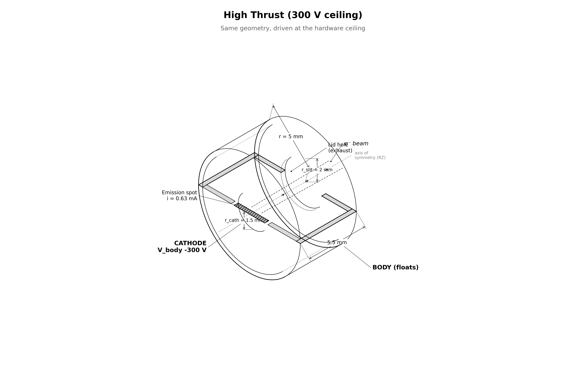

# capstone.high_thrust — 300 V (the tested ceiling until 2026-08-17; since extended by `../350V_400km/`)

same system as `floating_body` driven at **300 V** / 0.63 mA. asks: how much thrust at full drive, and does the body still float safely?

[](viz/20260804T154756Z_b854dcbe_dashboard.mp4)

*animated dashboard — click for the full video.*

## setup



| | floating_body | this stage |
|---|---|---|
| `cathode_offset` | −200 V | **−300 V** |
| `i_beam` | 0.342 mA | **0.63 mA** |
| `max_steps` | 160k | **200k** (CFL dt ~4.15 ps) |
| everything else | — | identical |

$$I / I_{CL} = 1.46 \;\Rightarrow\; i_\text{beam} = 0.63\ \text{mA}$$

the larger current needs ~2× ambient collection → float settles higher (~+30 V). choke watchdog (φ > 100 V sustained) fails the run if the ionosphere can't supply it.

## how the pic works

same engine as `floating_body` — deck, charge pump, reservoir, observer identical. only the drive point differs.

## results

reference run `20260804T154756Z_b854dcbe`, all gates PASS. no regression anchor — gates are theory-anchored invariants only.

| check | measured | target |
|---|---|---|
| escape | 99.0% | ≥ 95% |
| thrust | 30.13 nN | reported |
| φ_body | +36.3 V | ≤ 50 V |
| exhaust KE | 210.1 eV | reported |
| current balance | 3.5% | ≤ 5% |
| edge |φ| | 108 mV | ≤ 1 V |

mission-coverage (f_beam ≥ 28.4 nN for 500 km): PASS.

## commands

```bash
python simulation.py                    # ~8 h
python analyze.py --run outputs/<run-id> --policy acceptance.yaml
```

## limitations

- reduced ion mass (400 mₑ), electrostatic only, single grid/PPC/seed, finite-time equilibrium
