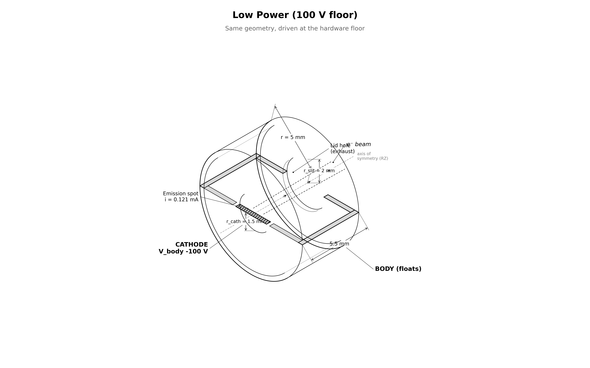

# capstone.low_power: 100 V floor

Same system as `floating_body`, driven at 100 V / 0.121 mA. Measures what
thrust costs at the power-optimal low-voltage point.

[](viz/20260804T230218Z_0adb478f_dashboard.mp4)

*Animated dashboard. Click for the full video.*

## Setup



| | floating_body | this stage |
|---|---|---|
| `cathode_offset` | −200 V | **−100 V** |
| `i_beam` | 0.342 mA | **0.121 mA** |
| everything else | — | identical (CFL dt ~6.93 ps, ~115k steps) |

$$I / I_{CL} = 1.46 \;\Rightarrow\; i_\text{beam} = 0.121\ \text{mA}$$

### Three-point P–F frontier

| stage | V | I | F (nN) | P (mW) | F/P (µN/W) |
|---|---|---|---|---|---|
| low_power | 100 | 0.121 mA | **3.42** | 12.1 | **0.283** |
| floating_body | 200 | 0.342 mA | **13.65** | 68.4 | **0.200** |
| high_thrust | 300 | 0.63 mA | **30.13** | 189 | **0.159** |

$F/P \propto 1/\sqrt{V}$ confirmed. Measured float 5.40 V, exhaust KE
77.19 eV.

## How the PIC works

Same engine as `floating_body`: deck, charge pump, reservoir, observer
identical. Only the drive point differs.

## Results

Reference run `20260804T230218Z_0adb478f`, all gates PASS. Same gate
structure as `high_thrust`.

| check | measured | target |
|---|---|---|
| escape | 96.1% | ≥ 95% |
| thrust | 3.42 nN | reported |
| φ_body | +5.40 V | ≤ 50 V |
| exhaust KE | 77.19 eV | reported |
| current balance | 1.5% | ≤ 5% |
| edge |φ| | 5.8 mV | ≤ 1 V |

## Commands

```bash
python simulation.py                    # ~5 h
python analyze.py --run outputs/<run-id> --policy acceptance.yaml
```

## Limitations

- reduced ion mass (400 mₑ), electrostatic only, single grid/PPC/seed, finite-time equilibrium
