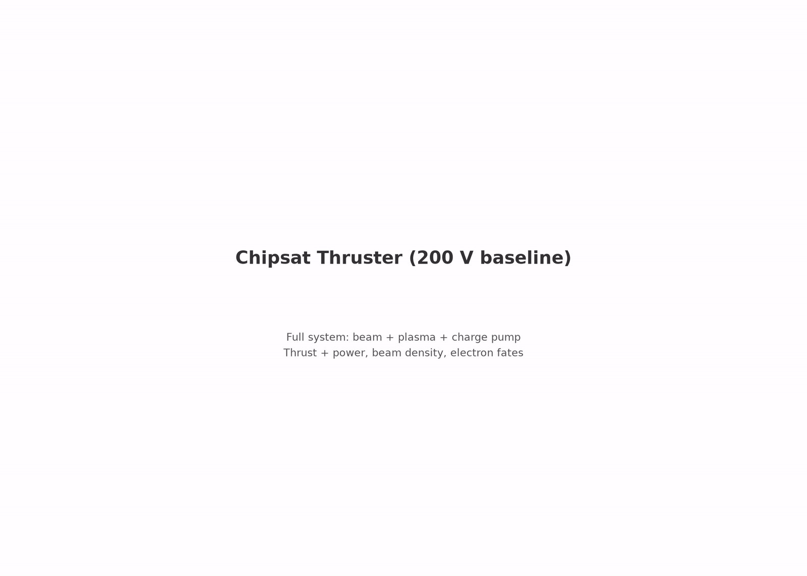

# characterization.magnetized_10x: field-aligned B at 10× LEO

Same system as the anchor with the axial field overdriven to 10× flight
strength, Bz = 300 µT. Tier M1b of the magnetized axis, pre-registered
2026-08-08 before the run (plan section below). The shared pre-run
`MAGNETIZED_PLAN.md` is preserved in git history; its never-run tier-M2
design moved to `../../../future_work/M2_TRANSVERSE_B.md`.

[](viz/20260810T131955Z_0b81e70a_dashboard.mp4)

*Reference-run dashboard (click through for the mp4).*

## Plan (pre-registered 2026-08-08, before the run)

The 1× companion (`../magnetized_1x/`, whose README carries the shared
near-field/far-field framing) tests the flight condition. This run is the
amplification instrument: at 10× the thermal-electron gyroradius is pushed
to sheath scale (2.7 mm ≈ 1.4 λ_De), so if cross-field transport ever bites
collection, it bites here first.

H-M1-tax (the alternative to the null): at 10×, cross-field electron
transport stiffens collection once r_g,e ~ λ_De. φ rises by > 2 V at fixed
emission (the collection law's effective βA falls), and KE = κ(V − φ) and
thrust fall correspondingly. Direction pre-registered, magnitude not.

## Setup

| | anchor (floating_body) | this spoke |
|---|---|---|
| `plasma.Bz_T` | absent (unmagnetized) | **3.0e-4** |
| everything else | — | identical |

At 300 µT the ambient thermal electrons are strongly magnetized (gyroradius
≲ the can radius). Cross-field collection onto the skin is throttled while
the stiff 200 V beam barely notices.

## How the PIC works

Same engine as the anchor: deck, charge pump, reservoir, observer identical
(`../../ladder/capstone/2_chipsat_thruster/README.md`). The Boris pusher
rotates in the prescribed uniform Bz; nothing else changes.

## Results

Reference run `20260810T131955Z_0b81e70a`, all 6 required gates PASS. Under
the exploratory policy φ and F are the measurement: reported, not gated.

| check | measured | target | type |
|---|---|---|---|
| escape fraction | 98.32% | ≥ 95% | required |
| current balance | 2.9% | ≤ 5% | required |
| net-force sanity | 0.003 | ≤ 1 | required |
| edge potential | 141 mV | ≤ 1 V | required |
| scrape ledger vs dumps | 7.0e-10 | ≤ 2% | required |
| beam-escape ledger vs dumps | 1.1e-9 | ≤ 2% | required |
| body float φ | **+48.63 V** (tail mean, **still climbing**; anchor: 16.98 V) | — | reported |
| beam thrust | **12.06 nN** (−11%; anchor: 13.65 nN) | — | reported |
| exhaust KE | **115.9 eV** (KE = κ(V − φ) predicts 116.5) | — | reported |

H-M1-tax confirmed in the pre-registered direction, entirely through the
float:

1. Beam formation is unharmed: escape 98.3%, Δ ≈ 0.1 pp, B-independent, as
   r_g,beam ≥ 0.10 m ≫ device scale requires.
2. The magnetized skin collects less effectively: φ rises +32.6 V over the
   anchor at fixed emission.
3. KE = κ(V − φ) falls 147 → 116 eV, and thrust follows, −11%.
4. The two-constant thrust law `F = 3.2675·I·√KE` reproduces both M1 runs
   (13.56 / 12.03 nN predicted vs 13.64 / 12.06 measured), so the entire
   tax enters through φ. c_F is untouched by Bz, and κ softens only
   slightly (0.806 → 0.766).

Disclosures that travel with the number:

- The float had not settled at 800 ns (14.4 V/µs at run end, final sample
  49.8 V), so the settled φ is strictly higher. +33 V is a lower bound on
  the settled tax, and 12.06 nN is an upper bound on settled 10× thrust.
- The `benign_float` trust gate passes at 48.63 ≤ 50 V only marginally; a
  continuation would cross the line. The 100 V choke ceiling was never
  approached.
- The informational `phi_vs_float200_reference` gate flags, as it must:
  the float moving off the anchor is the experiment.
- 10× is an amplification instrument, not a flight condition. The mission
  flies at 1×, where the null holds.

Full detail: `reference_results/20260810T131955Z_0b81e70a/REFERENCE.md`.


## Provenance

Executed 2026-08-10 as a variant deck through the anchor stage under the
pre-registered exploratory policy `capstone.exploratory_axes.v1` (strictly
sequential after M1a on one GPU, 12.8 h total), so the frozen run config and
manifests carry `stage_id: capstone.floating_body`.
`outputs/20260808T130307Z_0b81e70a` is an earlier launch of the same deck
with no gated result (superseded). This `config.yaml` is that same deck
(git-moved, history intact) under the new stage id. `acceptance.yaml`
re-identifies the same gates for future runs; it is not a pre-registration
for the migrated evidence. Launch console logs are local working files, not
committed; the run manifest under `reference_results/` carries the
provenance.

## Dependencies

Requires `capstone.floating_body` (the anchor). Spokes never depend on each
other.

## Cost

~6.4 GPU-h. 159k steps, dt ≈ 5.0 ps, 200 × 440 grid. CUDA build required
(`../../../SETUP.md`).

## Commands

```bash
python simulation.py
python analyze.py --run outputs/<run-id> --policy acceptance.yaml
```

## Limitations

- float unsettled at 800 ns; the +33 V tax is a lower bound, not a settled value
- overdriven field point: 10× is a mechanism probe, not a flight condition
- field-aligned geometry only; tier M2 transverse remains open
- anchor limitations inherited: single grid/PPC/seed, reduced ion mass 400 mₑ
