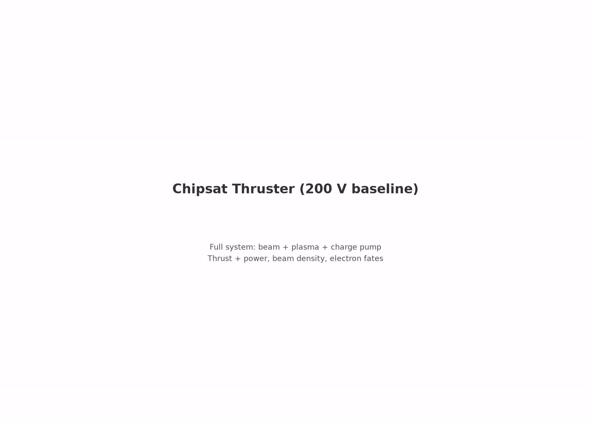
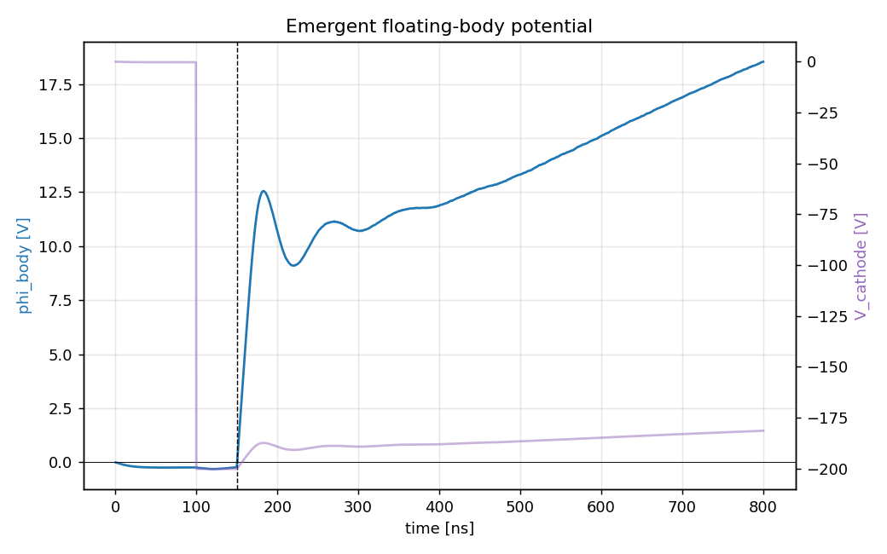

# characterization.magnetized_1x: field-aligned B at 1× LEO

Same system as the anchor with a uniform axial magnetic field at flight
strength, Bz = 30 µT. Tier M1a of the magnetized axis, pre-registered
2026-08-08 before the run (plan section below). The shared pre-run
`MAGNETIZED_PLAN.md` is preserved in git history; its never-run tier-M2
design moved to `../../../future_work/M2_TRANSVERSE_B.md`.

[](viz/20260810T064845Z_5e785001_dashboard.mp4)

*Reference-run dashboard (click through for the mp4).*

## Plan (pre-registered 2026-08-08, before the run)

Every committed run is electrostatic with B = 0, while the mission flies in
the LEO geomagnetic field. "What does B do" hides two separate physics
questions:

1. Near field: does the committed operating point (collection, float,
   escape, thrust production) survive magnetization? Answerable on the
   existing RZ deck.
2. Far field: where does the emitted momentum end up once the exhaust
   gyrates at r_g ≈ 1.4 m? Not answerable in RZ at 30 mm. That is tier M2,
   still open (`../../../future_work/M2_TRANSVERSE_B.md`).

The only external B compatible with the RZ deck is axial, which is exactly
the field-aligned-firing configuration, the fallback operating mode if the
far-field answer ever comes back unfavorable.

H-M1-null (expected): every anchor observable inside its exploratory trust
gates and close to the B = 0 anchor (|Δφ| ≤ 2 V, |ΔF|/F ≤ 5%,
Δescape ≤ 1 pp) at both field strengths. Grounds:

1. The beam is axially field-aligned and r_g ≥ 0.10 m ≫ every device scale,
   so beam optics and escape cannot be B-limited.
2. The Parker–Murphy ceiling (963 mm at 1×) sits far above the OML capture
   radius (61 mm), so magnetized collection is not flux-starved.
3. Ions stay unmagnetized at 1×.

What M1 cannot decide, stated up front: the far-field coupling. Even at 10×,
domain/r_g,beam ≈ 0.22; the exhaust leaves the box long before it gyrates.
A null here closes the near-field half and establishes the field-aligned
mode. It licenses no claim about transverse-B thrust.

## Setup

| | anchor (floating_body) | this spoke |
|---|---|---|
| `plasma.Bz_T` | absent (unmagnetized) | **3.0e-5** |
| everything else | — | identical |

The electron gyroradius at beam energy is ≫ the domain; at thermal energy
the ambient electrons begin to feel the field. The axial (flight,
field-aligned) orientation is deliberately the gentle one. The transverse
case is tier M2, still open.

## How the PIC works

Same engine as the anchor: deck, charge pump, reservoir, observer identical
(`../../ladder/capstone/2_chipsat_thruster/README.md`). The Boris pusher
rotates in the prescribed uniform Bz; nothing else changes.

## Results

Reference run `20260810T064845Z_5e785001`, all 6 required gates PASS. Under
the exploratory policy φ and F are the measurement: reported, not gated.

| check | measured | target | type |
|---|---|---|---|
| escape fraction | 98.44% | ≥ 95% | required |
| current balance | 3.2% | ≤ 5% | required |
| net-force sanity | 0.005 | ≤ 1 | required |
| edge potential | 40 mV | ≤ 1 V | required |
| scrape ledger vs dumps | 2.1e-9 | ≤ 2% | required |
| beam-escape ledger vs dumps | 1.6e-9 | ≤ 2% | required |
| body float φ | **+17.22 V** (anchor: 16.98 V) | — | reported |
| beam thrust | **13.64 nN** (anchor: 13.65 nN) | — | reported |
| exhaust KE | **147.3 eV** (anchor: 147.5 eV) | — | reported |

H-M1-null holds on every pre-registered bound:

- Δφ = +1.2 V (≤ 2)
- ΔF/F = +0.3% (≤ 5%)
- Δescape = 0.06 pp (≤ 1)

The tail slope (16.1 V/µs) matches the anchor's own (16.5 V/µs); the trace
is anchor-identical to within the campaign's read precision, as grounds
1–3 predicted. Field-aligned firing at 1× LEO leaves the committed operating
point untouched. The informational float/thrust regression bands vs the
anchor also pass. Together with the 10× companion (`../magnetized_10x/`)
this closes the near-field, field-aligned half of the magnetized question.
Full detail: `reference_results/20260810T064845Z_5e785001/REFERENCE.md`.



## Provenance

Executed 2026-08-10 as a variant deck through the anchor stage under the
pre-registered exploratory policy `capstone.exploratory_axes.v1` (strictly
sequential with M1b on one GPU, 12.8 h total), so the frozen run config and
manifests carry `stage_id: capstone.floating_body`. This `config.yaml` is
that same deck (git-moved, history intact) under the new stage id.
`acceptance.yaml` re-identifies the same gates for future runs; it is not a
pre-registration for the migrated evidence. Launch console logs are local
working files, not committed; the run manifest under `reference_results/`
carries the provenance.

## Dependencies

Requires `capstone.floating_body` (the anchor). Spokes never depend on each
other.

## Cost

~6.4 GPU-h. 159k steps, dt ≈ 5.0 ps, 200 × 440 grid. CUDA build required
(`../../../SETUP.md`).

## Commands

```bash
python simulation.py
python analyze.py --run outputs/<run-id> --policy acceptance.yaml
```

## Limitations

- field-aligned geometry only; the transverse case (tier M2, beam gyroradius ~1.4 m vs the 30 mm domain) is the project's largest unexamined question (`../../../future_work/M2_TRANSVERSE_B.md`)
- single field point at 1×; the axis is bracketed only by the 10× companion
- anchor limitations inherited: single grid/PPC/seed, reduced ion mass 400 mₑ
