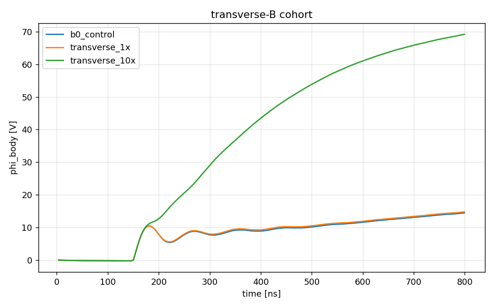
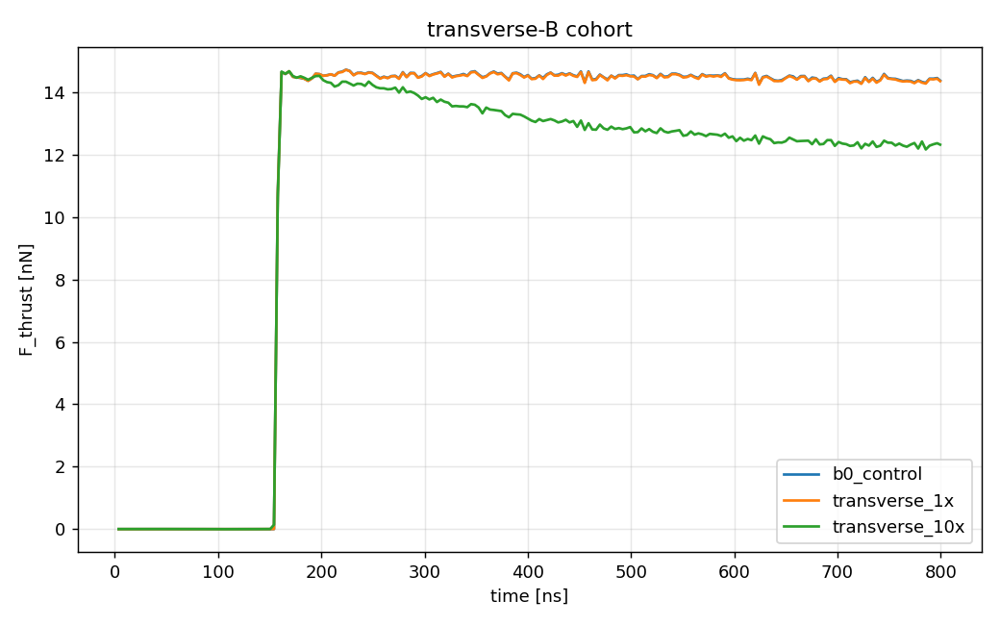

# characterization.magnetized_transverse: B perpendicular to the thrust axis (tier M2)

The anchor's chipsat body (capstone.floating_body, 200 V, 0.342 mA) in a
Cartesian 3D electrostatic deck with a uniform external magnetic field
**perpendicular** to the thrust axis: the flight geometry on a near-equatorial
orbit, which the RZ decks cannot represent (a transverse B breaks
axisymmetry). Tier M2 of the magnetized axis. Tier M1 (field-aligned Bz on the
RZ deck, `../magnetized_1x/`, `../magnetized_10x/`) closed the near-field
half of the question in the fallback operating mode; this stage answers it in
the operating mode the mission actually flies.

Three scenarios, one axis: `b0_control` (B = 0, the 3D control),
`transverse_1x` (Bx = 30 µT, 1× LEO), `transverse_10x` (Bx = 300 µT).

Pre-registered 2026-09-01, before any run (plan section below). Results are
appended below the plan once the cohort has run.

## Plan (pre-registered 2026-09-01, before the run)

### Why this instrument, and not the far-field control volume

The design note that preceded this stage
([`../../../future_work/M2_TRANSVERSE_B.md`](../../../future_work/M2_TRANSVERSE_B.md))
proposed a metre-scale similarity deck with a sub-cell craft and a momentum
ledger over a control volume of size L, reading its identity
`F_Lorentz/F_beam = L/r_g` as "the open quantity is L". That instrument was
not built, for a reason that is exact rather than practical:

Momentum conservation for the particles inside any box around the craft, in
steady state, reads

```
0 = (momentum injected at the source) + (force of the craft's field on the particles)
    + Σ q v × B  − (net momentum flux out through the faces) − (momentum absorbed by the craft)
```

and the force on the craft is the emission recoil plus the impacts plus the
reaction of its own field, so

```
F_craft = −(net momentum flux out) + Σ_particles q v × B        (over the box)
```

The term `Σ q v × B` is the **external** field's force on the beam and plasma
inside the box. It is Earth's field pushing electrons, its reaction is on the
source of B, and it grows with the box by construction: the beam curls more
the longer it stays inside. A control-volume ledger that reads the flux
through a surface of size L therefore measures `L/r_g` because it includes
that term, not because the craft feels it. The craft feels three things only,
all of them sheath-scale: the recoil at emission, the momentum of what lands
on it, and the electrostatic stress of the sheath on its surface. Where the
beam's momentum ends up afterwards is Earth's business: the gyro-orbit returns
the electron to +z every `T_ce`, exchanging momentum with the geomagnetic
field, never with the craft.

Two direct estimates bound the ways the far field can still reach the craft:

1. Beam return. At 1× the orbit closes 1.44 m away and comes back after
   1.19 µs with the anchor's 2° divergence spread over the 9 m circumference,
   a ~0.3 m footprint against a 10 mm craft: a 10⁻⁴ fraction, and those
   electrons arrive at 147 eV against a 17 V float, so they are not
   collected unless they hit. At 10× the footprint is 3 cm and the return
   fraction ~10 %; that case needs a 0.3 m box and is outside this stage
   (limitations).
2. Craft-scale J×B. The collected current flows through the craft over its
   5.5 mm height: `I·L·B` = 0.342 mA × 5.5 mm × 30 µT = 0.06 nN, 0.4 % of
   F_beam at 1× (4 % at 10×).

So the measurement is: the anchor body, resolved, floating self-consistently
in the anchor plasma, with B ⊥ ẑ, and a thrust ledger that separates the
craft's force from the Lorentz term the exit flux alone would misread.

### The instrument (delta from the anchor deck)

| | RZ anchor (`capstone.floating_body`) | this deck |
|---|---|---|
| geometry | RZ, r ≤ 30 mm, z ∈ [−30, 36] mm | Cartesian 3D, x,y ∈ ±32 mm, z ∈ [−30, 42] mm (same margins, snapped to 8-cell blocks) |
| cells | 0.15 mm, 200 × 440 = 88 k | 1.0 mm, 64 × 64 × 72 = 295 k (λ_D/dx = 1.97 vs 13.1) |
| body | can with 0.4 mm walls, lid hole, internal gun (two EB nodes) | the same Ø10 × 5.5 mm can, **solid**, one EB node |
| beam | thermionic-like source at the cathode, accelerated through the 4.7 mm gap | the escaped exhaust, prescribed on the lid: 0.342 mA at KE_lid = 164.5 eV (= anchor exhaust 147.5 eV + anchor float 17.0 V), r < 1.5 mm, anchor thermal spread |
| plasma, reservoir, schedule | n₀ = 1.627 × 10¹² m⁻³, kTe = 113.6 meV, mᵢ = 400 mₑ, 16 ppc; recycle shell; gun on 150 ns, end 800 ns | identical |
| external field | Bz (M1 only) | Bx = 0 / 30 µT / 300 µT |
| thrust ledger | F_beam = escaped-beam z-momentum flux; F_net = impacts | the same two, plus `F_lorentz` = Σ q v×B over every in-box particle (GPU sum each step), and `F_thrust = F_beam − F_lorentz,z`, the force on the body by momentum conservation |
| capacitance | Gauss law on the domain faces at the 1 V init solve: 0.645 pF | the same measurement on six faces (gated 0.35–1.20 pF) |

The gun is not re-modelled: the anchor measured it (κ = 0.81, 98.4 % escape).
Injecting the exhaust at the lid energy lets the sheath return
KE_∞ = KE_lid − φ self-consistently, which is how the control closes on the
anchor.

What 1 mm cells do and do not resolve: the sheath (tens of mm at 17 V, OML
capture radius 61 mm) is resolved; the body is 10 cells across; the gun is
not resolved and is not present. The Debye length is resolved at 2 cells
with the energy-conserving gather the anchor also uses.

### The validation mini-ladder

`../transverse_b_numerics/` (run first): single test electrons on this exact
grid and time step against closed forms: the gyration at 1× and 10×
(frequency to 0.2 %, radius to 0.5 %, energy to 10⁻⁶) and the E×B drift at
10× (to 1 %). The third rung of the design note's ladder is this stage's own
`b0_control`: the 3D coarse-grid solid-body deck must close on the fine RZ
anchor.

### Pre-registered predictions

`b0_control` (closure on the anchor: 16.98 V, 13.65 nN, 98.44 %, 147.5 eV):

- φ = 17 ± 4 V. The 1 mm grid, the solid body (4 % more collecting area than
  the holed can) and the snapped box (+2 mm in x,y, +6 mm in z) each move
  the float by ~1 V.
- F_beam = 13.65 ± 1.0 nN; F_lorentz = 0 to the ledger's noise (< 0.1 %).
- escape ≥ 99 % (the source sits outside the body; nothing to scrape but
  grazing lid hits); F_net/F_beam ≤ 0.02.
- C_float = 0.65 ± 0.3 pF.

`transverse_1x` (H-M2-null, the M1 bounds re-used): |Δφ| ≤ 2 V,
|ΔF_thrust|/F ≤ 5 %, |Δescape| ≤ 1 pp, Lorentz correction < 0.2 %. Grounds:
the beam deflects 0.6 mm over the 40 mm to the +z face (r_g = 1.44 m); the
thermal-electron gyroradius (27 mm) is the box size, so collection is
unmagnetized at the body scale; the Parker–Murphy ceiling (0.96 m) is far
above the OML capture radius (61 mm).

`transverse_10x` (H-M2-tax): Δφ = +20 to +60 V (φ ≈ 37–77 V),
ΔF_thrust = −5 to −25 % through the float (KE_∞ = KE_lid − φ), Lorentz
correction +2 to +8 %, escape ≥ 95 %. Grounds: the field-aligned M1 run
measured +33 V at 10×; here the collecting flux tube along ±x meets the
body's side profile (2 × 10 × 5.5 mm² plus the 2.7 mm gyro-broadening,
≈ 170 mm²) instead of its end faces (≈ 190 mm²), so the tax should be
comparable or somewhat larger; the beam deflects 18° before the +z face
(cos 18° = 0.95), which is what the exit flux misses and the Lorentz term
restores.

### Falsification

- `transverse_1x` outside the null bands: transverse firing changes the
  committed operating point at flight field. The mission table is re-opened
  and the M1 field-aligned mode becomes the primary evidence.
- `transverse_10x` with φ above 150 V for 50 ns: the run aborts as FAILED
  (choke). Transverse firing at 10× is infeasible for this body; that is a
  result, recorded as such.
- Lorentz correction outside its band in either magnetized run, or non-zero
  in the control: the ledger or the deck is wrong, not the physics; the stage
  is invalid until the numerics are fixed.

### What this stage cannot decide

- The 10× beam return (needs a ≥ 0.3 m box at this resolution).
- Electromagnetic coupling (Alfvén wings): outside an electrostatic model.
- Domain truncation (±32 mm against a 61 mm capture radius) is inherited
  from the anchor, deliberately, so the comparison is like for like.
- One grid, one ppc, one seed, 800 ns (a snapshot on the ion clock), as
  every committed run.

## Results

Reference cohort `joint_21e03d1d` (runs `20260901T174526Z_b0_control_d6f56019`,
`20260901T182023Z_transverse_1x_6a65fe5a`, `20260901T190346Z_transverse_10x_8ab76d60`;
analysis `20260901T194231Z_9b3513be`; commit `28d6c18`; ~38 min each on the
reference GPU, strictly sequential, 2026-09-01). Verdict **FAIL (exit 1)**:
22 of 24 required gates PASS, and the two failures are `transverse_10x`
trust gates — they are the finding for that corner, stated below.

| quantity | `b0_control` | `transverse_1x` | `transverse_10x` |
|---|---:|---:|---:|
| float φ [V] | 13.37 | 13.66 | 66.51 |
| F_beam (exit flux) [nN] | 14.42 | 14.41 | 11.94 |
| F_thrust = F_beam − F_L,z [nN] | 14.42 | 14.40 | 12.36 |
| F_L,z (in-box Lorentz) [nN] | +0.000 | +0.005 | −0.428 |
| Lorentz correction [%] | +0.00 | −0.04 | **+3.59** |
| escape [%] | 99.06 | 99.06 | 98.92 |
| exhaust KE [eV] (predicted) | 156.7 (155.8) | 156.5 (155.6) | 119.6 (118.5) |
| F_net/F_beam | 0.010 | 0.009 | 0.048 |
| current balance | 0.025 | 0.025 | **0.068 FAIL** |
| edge \|φ\| [V] | 0.35 | 0.36 | **1.04 FAIL** |
| late dφ/dt [V/ns] | 0.012 | 0.012 | 0.031 |
| C_float [pF] | 0.622 | 0.622 | 0.622 |
| I_emit/I_beam | 1.0013 | 1.0013 | 1.0013 |
| ledger vs dumps | ≤ 9e-9 | ≤ 9e-9 | ≤ 4e-9 |

1. **The control closes on the anchor** inside every pre-registered band:
   φ 13.37 V (17 ± 4), F_beam 14.42 nN (13.65 ± 1.0), escape 99.1 %,
   C 0.622 pF vs the anchor's RZ 0.645 pF. The +5 % thrust decomposes
   exactly: exhaust KE is 9 eV above the anchor's (lower float, and the
   source plane at lid + 2 mm has already dropped 4.7 V of sheath) and
   escape is 0.7 pp higher — both stated in the plan's limitations.
2. **H-M2-null at 1× LEO holds on every pre-registered bound**: Δφ =
   +0.29 V (≤ 2), ΔF_thrust = −0.14 % (≤ 5 %), Δescape = 0.00 pp (≤ 1),
   Lorentz correction −0.04 % (≤ 0.2 %). With the M1 field-aligned null,
   the committed operating point survives the flight-strength field in
   both orientations. This retires the flight-condition half of the
   question the design note called the project's largest unexamined risk.
3. **The 10× corner is a measured tax, reported as bounds.** φ reaches
   66.5 V (tail mean; endpoint 69.2 V) and is still rising 0.031 V/ns at
   800 ns, and the 66 V sheath reaches the grounded box (edge |φ| 1.04 V):
   the two failed trust gates say the state is neither settled nor
   box-converged, so 66.5 V is a floor on the settled float and −14.3 %
   the corresponding thrust tax through KE = KE_lid − φ (exhaust 119.6 eV
   vs the 118.5 predicted from the source-plane potential). Every
   pre-registered prediction band nevertheless holds: Δφ +53.1 V in
   [+20, +60]; ΔF −14.3 % in [−25, −5]; Lorentz correction +3.59 % in
   [2, 8] (and the per-step ledger agrees with the ParticleMomentum
   reduced diagnostic to 0.9 %). Against the field-aligned M1 10× point
   (φ 48.6 V, F −11 %), the transverse tax is ~18 V deeper — the
   direction the plan's flux-tube geometry argument predicted. The 50 V
   benign-float reporter flags accordingly.
4. **The Lorentz ledger behaves as momentum conservation demands**: zero
   in the control, −0.04 % at 1×, and at 10× it restores the 3.6 % of
   z-momentum the beam exchanges with the geomagnetic field over its 18°
   of gyration inside the box — confirming quantitatively that the exit
   flux alone under-reads the force on the body and that the correction,
   not the far-field closure scale, is what B ⊥ ẑ changes at the craft.

Follow-up that would settle the 10× corner (not run; needs a plan
amendment and ~6 GB of disk): the same scenario with t_end ≥ 2 µs and the
box at ±60 mm — both change the frozen study, so they are a new
pre-registered variant, not a rerun.

## Follow-up plan: the wide/long 10× corner (pre-registered 2026-09-01, after the first cohort, before the wide runs)

The first cohort's two FAILed gates say exactly what to change and nothing
else: the 10× state was not settled at 800 ns (balance 6.8 %, tail still
+0.031 V/ns) and its 66 V sheath reached the ±32 mm box (edge |φ| 1.04 V).
The variant study [`config_wide10x.yaml`](config_wide10x.yaml) therefore
moves only the instrument, never the physics: box ±60 mm in x,y and
z ∈ [−60, +68] mm (120 × 120 × 128 at the same 1.0 mm cells; the measured
sheath falloff length at 66 V is ~12 mm, so the new boundary sits ~4 falloff
lengths past the old one), t_end 2.0 µs (54 480 steps), 10 dumps,
`max_grid_size: 64` (a new optional compute key; 59 M macroparticles sort in
8 boxes) and an 8.5 GB arena. Two scenarios: the wide **B = 0 control**
(attribution needs a control at the same box — the small-box deltas would
otherwise mix the box effect the domain-truncation note predicts) and the
wide **10×**. Policy [`acceptance_wide10x.yaml`](acceptance_wide10x.yaml)
(`…wide10x.v1`): the same eight trust gates per scenario — including the two
that failed, which is what this variant must now satisfy.

Pre-registered predictions:

- wide control: φ 9–15 V (truncation released moves the float down from
  13.37 V; 1.2 µs more settling moves it up; both are ~±2 V), F_beam
  14.5 ± 0.7 nN, escape ≥ 99 %, C_float 0.35–1.20 pF (toward the isolated
  0.556 pF as the box recedes), Lorentz term zero.
- wide 10×: settled float 55–85 V with the tail slope at the control's level
  (|dφ/dt| ≤ 0.012 V/ns), Δφ (vs the wide control) +45 to +70 V, ΔF_thrust
  −10 to −25 %, Lorentz correction +2 to +8 %, escape ≥ 95 %, benign-float
  flag expected.

Falsification: edge |φ| > 1 V even at ±60 mm → the 10× sheath is still
box-limited and the corner stays a bound (next doubling is a new plan);
φ > 150 V sustained → choke, FAILED; balance > 5 % at 2 µs → not settled on
this clock and reported as such (the reduced-ion-mass caveat applies).

Cost: ~6.5 h per scenario on the reference GPU (0.4 s/step × 54 480),
~4 GB disk per run. `bash campaign_wide.sh` runs the chain.

## Follow-up results (2026-09-02)

Record: [`reference_results/wide2us_20260902/`](reference_results/wide2us_20260902/).
The pair ended on a falsification branch; verdict under `…wide10x.v1` is
void (one member FAILED by design), and what it established supersedes the
first cohort's absolute numbers:

1. **The settling curve** (wide `b0_control`, COMPLETE): φ = 7.8 / 11.6 /
   18.2 / 20.7 / 21.1 V at 0.4 / 0.8 / 1.2 / 1.6 / 2.0 µs — a peak near
   1.9 µs, relaxing at −0.019 V/ns at the end. The committed 800 ns clock
   reads ~55 % of the 2 µs float (the box change itself is only −1.8 V at
   fixed clock). Thrust moves ~−2 % (F_beam 14.15 nN, exhaust 151 eV);
   escape 99.45 %; the differential (1×-null) conclusions are unaffected —
   both legs share the clock. This turns the repo-wide "800 ns is a
   snapshot on the ion clock" caveat into a measured curve; the 400 mₑ
   reduced ion makes even this clock ~8.6× faster than real O⁺ (G8).
2. **The 10× corner chokes** (wide `transverse_10x`, FAILED by design):
   with the boundary at its proper distance, φ climbs monotonically
   through 102.6 V at 800 ns, crosses the 150 V ceiling at 1.156 µs, and
   the run aborts at 1.23 µs (φ = 160 V, exhaust 51 eV, F_thrust 8.6 nN,
   escape still 98.4 %). No benign equilibrium exists below 91 % of the
   beam energy: the magnetized ionosphere at 10× transverse cannot return
   0.342 mA to this Ø10 mm body. The first cohort's 66.5 V was
   boundary-fed — its failed containment gate said so — and the
   falsification branch pre-registered in the original plan is taken:
   **transverse firing at 10× is infeasible for this body and current;
   field-aligned firing (tier M1: φ 48.6 V, F −11 %) is the operating
   mode in amplified-field environments.** The flight-strength (1×) null
   is untouched by any of this.
3. The wide control's float (20.5 V) fell **outside** its pre-registered
   9–15 V band: the plan under-weighted the settling-time effect against
   the box effect. Read the value, not the flag — and the settled pair
   below replaces prediction with a gate.

## Settled-pair plan (pre-registered 2026-09-02, before the runs)

The flight-relevant numbers, made concrete on the model's clock: the wide
box (±60 mm, z ∈ [−60, 68] mm) at **t_end = 6.0 µs** (163 440 steps; the
2 µs curve peaks at 1.9 µs, so 6 µs is ≥ 2–3 relaxation times past the
peak), scenarios `b0_control` and `transverse_1x`
([`config_settled.yaml`](config_settled.yaml)). Policy
[`acceptance_settled.yaml`](acceptance_settled.yaml) (`…settled.v1`): the
eight trust gates per scenario **plus settledness as a required gate** —
|late dφ/dt| ≤ 0.005 V/ns over the closing 50 ns — so "settled" is
enforced, not asserted. 10× is deliberately absent: it has no equilibrium
to settle to (above).

Pre-registered predictions (reported gates): settled `b0_control` float
14–21 V and F_beam 14.2 ± 0.8 nN; the settled 1× null on the same bounds
as before (|Δφ| ≤ 2 V, |ΔF_thrust| ≤ 5 %, |Δescape| ≤ 1 pp, Lorentz
correction ≤ 0.2 %); benign floats. Falsification: a required-settledness
FAIL at 6 µs means the corner needs the real-ion clock (G8) and the 6 µs
values stand as bounds; a broken 1× null at the settled point re-opens the
flight question that the 800 ns cohort closed.

Cost: ~20.5 h per scenario (0.45 s/step × 163 440), ~8 GB disk per run.
`bash campaign_settled.sh` runs the chain.

## Settled-pair results

Pending (runs launch 2026-09-02, sequential).




## Dependencies

Requires `capstone.floating_body` (the anchor). Run
`characterization.transverse_b_numerics` first; its PASS is the numerics
warrant for this stage.

## Cost

Measured on the reference GPU (RTX 3060): a 3D electrostatic benchmark at
this size steps at ~0.05 s bare; with the per-step observer the deck is
budgeted at ~1 h per scenario (21 780 steps at 36.7 ps), ~3 GPU-h for the
cohort. Field dumps ~20 × 19 MB per run; scrape dumps ~0.5 GB per run.

## Commands

```bash
python simulation.py --scenario b0_control        # then transverse_1x, transverse_10x
python analyze.py --runs outputs/<b0> outputs/<1x> outputs/<10x> --policy acceptance.yaml
bash campaign.sh                                   # the whole chain, sequential, logs under logs/
```

## Limitations

- 1 mm cells: the sheath is resolved, the gun is not (and is not modelled);
  the source energy is the anchor's measurement, so any error in the anchor's
  exhaust energy is inherited, not re-measured.
- The ambient species' momentum flux through the faces is not in the ledger
  (the anchor omits it too; the ambient pressure is 0.05 nN per face).
- Beam macroparticles are born 2 cells above the lid and see the sheath from
  there; `ke_predicted_eV` reports what the sheath returns from that plane.
