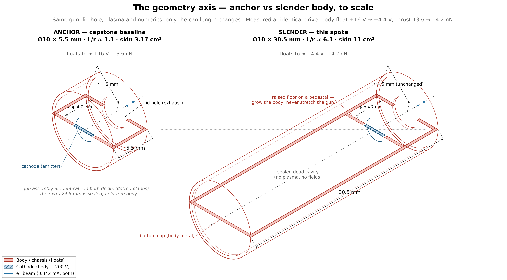
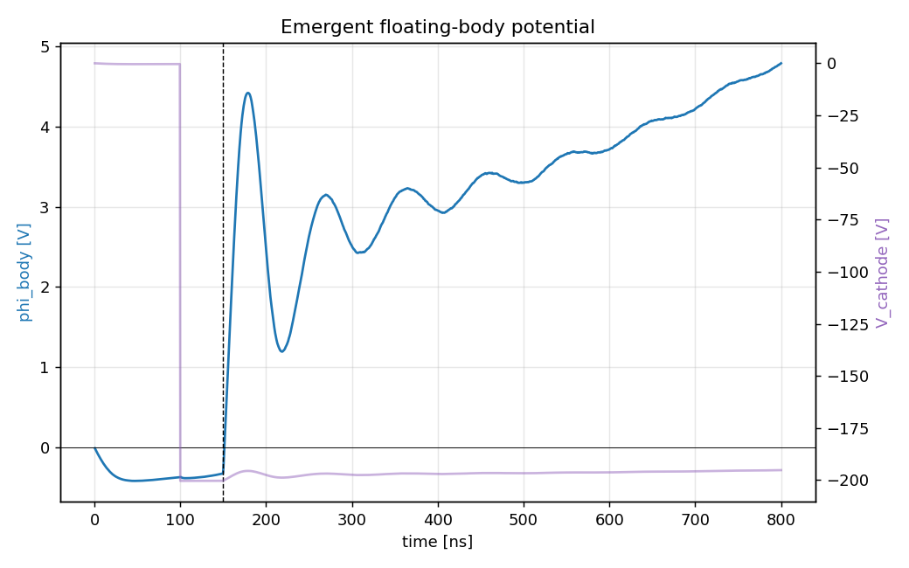

# characterization.slender_body: the geometry axis

## Goal

Test whether making the spacecraft body longer (more slender) hurts current
collection. If it does not, the thruster concept scales to CubeSat-class
bodies.

The anchor body is a short cylinder, Ø10 × 5.5 mm ($L/r \approx 1.1$). This
run stretches it to Ø10 × 30.5 mm ($L/r = 6$), increasing total skin area
from 3.17 to 11.0 cm². Everything else (drive voltage, commanded current,
gun gap) stays identical. The only change is where and how the return
current is collected.



## Why elongation matters: the size-cancellation argument

The thruster has to beat atmospheric drag. Three quantities decide whether
the power budget closes.

### Demand side: drag force

$$F_{\mathrm{drag}} = \tfrac{1}{2}\, n_i\, m_i\, v^2\, C_D \cdot A_{\mathrm{ram}}$$

Drag scales with the ram silhouette $A_{\mathrm{ram}} = \pi r^2$ (the
cross-section the atmosphere hits). To hold altitude the thruster must
produce $F \geq F_{\mathrm{drag}}$, which sets the required beam current
$I = F / (c_F \sqrt{\mathrm{KE}})$ and the electrical power $P = I \cdot V$,
both proportional to $A_{\mathrm{ram}}$.

### Supply side: current collection and solar harvest

Current collection. The body floats positive and collects ambient electrons
to close the circuit:

$$I_{\mathrm{col}} = \beta\, j_{\mathrm{the}}\, (1 + \chi)^\alpha \cdot A_{\mathrm{skin}}, \qquad j_{\mathrm{the}} = e\, n_e \sqrt{\frac{kT_e}{2\pi m_e}}, \qquad \chi = \frac{e\varphi}{kT_e}$$

- $j_{\mathrm{the}}$ is the one-sided thermal electron flux (set by the plasma, not the spacecraft)
- $\beta \sim 0.5$ is a geometry factor
- $(1 + \chi)^\alpha$ is the OML enhancement: the float potential $\varphi$ pulls in more electrons than random thermal motion alone
- $\alpha$ is the collection exponent (sphere: 1, infinite cylinder: 0.5, anchor measured: 0.82–0.89)

Solar power. Body-mounted cells harvest sunlight over the skin:

$$P_{\mathrm{solar}} = S \cdot \eta \cdot f_{\mathrm{duty}} \cdot f_{\mathrm{cell}} \cdot A_{\mathrm{skin}}$$

with $S = 1361$ W/m², cell efficiency $\eta = 0.30$, orbit-average
illumination duty $f_{\mathrm{duty}} = 0.25$, and cell fraction of skin
$f_{\mathrm{cell}} = 1/3$ (the rest is bare collector + structure), giving
~102 W per m² of cell area.

Both supply terms scale with the total skin
$A_{\mathrm{skin}} = 2\pi r^2 + 2\pi r L$.

### The ratio: size cancels

Divide supply by demand. Both scale with area, so the absolute size divides
out:

$$\frac{\mathrm{supply}}{\mathrm{demand}} \;\propto\; \frac{A_{\mathrm{skin}}}{A_{\mathrm{ram}}} = \frac{2\pi r^2 + 2\pi r L}{\pi r^2} = 2 + \frac{2L}{r}$$

Scale the body by any factor $k$ ($r \to kr$, $L \to kL$): both areas pick
up $k^2$, the ratio stays the same. Feasibility is a shape property
($L/r$), not a size property. A 3U CubeSat flying end-on and the
Ø10 × 30.5 mm cylinder both have
$A_{\mathrm{skin}}/A_{\mathrm{ram}} \approx 14$, so they share the same
mission margins.

Caveat: solar cells and bare collector compete for the same skin (clad
dielectric does not collect).

There is a catch. Making the body more slender might hurt the collection
exponent $\alpha$. OML theory gives:

| shape | $\alpha$ | meaning |
|---|---|---|
| sphere | 1.0 | best — collects the most current per volt |
| infinite cylinder (no ends) | 0.5 | worst — collects less current per volt |
| anchor (Ø10 × 5.5 mm, measured) | 0.82–0.89 | between the two limits |

The worry: a longer cylinder approximates an infinite cylinder, so $\alpha$
might slide toward 0.5. That would mean the body needs a higher float
potential to collect the same current, wasting beam energy and reducing
thrust.

This tension (elongation helps the mission math but might hurt the
collection physics) is what this run tests.

## Hypotheses (before the run)

At fixed escaped current (~0.337 mA), where does the float potential settle?

| hypothesis | assumption | predicted float $\varphi$ |
|---|---|---|
| **A** — alpha holds | the anchor's $\alpha \approx 0.89$ still applies | **~4–5 V** |
| **B** — cylinder-limit tax | $\alpha$ slides toward 0.5 for the longer body | **tens of volts** (possibly above 50 V) |

The two predictions differ by ~10×, so one run can tell them apart.

## Results

Reference run `20260806T011847Z_5670e54c` (159,160 steps, 800 ns). All 6
required gates PASS:

| check | measured | target | status |
|---|---|---|---|
| escape fraction | 98.42% | ≥ 95% | PASS |
| current balance | 2.0% | ≤ 5% | PASS |
| net-force sanity | 0.014 | ≤ 1 | PASS |
| edge potential | 21 mV | ≤ 1 V | PASS |
| scrape ledger vs dumps | 2.6e-10 | ≤ 2% | PASS |
| beam-escape ledger vs dumps | 7.5e-10 | ≤ 2% | PASS |

Main measurements (reported, not gated; under the exploratory policy these
are the measurement):

| metric | anchor | slender cylinder | change |
|---|---|---|---|
| body float $\varphi$ | 16–17.7 V | **4.38 V** | **3.9× lower** |
| escape fraction | 98.3% | 98.42% | held |
| beam thrust | 13.65 nN | 14.22 nN | +4.2% |
| exhaust KE | ~147 eV | 159.7 eV | +8.6% |

### Hypothesis A confirmed, B refuted by ~10×

The measured float falls in the alpha-holds bracket:

| bound | $\alpha$ used | predicted $\varphi$ |
|---|---|---|
| upper | 0.893 | 4.66 V |
| **measured** | — | **4.38 V** |
| lower | 0.82 | 4.14 V |

The anchor's collection exponent survived a 3.24× area change and an
aspect-ratio jump from $L/r \approx 1.1$ to 6.

Settle caveat: $\varphi$ was still rising at run end (~4–7 mV/ns), so the
settled value is quoted as a ~5–6 V band. The 10× hypothesis gap leaves the
conclusion unchanged either way.



### Why alpha held: the body is still too short for the cylinder limit

The OML infinite-cylinder limit ($\alpha = 0.5$) applies when the body is so
long that collected electrons see only wall, no ends. The reach of the
collection fan is $b_{\max} \approx r\sqrt{1 + \chi}$:

| body | $\chi$ | $b_{\max}$ | body length | what electrons see |
|---|---|---|---|---|
| anchor (Ø10 × 5.5 mm) | ~150 | ~60 mm | 5.5 mm | a point — ends everywhere |
| slender (Ø10 × 30.5 mm) | ~39 | ~31 mm | 30.5 mm | still a finite body with ends |

Electrons approaching either body see one compact object, not an infinite
wall. Lengthening added area without changing the exponent. The cylinder
limit would need $L \gg b_{\max}$, meaning
$L/r \gg \sqrt{1 + \chi} \approx 6\text{–}12$, beyond the $L/r = 6$ tested
here.

This does not prove OML theory is wrong. It shows the infinite-cylinder
assumption is not met yet at $L/r = 6$.

### Why the slender cylinder is strictly better

More skin area means less voltage enhancement is needed to collect the same
current:

$$\text{at fixed demand:} \quad (1 + \chi) \propto A_{\mathrm{skin}}^{-1/\alpha}$$

The chain:

1. 3.24× more skin → 3.83× less enhancement needed
2. lower float potential
3. more beam energy ($\mathrm{KE} = \kappa(V - \varphi)$)
4. more thrust (13.65 → 14.22 nN)

Elongation is free on the thrust side and strictly better on the charging
side.

## Confidence for scaling to 3U CubeSat

1. The size-cancellation argument (high confidence). Pure geometry:
   $A_{\mathrm{skin}}/A_{\mathrm{ram}}$ depends only on $L/r$, not absolute
   size. A 3U CubeSat end-on has the same ratio (~14) as the slender
   cylinder. The drag-vs-supply margin is identical. This is algebra; it
   cannot be wrong.
2. The collection exponent (strong confidence at this scale). $\alpha$ held
   at 0.82–0.89 across a 3.24× area change and $L/r$ from 1.1 to 6. The two
   hypotheses differed by 10×, so this is not a marginal call. The measured
   float (4.38 V) landed in the alpha-holds bracket.
3. The collection regime at CubeSat scale (moderate confidence). The anchor
   and slender cylinder both sit at $r/\lambda_D \approx 2.5$ (thick
   sheath, OML collection). A 3U CubeSat has $r \sim 25\text{–}60\,\lambda_D$,
   a thin-sheath regime where the collection mechanism is different
   (enhancement tracks area ratio, not the OML power law). This regime is
   analytically more favorable (lower float for the same current), but it
   is an estimate, not a calibrated PIC result (`thick_sheath_phi` in
   `model/scale_analysis.py`).

Bottom line: we cannot run a CubeSat-scale PIC simulation (it would take
days to weeks). The geometry argument is airtight, the collection exponent
is measured at this scale, and the extrapolation to CubeSat sizes goes into
a more favorable regime. A reviewer can reasonably conclude that a 3U
CubeSat with the right $L/r$ should work.

## What remains open

| direction | what happens there | status |
|---|---|---|
| $L/r > 6$ | the cylinder limit must eventually bite — $\alpha$ will drop | unmeasured |
| $r \lesssim \lambda_D$ (tether regime) | bare-tether collection (Sanmartín 1993) | connects to flown physics |
| $r \gg \lambda_D$ (CubeSat, $25\text{–}60\,\lambda_D$) | thin-sheath regime, different collection mechanism | estimate only |
| settle time | $\varphi$ still rising at 800 ns | quoted as 5–6 V band |
| grid/PPC/seed sensitivity | single configuration | inherited from anchor |

## Setup

| parameter | anchor | slender cylinder |
|---|---|---|
| `z_bot` | $-5.0$ mm | **$-30.0$ mm** |
| `cathode_standoff` | floor-tied | **4.7 mm** |
| grid | 200 × 440 | **200 × 608** (~122k cells) |
| everything else | — | identical |

The standoff pins the gun gap at 4.70 mm while the body grows around it:
demand/ceiling 1.457, matching the anchor's 1.46.

Same engine as the anchor: deck, charge pump, reservoir, observer identical
(`../../ladder/capstone/2_chipsat_thruster/README.md`). Only the conductor
geometry differs.

## First attempt: killed by design flaw

Run `20260805T190609Z_f59e228b`, killed at 69% by operator decision.

1. The flaw: the anchor deck ties the cathode to the cylinder floor, so
   lengthening the cylinder stretched the gun gap from 4.7 mm to ~30 mm.
2. Child–Langmuir scales as $1/d^2$, putting the commanded 0.342 mA at ~60×
   the long gap's space-charge ceiling.
3. The beam blew open over the drift and self-scraped.
4. The A/B hypotheses were never tested by this run.

Design rule: grow the body around the gun, never stretch the gun. The fix,
a `geometry.cathode_standoff` parameter that decouples the cathode from
`z_bot`, was committed (`a7f4106`) before the production relaunch.

## What this run opens

- the geometry-split collection law in `model/minimal_model.py`, letting the model sweep aspect ratio
- slender-body mission rows (rod/plate designs at 400–500 km) move from flagged to measured
- the $r \lesssim \lambda_D$ end of the axis connects to bare-tether collection (Sanmartín 1993), bridging the device to flown physics

## Provenance

Executed 2026-08-06 as a variant deck through the anchor stage under the
exploratory policy `capstone.exploratory_axes.v1`; the frozen run config and
manifests carry `stage_id: capstone.floating_body`. This folder's
`config.yaml` reproduces that deck under the new stage id. `acceptance.yaml`
re-identifies the same gates for future runs; it is not a pre-registration
for the migrated evidence. Launch console logs are local working files, not
committed; the run manifest under `reference_results/` carries the
provenance.

*(This file was formerly `SLENDER_BODY_PLAN.md`, unified 2026-08-11; the
pre-run plan is preserved in that file's git history.)*

## Dependencies

Requires `capstone.floating_body` (the anchor). Spokes never depend on each
other.

## Cost

~6.5 GPU-h. 159k steps, $\Delta t \approx 5.0$ ps, 200 × 608 grid. CUDA
build required (`../../../SETUP.md`).

## Commands

```bash
python simulation.py
python analyze.py --run outputs/<run-id> --policy acceptance.yaml
```
