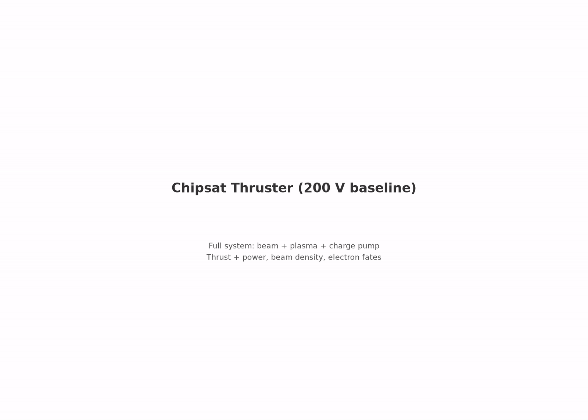
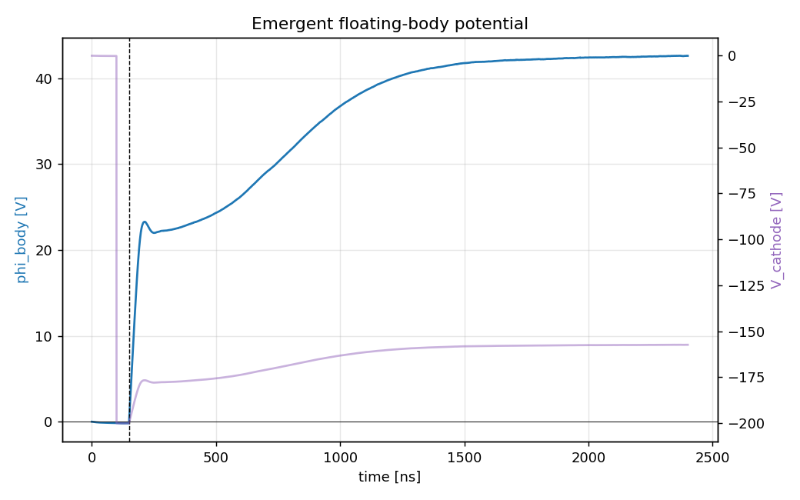

# characterization.thin_plasma — the density axis (n0/3)

same system as the anchor in a **3× thinner ionosphere**. asks: do the collection law's fitted exponents (α, β) hold as r_probe/λ_D drops 2.5 → 1.5? pre-registered 2026-08-06 in `THIN_PLASMA_PLAN.md` with per-α float predictions (α = 1 → 53.4 V, 0.893 → 60.9 V, 0.82 → 68.0 V, 0.5 → 160.4 V), then **unchained before launch by scope decision** (the n-linear term was already validated ±1% at `collector.thermal`, and the settle limit would blur a 53–68 V discrimination); relaunched 2026-08-08 as a gross-breakdown detector.

[](viz/20260811T213635Z_acc8f8f9_dashboard.mp4)

*dashboard of the 2.4 µs continuation run (click through for the mp4).*

## setup

| | anchor (floating_body) | this spoke |
|---|---|---|
| `plasma.n0` | 1.627e12 m⁻³ | **5.4233e11 m⁻³** (n0/3) |
| `rmax` | 30 mm | **40.8 mm** (containment for the √3× larger λ_D) |
| gpu arena | — | enlarged (disclosed numerics) |
| everything else | — | identical |

the deck as committed carries the pre-registered **2.4 µs continuation** (`t_end` 800 ns → 2.4 µs, `max_steps` 480k, `phi_ceiling` 100 → 180 V — see `THIN_PLASMA_PLAN.md` §CONTINUATION; run `20260811T213635Z_acc8f8f9`, gated PASS 2026-08-12). results for both the 800 ns reference and the continuation are below.

## how the pic works

same engine as the anchor — deck, charge pump, reservoir, observer identical (`../../ladder/capstone/2_chipsat_thruster/README.md`). only the plasma density (and the containment radius it demands) differs. the `sheath_and_plume_contained` gate is what proves the rmax enlargement sufficed.

## results

reference run `20260808T165839Z_41b114e2`, all 6 required gates PASS. under the exploratory policy φ and F **are** the measurement — reported, not gated:

| check | measured | target | type |
|---|---|---|---|
| escape fraction | 98.39% | ≥ 95% | required |
| current balance | 4.9% | ≤ 5% | required |
| net-force sanity | 0.026 | ≤ 1 | required |
| edge potential | 103 mV | ≤ 1 V | required |
| scrape ledger vs dumps | 3.9e-9 | ≤ 2% | required |
| beam-escape ledger vs dumps | 5.1e-10 | ≤ 2% | required |
| body float φ | **+29.47 V** (tail mean, **unsettled**) | — | reported |
| beam thrust | **13.04 nN** | — | reported |
| exhaust KE | **135.1 eV** (KE = κ(V − φ) predicts 135.6) | — | reported |

device **healthy at n0/3**: no gross breakdown of the collection law. the float is unsettled at 800 ns (run-end above the tail mean), so the α discrimination was **not achieved**; the recorded hard bound is **φ_settled > 31.6 V**. the 2.4 µs continuation exists to close exactly this gap. full detail: `reference_results/20260808T165839Z_41b114e2/REFERENCE.md`.

### continuation: the float settled, and it settled low

run `20260811T213635Z_acc8f8f9` (2.4 µs, 477,480 steps, 22.4 h wall; analysis `results/20260811T213635Z_acc8f8f9/20260812T200258Z_aef34e72`), all 6 required gates PASS:

| check | measured | target | type |
|---|---|---|---|
| escape fraction | 99.13% | ≥ 95% | required |
| current balance | 0.10% | ≤ 5% | required |
| net-force sanity | 0.029 | ≤ 1 | required |
| edge potential | 188 mV | ≤ 1 V | required |
| scrape ledgers vs dumps | ~1e-10 | ≤ 2% | required |
| body float φ | **+42.5 V, SETTLED** (late slope ≈ −0.14 V/µs) | — | reported |
| beam thrust | **12.39 nN** | — | reported |
| exhaust KE | **122.0 eV** (injection-plane φ predicts 122.6) | — | reported |

the campaign's first **settled** float, and the verdict on the pre-registered predictions is a surprise on both ends:

- **α = 0.5 refuted** on the density axis — the float saturated at 42.5 V with the choke ceiling parked above 160 V; nothing heads there.
- **α = 1 / 0.893 / 0.82 all overshoot** (53.4 / 60.9 / 68.0 V predicted): the settled float lands *below* the entire 45–75 V measurement band. \((1+\chi)\) rose 2.39× for the 3× density drop, where any fixed α ≤ 1 requires ≥ 3× — a secant exponent \(\alpha_{\rm eff} = \ln 3 / \ln 2.39 = 1.26\), or equivalently a ~38% β rise at the model's default α, the direction sheath expansion toward OML predicts as r_probe/λ_D falls 2.5 → 1.5.
- **benign-float gate (φ < 50 V) passes**, contrary to the plan's expectation: thin plasma at n0/3 does *not* end the envelope at the anchor's drive. the fitted law is **conservative along the density axis** — it over-predicts the float cost of thin plasma.

caveat: a two-point A/B (one 3× step) across the disclosed rmax change; α_eff is a secant, not a fit, and says nothing beyond n0/3 toward the ~1e11 m⁻³ night minimum.



## provenance

executed 2026-08-08 as a variant deck through the anchor stage under the pre-registered exploratory policy `capstone.exploratory_axes.v1`; the frozen run config and manifests therefore carry `stage_id: capstone.floating_body`. this `config.yaml` is that same deck (git-moved, history intact) under the new stage id; `acceptance.yaml` re-identifies the same gates for future runs — it is not a pre-registration for the migrated evidence. launch record: `logs/`.

## dependencies

requires `capstone.floating_body` (the anchor). spokes never depend on each other.

## cost

~8.4 GPU-h for the 800 ns reference (159k steps, enlarged domain); the 2.4 µs continuation is ~3× that. CUDA build required (`/SETUP.md`).

## commands

```bash
python simulation.py
python analyze.py --run outputs/<run-id> --policy acceptance.yaml
```

## limitations

- the α discrimination is a two-point secant along density, not a fit: α_eff = 1.26 (or β drift) cannot be separated into exponent vs area with one step
- single density point (n0/3), no sweep down to CubeSat-regime r/λ_D — behavior toward the ~1e11 m⁻³ night minimum remains extrapolated (now with a measured conservative bias)
- anchor limitations inherited: single grid/PPC/seed, reduced ion mass 400 mₑ
- the anchor's own float is still an 800 ns read with a disclosed slope; only the thin row is settled
