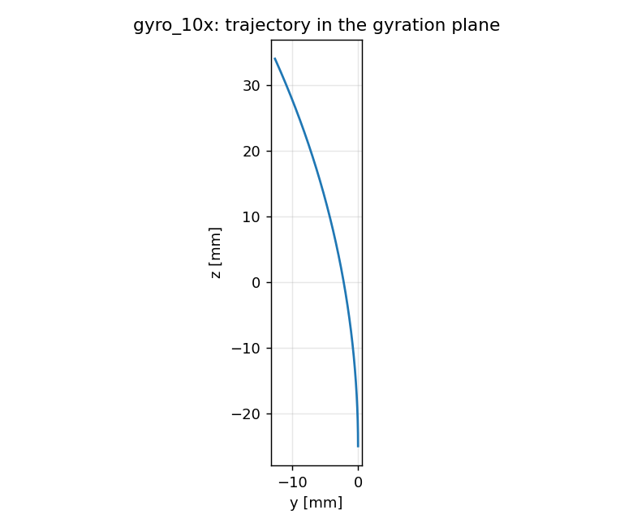

# characterization.transverse_b_numerics: the mini-ladder under the transverse-B measurement

Single test electrons on the exact grid (64 × 64 × 72 at 1.0 mm) and time
step (36.7 ps) of `../magnetized_transverse/`, pushed by the same Boris /
electrostatic machinery with the same applied-field mechanism, against closed
forms. Each gate is a numerics claim the measurement rides on. The design
note for tier M2 (`../../../future_work/M2_TRANSVERSE_B.md`) asked for exactly
this before any measurement run: "single-particle gyro-orbit vs exact r_g and
T_ce on the coarse grid; E×B drift vs analytic". Pre-registered 2026-09-01.

| scenario | what | closed form | gate |
|---|---|---|---|
| `gyro_1x` | 164.5 eV electron launched along +z in Bx = 30 µT (r_g = 1.44 m; a 2.4° arc fits the box) | ω_c = eB/m, r_g = p/(eB), KE constant | ω to 0.2 %, r_g to 0.5 %, KE to 10⁻⁶ |
| `gyro_10x` | the same in Bx = 300 µT (r_g = 144 mm, a 25° arc) | same | same |
| `exb_10x` | electron born at rest in Bx = 300 µT and Ez = 30 V/m (z-face potentials, x,y periodic) over three gyroperiods | v_d = Ez/Bx = 10⁵ m/s along +y, no z drift | v_d to 1 %, v_z/v_d < 2 % |

The trajectory is the `BeamRelevant` reduced diagnostic (mean position and
momentum of the one particle, every step). Frequency from the rotation of
(p_y, p_z); radius from an algebraic circle fit to (y, z); drift from a
least-squares fit `y(t) = y0 + v t + A cos ω_c t + B sin ω_c t`.

## Results

Reference cohort `joint_18b7e00e` (runs `20260901T174206Z_gyro_1x_fa935f76`,
`20260901T174213Z_gyro_10x_0d90a7ef`, `20260901T174220Z_exb_10x_cca068af`;
analysis `20260901T174525Z_a5106fb0`), **all 8 required gates PASS**
(2026-09-01, commit `148a7af`).

| scenario | measured | closed form | gate |
|---|---|---|---|
| `gyro_1x` (2.4° arc) | ω/ω_c = 0.99968, r_g/r_g,exact = 1.000000, ΔKE/KE = 9 × 10⁻¹⁰ | ω_c = 5.28 × 10⁶ s⁻¹, r_g = 1.44 m | 2 × 10⁻³, 5 × 10⁻³, 10⁻⁶ |
| `gyro_10x` (24.2° arc) | ω/ω_c = 0.99968, r_g/r_g,exact = 1.000000, ΔKE/KE = 1.7 × 10⁻⁹ | ω_c = 5.28 × 10⁷ s⁻¹, r_g = 144 mm | same |
| `exb_10x` (3.0 gyroperiods) | v_d/(E/B) = 1.000000, v_z/v_d = −1.5 × 10⁻⁶ | v_d = 10⁵ m/s along +y | 10⁻², 2 × 10⁻² |

The 3 × 10⁻⁴ frequency deficit is the Boris rotation's phase error at
ω_c dt = 1.9 × 10⁻³ (it is the same at both fields because the arc is
resolved by the same 218 steps), far inside the gate; radius, energy and
drift are exact to the trace's precision. The numerics warrant for
`../magnetized_transverse/` holds. Full detail:
`reference_results/joint_18b7e00e/REFERENCE.md`.



## Dependencies

Requires `capstone.floating_body` per the spoke rule. Run before
`characterization.magnetized_transverse`.

## Cost

Seconds to a few minutes per scenario (a Poisson solve per step on the
measurement grid, one particle).

## Commands

```bash
python simulation.py --scenario gyro_1x        # gyro_10x, exb_10x
python analyze.py --runs outputs/<gyro_1x> outputs/<gyro_10x> outputs/<exb_10x>
```
