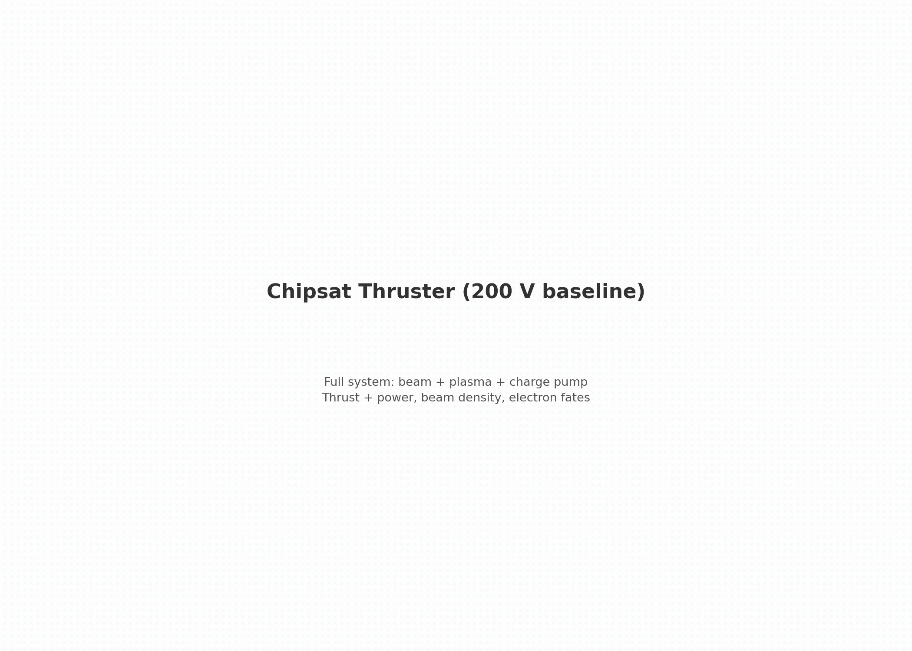

# ladder — verification ladder to the chipsat thruster

[](capstone/2_chipsat_thruster/viz/20260806T011847Z_5670e54c_dashboard.mp4)

*The top step in motion — the chipsat electron thruster capstone ([`capstone/2_chipsat_thruster`](capstone/2_chipsat_thruster/README.md)); click for the full video.*

See `LADDER_SUMMARY.md` for every step's test, measured numbers, and theory comparison on one page.

## What this is

A series of PIC simulations in order of increasing physics, each gated against closed-form theory. The ladder validates:

- **The code**: WarpX RZ electrostatics, embedded boundaries, flux emission, scraping
- **The configuration**: grid resolution, plasma parameters, ppc, emitted current, aperture geometry — so that by the top step every numerical choice has already passed a gate somewhere cheaper

## Steps

**Emitter side** (prescribed-current beams) → **Collector side** (ambient plasma) → **Capstone** (the thruster):

| Step | Stage ID | What it tests | Cost |
|---|---|---|---|
| [`electron_gun/1_negative_cathode`](electron_gun/1_negative_cathode/README.md) | `emitter.negative_cathode` | plane diode, no EB | ~3 min |
| [`electron_gun/2_electron_gun`](electron_gun/2_electron_gun/README.md) | `emitter.holed_anode` | + holed-anode plate | ~10 min |
| [`current_collection/1_thermal`](current_collection/1_thermal/README.md) | `collector.thermal` | sphere at 0 V, exact theory | ~16 min |
| [`current_collection/2_biased_3v`](current_collection/2_biased_3v/README.md) | `collector.biased_3v` | OML ceiling, χ = 26.4 | ~1 h |
| [`current_collection/3_biased_10v`](current_collection/3_biased_10v/README.md) | `collector.biased_10v` | sheath growth, χ = 88 | ~2 h |
| [`current_collection/4_floating`](current_collection/4_floating/README.md) | `collector.floating` | charge pump → floating potential | ~35 min |
| [`capstone/1_two_node_laplace`](capstone/1_two_node_laplace/README.md) | `capstone.two_node_laplace` | two-node EB in vacuum | seconds |
| [`capstone/2_chipsat_thruster`](capstone/2_chipsat_thruster/README.md) | `capstone.floating_body` | float200 regression — **the anchor, ladder terminus** | ~6 h |

The ladder ends at the anchor. Everything varied *off* the anchor — the 300 V /
100 V voltage points, the slender geometry, thin plasma, magnetized runs —
lives in [`../thruster_characterization/`](../thruster_characterization/README.md)
as hub-and-spoke stages that each depend only on `capstone.floating_body`.

### Gap closures

- `collector.floating` and `capstone.two_node_laplace` close validation gaps G1/G2 (the charge pump and two-node EB had no analytic anchors beneath the capstone)
- `capstone.high_thrust` (300 V, 30.13 nN) and `capstone.low_power` (100 V, 3.42 nN) — now filed under `../thruster_characterization/` — complete the three-point P-F frontier across the full hardware voltage range, bracketing the validated 200 V anchor

## Architecture

See `../ARCHITECTURE.md` for details. Two key decisions:

1. **Each stage is a self-contained folder** with its own simulation, config, helpers, analysis, animation, and tests. Physics duplication is deliberate — a reviewer reads one folder and sees the whole model.
2. **Shared plumbing** (run IDs, manifests, immutable directories, gate evaluation) lives in `../ladder_contract.py`, one level up, serving the ladder and the characterization spokes alike. No physics, no pywarpx, no plotting.

### Stage folder layout

```
<stage>/
  config.yaml        # physics/numerics (frozen + hashed per run)
  acceptance.yaml    # gates + tolerances
  simulation.py      # the PIC deck + run lifecycle
  helpers.py         # typed config + analytic references
  analyze.py         # reads evidence -> metrics.json + verdict.json
  animate.py         # presentation (optional)
  README.md
  tests/             # config + analysis unit tests (no WarpX)
  outputs/<run-id>/  # generated, immutable, git-ignored
  results/<run-id>/<analysis-id>/   # generated, immutable, git-ignored
  reference_results/ # curated, committed
```

### Root files

```
ladder_contract.py   # shared plumbing (unit-tested in tests/)
ladder.py            # the stage list
run_ladder.py        # subprocess orchestration + suite verdict
cross_stage.py       # cross-stage checks (trends, orderings, shared params)
tests/               # contract + repository-level tests
suite_results/       # generated suite verdicts (git-ignored)
```

## Run / analysis lifecycle

- Every `simulation.py` run creates a fresh immutable `outputs/<run-id>/`, marked COMPLETE only after verification. Reruns never mix with old output.
- Every `analyze.py` run creates a fresh immutable `results/<run-id>/<analysis-id>/`. Analysis reads the frozen `config_used.yaml`, never the live `config.yaml`.
- Gates are fail-closed: missing, non-finite, duplicate, or skipped required gates are ERROR (exit 2), never silent PASS. Empty policy = ERROR.
- Exit codes: `0` all pass, `1` gate failed, `2` analysis error.
- JSON is strict (`allow_nan=False`).

## Commands

```bash
conda activate warpx-cpu-mpich-dev

# one stage
cd electron_gun/1_negative_cathode
python simulation.py                                       # -> outputs/<run-id>/
python analyze.py --run outputs/<run-id> --policy acceptance.yaml

# the whole ladder
python run_ladder.py --check                               # contract + topology only
python run_ladder.py                                       # run + analyze every stage
python run_ladder.py --stages emitter.negative_cathode emitter.holed_anode
python run_ladder.py --analyze-only --stages collector.thermal

# tests (no WarpX)
PYTHONNOUSERSITE=1 python -m pytest tests/ -q
```

Run one WarpX case at a time. Deleting any `outputs/<run-id>/` or `results/` subtree is always safe.

## Status

**Milestone A (Phases 0–4): done.** All 10 stages run and PASS. All carry verified `reference_results/`; numbers are in `LADDER_SUMMARY.md`.

**Milestone B (Phase 5): not done.** Stationarity gates, consistent ensembles, corrected Child-Langmuir narratives, convergence sweeps. See `../ARCHITECTURE.md` (open items).
