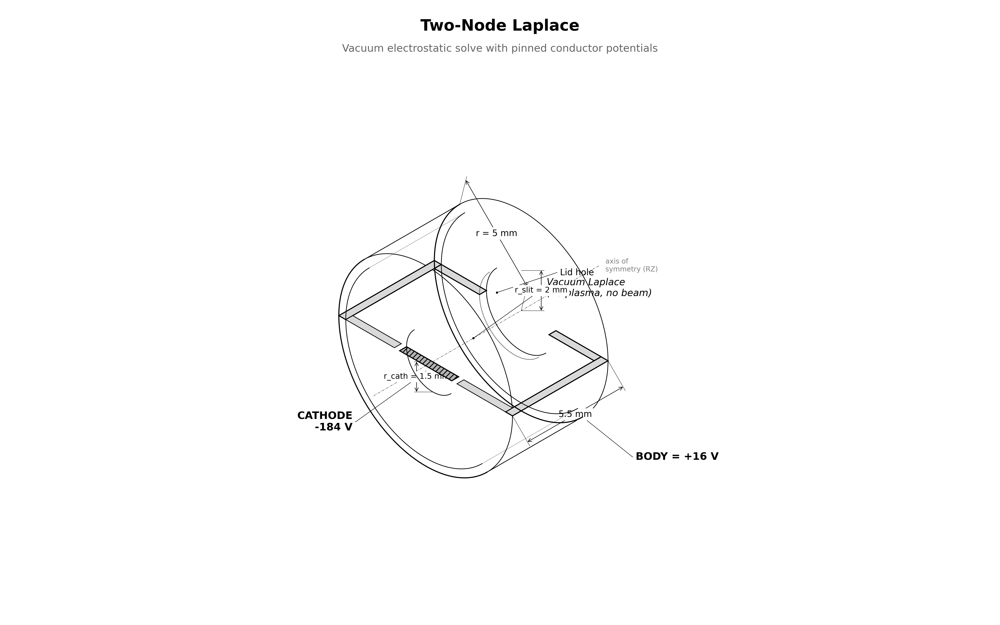
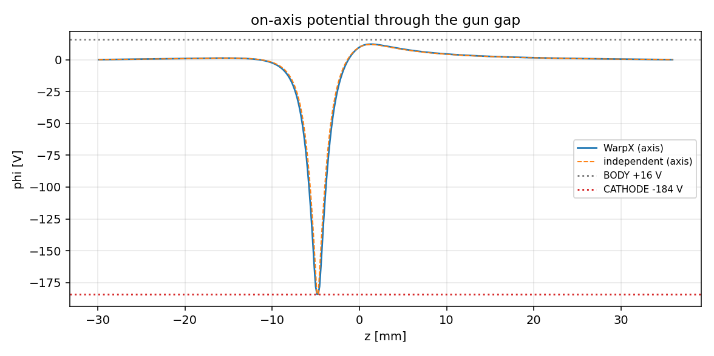

# capstone.two_node_laplace — the can geometry in vacuum

the chipsat's two-node EB geometry solved in vacuum (no particles). BODY at +16 V, CATHODE at −184 V, using the same `set_potential_on_eb` per-step rewrite the capstone uses. proves the vacuum laplace field is correct before any plasma is added.

## setup



- **grid**: capstone's exact grid (200 × 440, dx = 0.15 mm)
- **particles**: none
- **solver**: every solve is laplace's equation ($\nabla^2 \varphi = 0$)

## how the pic works

- **no particles**: grid + EB + electrostatic solver only
- **EB init**: boundary starts at uniform 1 V (mirrors capstone's capacitance calibration)
- **two-node imposition**: after-init callback rewrites BODY = +16 V, CATHODE = −184 V via `set_potential_on_eb`
- **per-step**: 5 multigrid solves; re-imposing unchanged potential tests idempotency
- **output**: φ dumped every step; analysis gates surface values, maximum principle, independent solver match, rewrite drift

## results

reference run `20260806T142600Z_f44044c6`, all gates PASS:

| check | measured | target |
|---|---|---|
| body surface potential vs assigned | 0.220 V error | ≤ 1 V |
| cathode surface potential vs assigned | 0 V error | ≤ 1 V |
| maximum principle | 0 V violation | ≤ 0.1 V |
| independent RZ solver | 1.864 V diff | ≤ 4 V |
| per-step rewrite idempotency | 0 V drift | ≤ 1 mV |

the independent solver is a scipy sparse direct factorization with stair-step EB — different representation and solver than warpx. comparison excludes the 3-cell skin near surfaces.

## dependencies

none (leaf step). the capstone requires this stage.

## cost

seconds — five laplace solves, no particles.

## commands

```bash
python simulation.py
python analyze.py --run outputs/<run-id> --policy acceptance.yaml
```

## reference figures

| | |
|---|---|
|  |  |

## validates for capstone

the capstone's exact two-node EB geometry and piecewise `set_potential_on_eb` rewrite — verified in vacuum before plasma is added.

## limitations

- independent solver uses stair-step EB; comparison only meaningful a few cells from surfaces
- EB potential is static here (capstone changes it dynamically via the charge pump)
