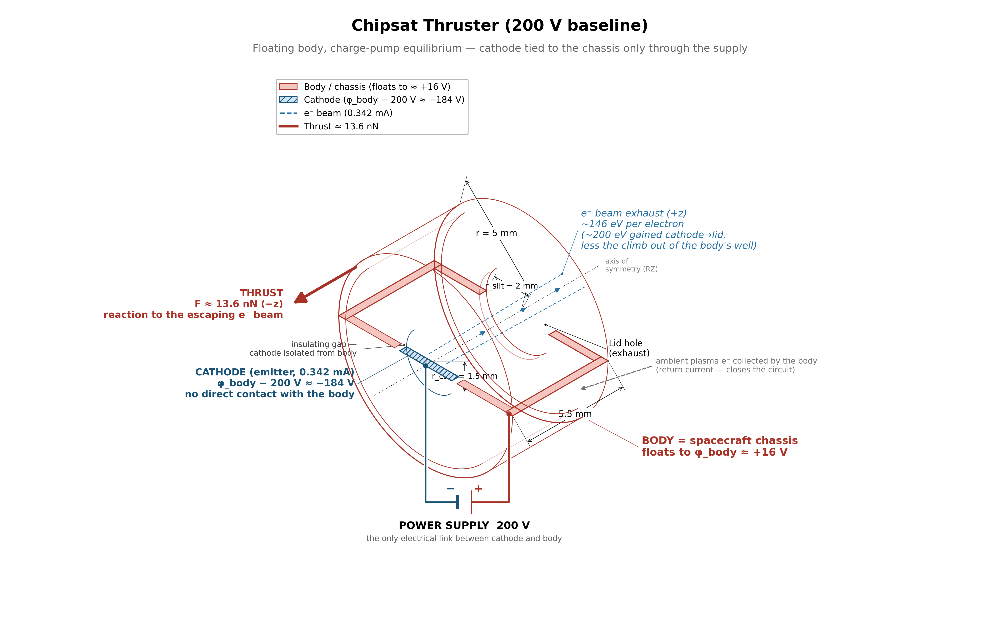
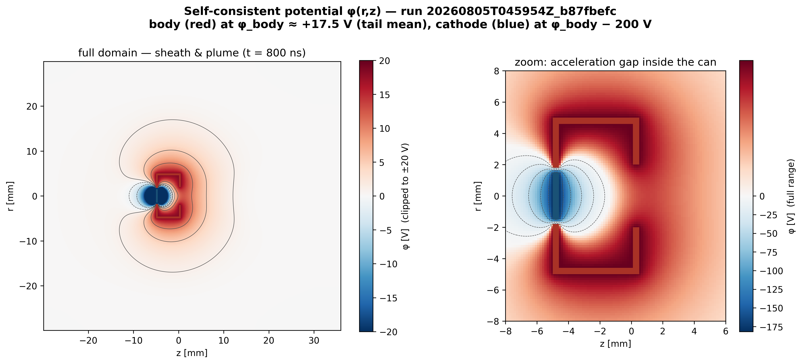

# capstone.floating_body — the chipsat electron thruster

the full chipsat electron thruster in ambient plasma — the capstone the whole ladder builds to. emitter + collector in one self-consistent system: the body floats while the gun fires, and the thruster only works if it floats to a benign potential. thrust is gated directly.

[](viz/20260806T011847Z_5670e54c_dashboard.mp4)

*animated dashboard — click for the full video.*

## setup



- **can**: conducting body, floats electrically in ionospheric plasma
- **plasma**: n0 = 1.627e12 m⁻³, kTe = 113.6 meV, dx = 0.15 mm, ppc = 16
- **beam**: prescribed 0.342 mA, spot r < 0.5 mm, on at 150 ns
- **cathode**: 200 V below body, on at 100 ns
- **grid**: 200 × 440 cells


*the current loop: supply lifts electrons out of cathode → beam carries them to space → ionosphere returns them to the floating body.*

a **reservoir** re-injects every EB-collected ambient particle into the outer radial shell (r > 22.5 mm, every 25 steps).



*self-consistent φ(r,z) from baseline run — shows: (1) φ decays to ≈0 inside domain (containment), (2) two-node pump applied correctly, (3) body floats benignly while 200 V drops inside the can.*

## how the pic works

### species and initialization

- **ambient plasma**: bulk maxwellian fill at $t = 0$, one-sided flux injection from the three open faces (r = rmax, z = zmin, z = zmax) every step — models an infinite ionosphere
- **beam electrons**: prescribed 0.342 mA surface-flux source 2 cells above cathode, on at $t = 150$ ns. flux-maxwellian (not space-charge-limited): the emitter stages validated that the gun transmits at this current
- **field solve**: electrostatic poisson (multigrid) every step, two-node embedded boundary — BODY (wall + lid + floor annulus) and CATHODE (central emitter disk), separated by a ≥ 2-cell insulating gap

### self-capacitance calibration

the EB starts at a uniform 1 V with no particles. the init solve gives a pure laplace solution, and gauss' law on the domain faces yields the body's self-capacitance:

$$C = -\int \rho\,dV \;-\; \varepsilon_0 \oint \nabla\varphi \cdot d\mathbf{A}$$

for the baseline geometry, $C \approx 1$ pF (close to the isolated-sphere scale $4\pi\varepsilon_0 r_p$). $C$ is measured once — it is a geometric property of the conductor, independent of what charge accumulates later.

### charge pump — how the body potential evolves

the body is electrically floating: no wire to ground. every step, particles hit or leave the body, changing its net charge $Q$. four current channels drive $Q$:

| channel | what happens | effect on $Q$ |
|---|---|---|
| beam escape | beam electrons leave the domain (+z, +r) | $+e$ per escaped electron (body loses negative charge) |
| beam scrape | beam electrons return to cathode or body | internal to the supply loop — no net $\Delta Q$ |
| ambient $e^-$ collection | ionospheric electrons hit the body | $-e$ per collected electron |
| ambient $i^+$ collection | ionospheric ions hit the body | $+e$ per collected ion |

per-step charge accounting (transcribed from the validated deck):

$$dQ = e\,(\Delta W_{\text{beam}} + w_{\text{escape}}) - e\,w_{\text{amb},e} + e\,w_{\text{amb},i}$$

where $\Delta W_{\text{beam}}$ is the change in in-domain beam weight (emission minus all scraping) and $w$ are scraped macro-weights. the supply is an internal EMF, so beam returning to any surface (cathode or body) is captured by $\Delta W_{\text{beam}}$ — only escape is a permanent loss.

the potential update each step:

$$\varphi_{\text{body}} = \varphi_0 + \frac{Q}{C}$$

the cathode tracks the body at a fixed offset once the supply turns on ($t \geq 100$ ns):

$$V_{\text{cathode}} = \varphi_{\text{body}} + V_{\text{offset}} \quad (V_{\text{offset}} = -200\ \text{V})$$

both are rewritten every step via `set_potential_on_eb`.

### floating equilibrium — why the body settles

the beam carries electrons away → body charges positive → $\varphi_{\text{body}}$ rises. a positive body attracts ambient electrons and repels ions, increasing the return current. the body floats to the potential where the currents balance:

$$I_{\text{beam,escape}} = I_{\text{amb},e} - I_{\text{amb},i}$$

this is the same physics as a langmuir probe at floating potential, but with an additional beam source. for this config, the body settles at $\varphi_{\text{body}} \approx +17$ V (a few $kT_e$ above plasma potential). the equilibrium is independent of $C$ — capacitance only sets the RC timescale to reach it.

### reservoir — infinite ionosphere in a finite box

the floating equilibrium is a current balance and must not deplete the finite domain. every EB-collected ambient particle (electron or ion) is banked, and every 25 steps the banked weight is re-injected as fresh maxwellians into the outer radial shell ($r > 22.5$ mm). this preserves the infinite-ionosphere boundary condition.

### thrust measurement

$$F_{\text{beam}} = \sum_{\text{escaped}} m_e \, w \, u_z$$

summed over beam macroparticles that exit through the $z_{\text{hi}}$ and $r_{\text{hi}}$ boundaries. this is the reaction force: the spacecraft pushes electrons out, the electrons push back. mean exhaust kinetic energy is computed from the escaped velocity distribution. currents and fates are logged to `contactor_log.csv` every 100 steps.

### watchdogs

- non-finite $\varphi_{\text{body}}$ → immediate FAILED
- $\varphi_{\text{body}} > 100$ V sustained for 50 ns → FAILED (the ionosphere cannot neutralize this current)

## results

reference run `20260801T142601Z_2f822a95`, all 8 gates PASS:

| check | measured | target | type |
|---|---|---|---|
| escape fraction | 98.44% | ≥ 95% | regression |
| beam thrust | 13.65 nN | 13.6 ± 2.04 nN | regression |
| body float | +16.98 V | +16 ± 4 V | regression |
| exhaust KE | 147.5 eV | — | reported |
| current balance | 3.2% | ≤ 5% | theory |
| edge potential | 38 mV | ≤ 1 V | containment |
| scrape consistency | 3e-9 | ≤ 2% | ledger vs dump |

regression anchors from validated float200 run — disclosed calibration.

## dependencies

`emitter.holed_anode` + `collector.biased_10v`. config hash-verified against `collector.thermal`.

## cost

~6 h. 159k steps, dt ≈ 5.0 ps, 200 × 440 grid, ~3 M macroparticles.

## commands

```bash
python simulation.py
python analyze.py --run outputs/<run-id> --policy acceptance.yaml
python animate.py --run outputs/<run-id>
```

## limitations

- 800 ns is finite-time equilibrium; ion-clock tail still moving
- ppc_beam = 16 (emitter steps validated at 128)
- single grid/PPC/seed; EB staircase at 0.15 mm; reduced ion mass 400 mₑ
