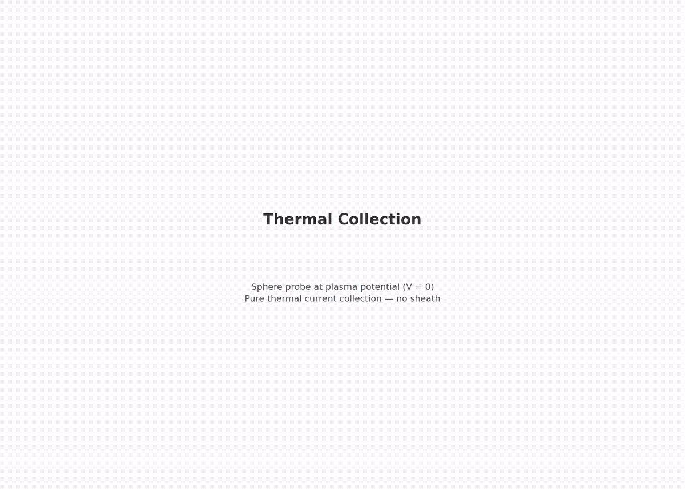

# collector.thermal: sphere at plasma potential

A sphere at 0 V collects thermal current from the capstone plasma. This checks the capstone's numerical setup (grid, ppc, plasma, flux injection) against the exact thermal-flux law.

[](viz/20260806T084611Z_ebb0fae8_dashboard.mp4)

*Animated dashboard. Click for the full video.*

## Setup


- sphere: EB, radius 0.75 mm, held at 0 V
- domain: RZ, filled with capstone plasma
- plasma: n0 = 1.627e12 m⁻³, kTe = 113.6 meV, Ti = 936.2 K, ion mass 400 mₑ
- injection: one-sided Maxwellian flux from three open faces plus bulk fill at t = 0

### Thermal current theory

At plasma potential there is no electric field, so every orbit is a straight line:

$$I_{th} = n_0 \, e \, \frac{\langle v \rangle}{4} \cdot 4\pi a^2 \qquad \frac{I_e}{I_i} = \sqrt{\frac{m_i}{m_e}\cdot\frac{T_e}{T_i}}$$

| quantity | value |
|---|---|
| $I_{th,e}$ | 0.10393 µA |
| $I_{th,i}$ | 4.379 nA |
| $I_e/I_i$ | 23.74 |

| boundary | potential | particles |
|---|---|---|
| r_max, z = ±z_half | 0 V dirichlet | absorbing + flux injection |
| r = 0 (axis) | — | — |
| probe (EB) | 0 V | absorbing |

## How the PIC works

1. t = 0 load: bulk Maxwellian of both species at n0, 16 ppc.
2. Replenishment: one-sided flux-Maxwellian injection from three open faces every step.
3. Field solve: electrostatic Poisson (multigrid) every step, 0 V sphere and walls.
4. Collection: the EB absorbs particles and saves their weights to the scrape buffer.
5. Measurement: collected current = e × scraped weight per window (every 500 steps). Gates average over the last-40% steady window.

## Results

Reference run `20260801T082253Z_ebb0fae8`, all gates PASS:

| check | measured | target |
|---|---|---|
| electron current vs $I_{th}$ | 0.8% off (0.1031 µA) | ≤ 5% |
| ion current vs $I_{th}$ | 1.0% off (4.42 nA) | ≤ 10% |
| species ratio vs 23.74 | 1.7% off | ≤ 8% |
| far-field density vs n0 | 0.3% off | ≤ 5% |
| quasineutrality (far shell) | 0.51% | ≤ 2% |
| edge potential | 2.2 mV | ≤ 0.2 V |

## Dependencies

None. Root stage of the collector branch.

## Cost

~16 min. 50 000 steps × 60 ps = 3.0 µs.

## Commands

```bash
python simulation.py
python analyze.py --run outputs/<run-id> --policy acceptance.yaml
python animate.py --run outputs/<run-id>
```

## Validates for capstone

The capstone's exact numerical setup (plasma params, dx, ppc, flux injection), tested against exact theory before any plasma is added to the thruster.

## Limitations

- EB faceting: at 5 cells/radius, the staircased area is ~1–2% below 4πa²
- RZ r_max injection has a known WarpX over-emission quirk; the far-density gate is the check
- t = 0 spike from particles born inside the sphere; the last-40% window excludes it
- single grid/PPC/seed (phase 5)
