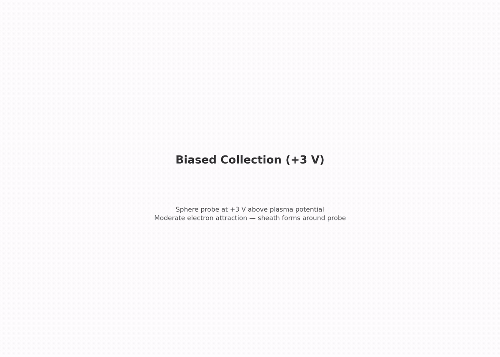

# collector.biased_3v: sphere at +3 V

Same sphere and plasma as `thermal`, biased to +3 V. An attracting sheath forms. Electron current is checked against the OML ceiling.

[](viz/20260806T142605Z_1a87cbce_dashboard.mp4)

*Animated dashboard. Click for the full video.*

## Setup


- sphere: 0.75 mm radius (a/λ_De = 0.38), held at +3 V
- plasma: same as `thermal`
- domain: enlarged to 7.3 λ_De to hold the sheath

### OML theory

$$I_{OML} = I_{th}\,(1 + \chi), \qquad \chi = \frac{eV}{kT_e} = 26.4$$

$$I_{OML} = 0.10393\ \mu\mathrm{A} \times 27.40 = 2.847\ \mu\mathrm{A}$$

OML is a ceiling (Mott-Smith and Langmuir 1926), attained as a/λ_De → 0. At finite radius the fraction falls below it (Laframboise 1966). Measured: 85% of ceiling. The gate is [0.85, 1.05].

## How the PIC works

Same deck as `thermal`. Only the config differs (bias +3 V, larger domain, dt = 30 ps):

1. Bulk Maxwellian fill at t = 0, flux injection from three open faces.
2. Electrostatic Poisson every step; +3 V sphere against 0 V walls.
3. EB collection plus scrape buffer; last-40% steady window.

## Results

Reference run `20260806T142605Z_1a87cbce`, all gates PASS:

| check | measured | target |
|---|---|---|
| electron current vs OML ceiling | 0.852 | [0.85, 1.05] |
| far-field density vs n0 | 3.0% off | ≤ 5% |
| quasineutrality | 0.19% | ≤ 2% |
| edge potential | 2.5 mV | ≤ 0.5 V |

## Dependencies

Requires `collector.thermal`.

## Cost

~1–2 h. 100k steps × 30 ps = 3.0 µs.

## Commands

```bash
python simulation.py
python analyze.py --run outputs/<run-id> --policy acceptance.yaml
python animate.py --run outputs/<run-id>
```

## Validates for capstone

OML electron collection at moderate bias. The capstone body floats positive and collects ambient electrons the same way.

## Limitations

- OML is a ceiling, not an equality at this a/λ_De; the band is a sanity check
- ion current is start-up biased (reported, not gated)
- EB faceting, RZ flux quirk, t = 0 spike: same as `thermal`
- single grid/PPC/seed (phase 5)
