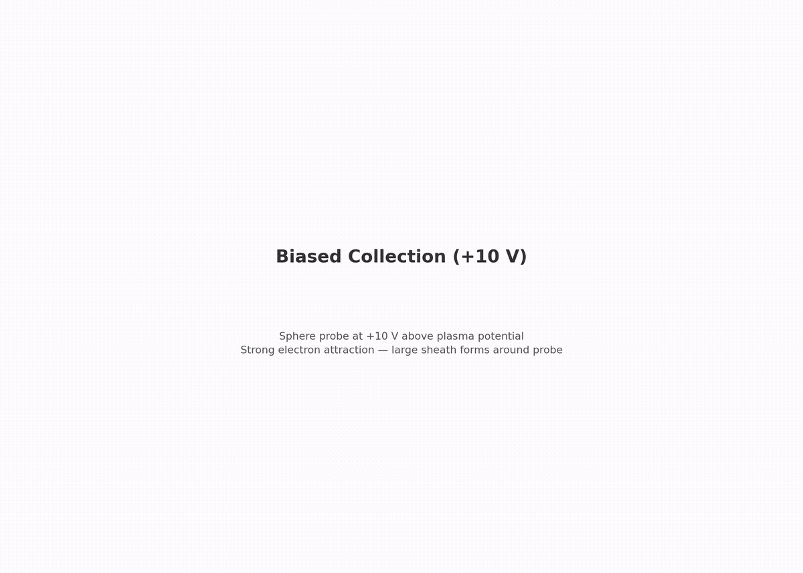
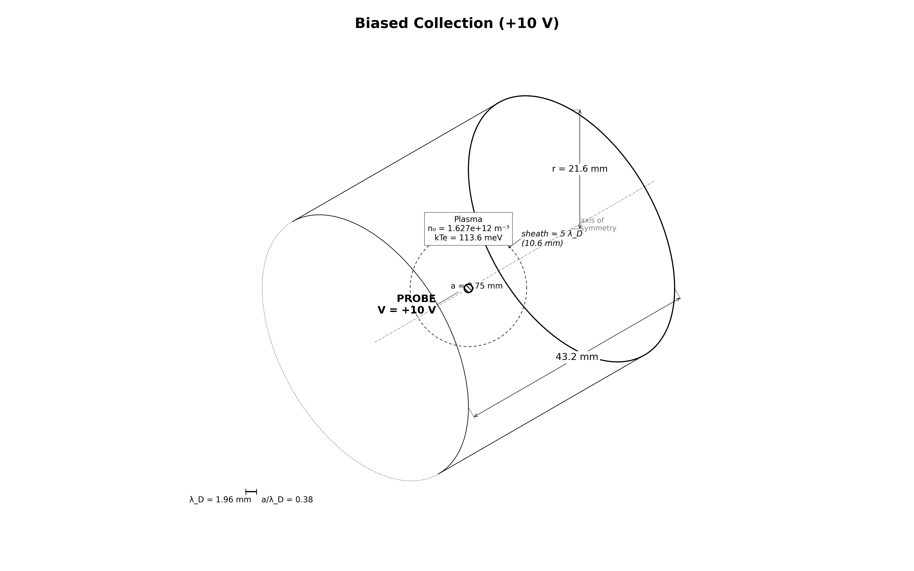

# collector.biased_10v: sphere at +10 V (sheath stress test)

Same sphere and plasma, now at +10 V. The main test is sheath containment: can the domain hold the thick sheath? Electron current is checked against the OML ceiling with a wider floor, since barrier deepening grows with χ.

[](viz/20260806T150359Z_503c1220_dashboard.mp4)

*Animated dashboard. Click for the full video.*

## Setup



- sphere: 0.75 mm radius, +10 V ($\chi = eV/kT_e = 88.0$)
- plasma: same as `thermal`
- domain: largest collector step (11 λ_De). A clipped sheath fakes extra current.

### OML theory

$$I_{OML} = I_{th}\,(1 + \chi) = 0.10393\ \mu\mathrm{A} \times 89.0 = 9.249\ \mu\mathrm{A}$$

## How the PIC works

Same deck as `thermal`. Only the config differs (bias +10 V, largest domain, dt = 20 ps):

1. Bulk Maxwellian fill at t = 0, flux injection from three open faces.
2. Electrostatic Poisson every step; +10 V sphere against 0 V walls.
3. EB collection plus scrape buffer; last-40% steady window.

## Results

Reference run `20260806T150359Z_503c1220`, all gates PASS:

| check | measured | target |
|---|---|---|
| electron current vs OML ceiling | 0.809 | [0.80, 1.05] |
| far-field density vs n0 | 4.6% off | ≤ 6% |
| quasineutrality | 0.40% | ≤ 2% |
| edge potential (the gate to watch) | 2.6 mV | ≤ 0.5 V |

## Dependencies

Requires `collector.biased_3v`.

## Cost

~2–4.5 h. 150k steps × 20 ps = 3.0 µs.

## Commands

```bash
python simulation.py
python analyze.py --run outputs/<run-id> --policy acceptance.yaml
python animate.py --run outputs/<run-id>
```

## Validates for capstone

Sheath containment at strong bias. This stress-tests the domain sizing the capstone inherits.

## Limitations

- +4% current drift in the steady window, no stationarity gate yet (phase 5)
- OML is a ceiling; the band is a sanity check
- EB faceting, RZ flux quirk, t = 0 spike: same as `thermal`
- single grid/PPC/seed (phase 5)
