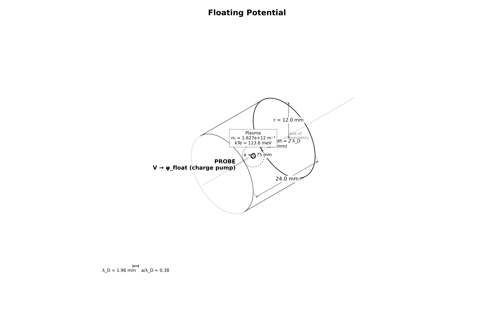

# collector.floating: sphere on the charge pump

Same sphere and plasma, but the EB potential floats using the capstone's charge-pump mechanism. With no beam, the pump drives the sphere to the floating potential, where electron and ion collection balance.

[](viz/20260806T162656Z_40e77ecd_dashboard.mp4)

*Animated dashboard. Click for the full video.*

## Setup



The charge pump:

1. The EB starts at 1 V. The init solve calibrates the self-capacitance C (Gauss' law on the domain faces).
2. Every step, scraped weights give $dQ = e\,(w_i - w_e)$.
3. `set_potential_on_eb` rewrites $\phi = \phi_{init} + Q/C$.

### Analytic references

Let $R = I_{th,e}/I_{th,i} = 23.74$.

| ion model | balance equation | φ_f |
|---|---|---|
| thermal-ion | $\exp(e\phi/kT_e)\cdot R = 1$ | −0.360 V |
| OML-ion | $\exp(e\phi/kT_e)\cdot R = 1 - e\phi/kT_i$ | −0.213 V |

The truth lies between the two. φ_f is independent of C; C only sets the timescale.

## How the PIC works

Same deck as `thermal` (bulk fill plus flux injection), with the charge pump added:

1. Field solve: electrostatic Poisson every step, EB sphere plus grounded walls.
2. C calibration: init solve at uniform 1 V, then a Gauss-law surface integral gives C.
3. Charge pump: per step, $dQ = e\,(w_i - w_e)$ from the EB scrape buffers, then $\phi = \phi_{init} + Q/C$ via `set_potential_on_eb`.
4. Measurement: a CSV ledger records φ, Q, I_e, I_i every 500 steps. Gates check the last-40% steady window.

## Results

Reference run `20260806T162656Z_40e77ecd`, all gates PASS:

| check | measured | target |
|---|---|---|
| floating potential φ_f | −0.251 V | [−0.40, −0.19] V |
| current balance | 0.89% | ≤ 15% |
| capacitance vs $4\pi\varepsilon_0 a$ | 1.068 | [0.8, 1.4] |
| ledger vs openpmd dumps | 2.7e-9 | ≤ 2% |
| far-field density vs n0 | 0.02% off | ≤ 5% |
| quasineutrality | 0.13% | ≤ 2% |
| edge potential | 5.8 mV | ≤ 0.2 V |

## Dependencies

Requires `collector.thermal` (hash-verified config match). The capstone requires this stage.

## Cost

~35 min. 100k steps × 60 ps = 6.0 µs. Pump RC clock: $\tau \approx 1.7\ \mu$s near equilibrium.

## Commands

```bash
python simulation.py
python analyze.py --run outputs/<run-id> --policy acceptance.yaml
```

## Validates for capstone

The charge-pump mechanism (C calibration, per-step dQ, `set_potential_on_eb`). The capstone uses the same code verbatim.

## Limitations

- the φ_f gate is a two-model bracket, not a single-model identity
- reduced ion mass (400 mₑ), not real O⁺
- single grid/PPC/seed (phase 5)
