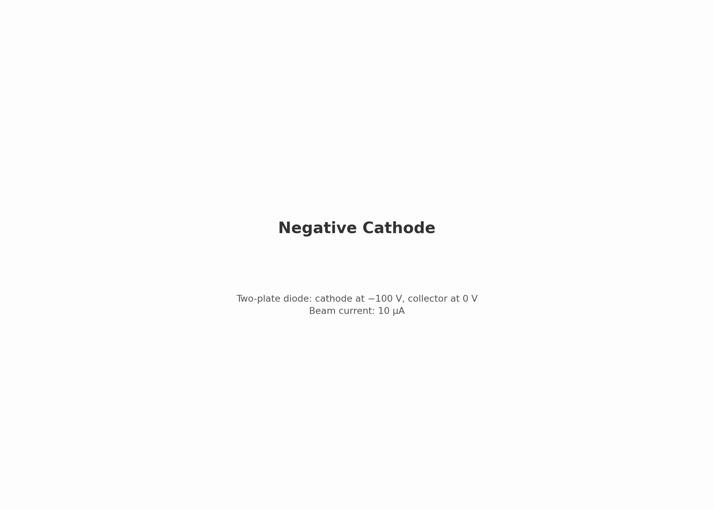

# emitter.negative_cathode — two-plate diode

a −100 V cathode emits a 10 µA electron beam toward a grounded collector. proves emission, acceleration, scraping, and poisson solve are self-consistent — current, energy, and particle budget all close.

[](viz/20260806T073653Z_52a474f6_dashboard.mp4)

*animated dashboard — click for the full video.*

## setup


- **cathode** (z = −2 mm): −100 V, emits prescribed 10 µA beam
- **collector** (z = +2 mm): grounded (0 V), absorbs electrons
- **domain**: RZ, radius 2 mm, 40 × 80 cells (dr = dz = 0.05 mm)
- **beam**: flux-maxwellian from a 0.5 mm disc, ~0.25 eV/axis

| boundary | potential | particles |
|---|---|---|
| z_min (cathode) | −100 V dirichlet | absorbing |
| z_max (collector) | 0 V dirichlet | absorbing |
| r_max (wall) | neumann | absorbing |
| r = 0 (axis) | — | — |

## how the pic works

- **emission**: prescribed flux $\Phi = I / (e \, \pi r_c^2)$ from disc ($r < 0.5$ mm), flux-maxwellian momenta, 128 macroparticles/cell/step
- **field solve**: electrostatic poisson (multigrid) every step, self-consistent space charge
- **push**: shape-1 gather/deposit, dt = 1.5 ps ($v_{max}\,dt \approx 0.18\,dz$)
- **scraping**: absorbing walls, per-surface scraped counts dumped every 80 steps
- **diagnostics**: $\phi$/$\rho$ field dumps + reduced particle diagnostics every 80 steps

## results

reference run `20260801T075244Z_52a474f6`, all gates PASS:

| check | measured | target |
|---|---|---|
| vacuum potential (on-axis φ vs laplace) | 0.035 mV error | ≤ 10 mV |
| arrival energy | 0.028 eV error | ≤ 0.5 eV |
| beam transmission | 100.02% | ~100% |
| cathode return | 0 | ≤ 1e-4 |
| radial wall loss | 3e-7 | ≤ 1e-4 |
| particle budget | 7.5e-4% | ≤ 0.1% |
| space-charge dip | 0.092 V | 0.092 ± 0.04 V* |

*regression target measured from baseline (1D estimate brackets 0.04–0.09 V).

## dependencies

none — root stage.

## cost

~3 min. 4000 steps × 1.5 ps = 6.0 ns.

## commands

```bash
python simulation.py
python analyze.py --run outputs/<run-id> --policy acceptance.yaml
python animate.py --run outputs/<run-id>
```

## validates for capstone

poisson solve, prescribed emission, scraping, and energy/budget conservation — all reused with identical mechanics in the capstone deck.

## limitations

- single grid resolution, PPC, and seed — no convergence study (phase 5)
- emission is prescribed, not self-limiting
- no apertures, sheaths, or embedded boundaries (later steps)
