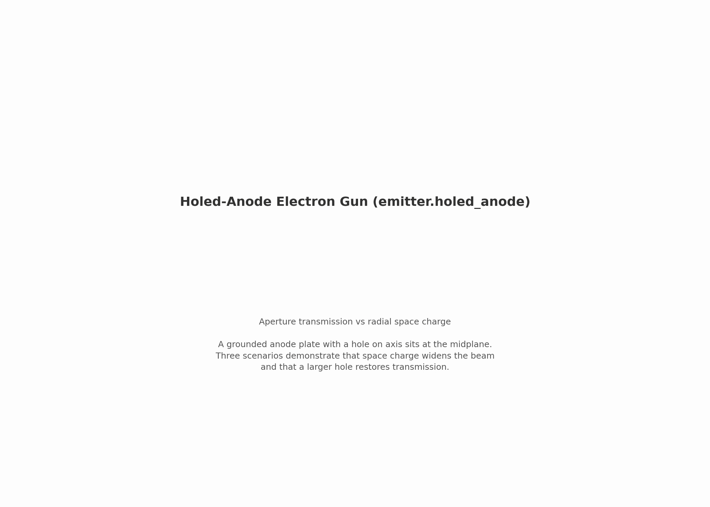
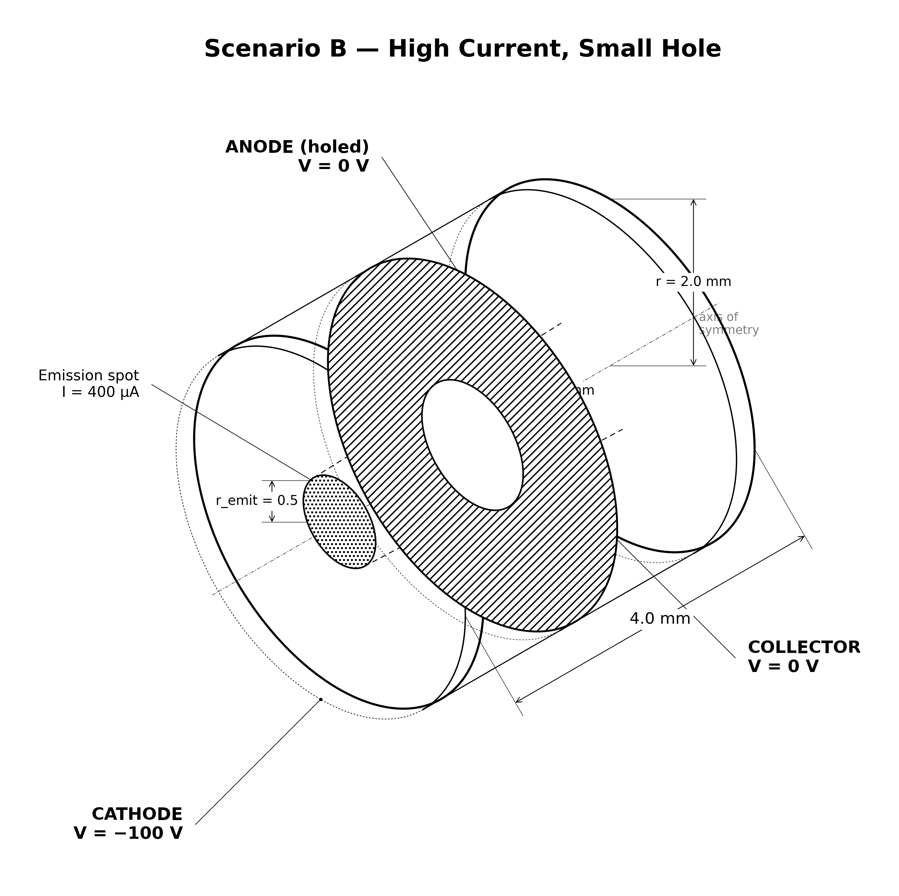
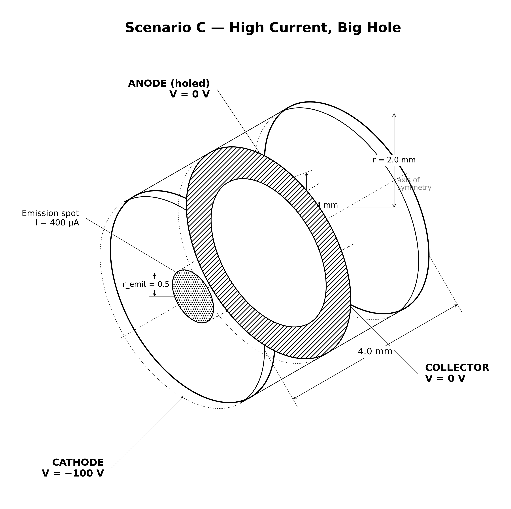

# emitter.holed_anode: electron gun with aperture

Same diode as `negative_cathode`, plus a grounded plate with a hole (embedded boundary). Three scenarios:

1. (A) a small hole transmits a low-current beam
2. (B) space charge at 40× current blows the beam into the plate
3. (C) a wider hole restores transmission, so the aperture, not the physics, was the limiter

[](viz/20260806_20260806_20260806_dashboard.mp4)

*Animated dashboard. Click for the full video.*

## Setup

| scenario A | scenario B | scenario C |
|---|---|---|
|  |  |  |

1. Cathode (z_min): −100 V, prescribed beam.
2. Anode plate (z ∈ [−0.1, +0.1] mm, r > hole radius): grounded EB.
3. Collector (z_max): grounded.
4. The three scenarios run as separate WarpX processes.

| scenario | current | hole radius | what happens |
|---|---|---|---|
| A — low current, small hole | 10 µA | 0.7 mm | beam narrow, ~97% transmits; thermal tail clips |
| B — high current, small hole | 400 µA | 0.7 mm | space charge blows beam, significant plate loss |
| C — high current, big hole | 400 µA | 1.4 mm | wider hole restores transmission |

## How the PIC works

1. Emission: prescribed flux-Maxwellian from a 0.5 mm disc, ~0.25 eV/axis, 128 macroparticles/cell/step.
2. Anode plate: implicit-function EB ($z_a < z < z_a + t_a$, $r > r_h$), held at 0 V. It is both electrode and absorber.
3. Field solve: electrostatic Poisson (multigrid) every step, self-consistent space charge with Dirichlet plates and EB.
4. Push: shape-1 gather/deposit, dt = 1.5 ps.
5. Scraping: per-surface counts (cathode, collector, wall, anode plate) dumped every 80 steps.

## Results

Reference run `joint_5e72702e`, all gates PASS:

| check | A | B | C | target |
|---|---|---|---|---|
| collector fraction | 97.3% | 90.0% | 100.0% | A ≥ 96%, C ≥ 98% |
| anode clip | 2.7% | 10.0% | ~0 | A ≤ 4% |
| KE error (eV) | −0.025 | −0.025 | 0.022 | ≤ 1.5 |
| budget closure (%) | 7.5e-4 | 7.5e-4 | 7.5e-4 | ≤ 0.1 |

B→A collector drop: 7.3 pp (target ≥ 3 pp). B→C anode reduction: 10.0 pp.

## Dependencies

Requires `emitter.negative_cathode`.

## Cost

A ~3 min. B and C are heavier (40× more particles). Total ~10 min.

## Commands

```bash
python simulation.py --scenario A_low_current_small_hole
python simulation.py --scenario B_high_current_small_hole
python simulation.py --scenario C_high_current_big_hole

python analyze.py --runs outputs/<A-run> outputs/<B-run> outputs/<C-run> \
    --policy acceptance.yaml
```

## What it validates for the capstone

Embedded-boundary aperture and beam transmission through a hole. The capstone's can lid has the same geometry.

## Limitations

- single grid/PPC/seed (phase 5)
- anode plate is a staircased EB at 0.05 mm; sub-cell aperture-edge effects not resolved
- A's plate clip is the thermal tail (~2–3%), not a cold-beam prediction; the gate was calibrated from the first run
