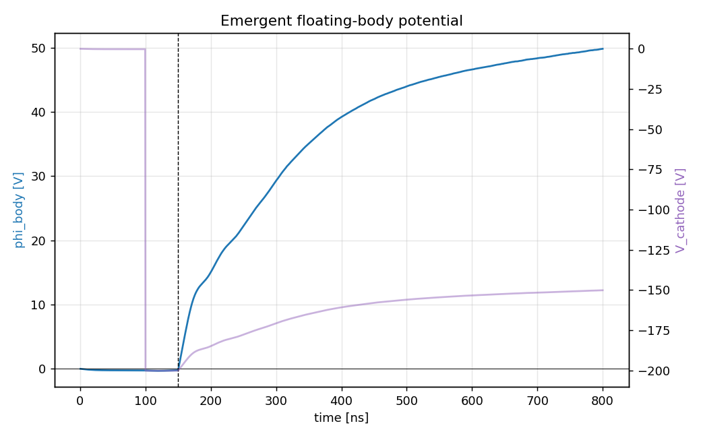

# characterization.magnetized_10x — field-aligned B at 10× LEO

same system as the anchor with the axial field **overdriven to 10× flight strength**, Bz = 300 µT. tier M1b of `../MAGNETIZED_PLAN.md`, which pre-registered H-M1-tax before the run: overdriving the axial field locates the mechanism that eventually bites.

## setup

| | anchor (floating_body) | this spoke |
|---|---|---|
| `plasma.Bz_T` | absent (unmagnetized) | **3.0e-4** |
| everything else | — | identical |

at 300 µT the ambient thermal electrons are strongly magnetized (gyroradius ≲ the can radius) — cross-field collection onto the skin is throttled while the stiff 200 V beam barely notices.

## how the pic works

same engine as the anchor — deck, charge pump, reservoir, observer identical (`../../ladder/capstone/2_chipsat_thruster/README.md`). the Boris pusher rotates in the prescribed uniform Bz; nothing else changes.

## results

reference run `20260810T131955Z_0b81e70a`, all 6 required gates PASS. under the exploratory policy φ and F **are** the measurement — reported, not gated:

| check | measured | target | type |
|---|---|---|---|
| escape fraction | 98.32% | ≥ 95% | required |
| current balance | 2.9% | ≤ 5% | required |
| net-force sanity | 0.003 | ≤ 1 | required |
| edge potential | 141 mV | ≤ 1 V | required |
| scrape ledger vs dumps | 7.0e-10 | ≤ 2% | required |
| beam-escape ledger vs dumps | 1.1e-9 | ≤ 2% | required |
| body float φ | **+48.63 V** (tail mean, **still climbing**; anchor: 16.98 V) | — | reported |
| beam thrust | **12.06 nN** (−11%; anchor: 13.65 nN) | — | reported |
| exhaust KE | **115.9 eV** (KE = κ(V − φ) predicts 116.5) | — | reported |

**H-M1-tax confirmed, entirely through the float**: beam formation is unharmed (escape essentially unchanged), but the magnetized skin collects less effectively, the float rises ~+33 V, and the thrust loss follows KE = κ(V − φ) exactly. the tax is a *collection* effect, not a gun effect. the caveat travels with the number: the float had not settled at 800 ns, so +33 V is a **lower bound** on the settled tax at this field. full detail: `reference_results/20260810T131955Z_0b81e70a/REFERENCE.md`.



## provenance

executed 2026-08-10 as a variant deck through the anchor stage under the pre-registered exploratory policy `capstone.exploratory_axes.v1` (strictly sequential after M1a on one GPU, 12.8 h total); the frozen run config and manifests therefore carry `stage_id: capstone.floating_body`. `outputs/20260808T130307Z_0b81e70a` is an earlier launch of the same deck with no gated result (superseded). this `config.yaml` is that same deck (git-moved, history intact) under the new stage id; `acceptance.yaml` re-identifies the same gates for future runs — it is not a pre-registration for the migrated evidence. launch record: `logs/`.

## dependencies

requires `capstone.floating_body` (the anchor). spokes never depend on each other.

## cost

~6.4 GPU-h. 159k steps, dt ≈ 5.0 ps, 200 × 440 grid. CUDA build required (`/SETUP.md`).

## commands

```bash
python simulation.py
python analyze.py --run outputs/<run-id> --policy acceptance.yaml
```

## limitations

- float unsettled at 800 ns — the +33 V tax is a lower bound, not a settled value
- overdriven field point: 10× is a mechanism probe, not a flight condition
- field-aligned geometry only — tier M2 transverse remains open
- anchor limitations inherited: single grid/PPC/seed, reduced ion mass 400 mₑ
