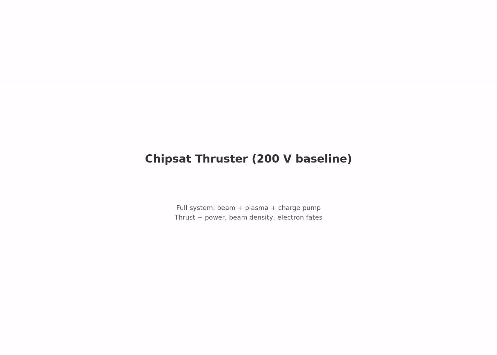

# characterization.slender_body — the geometry axis

same drive and commanded current as the anchor, but the can lengthened from Ø10 × 5.5 mm to **Ø10 × 30.5 mm** (L/r = 6, total skin 3.17 → 11.0 cm²). identical demand makes the run a clean A/B against the anchor: the only physics change is where and how the return current is collected.


*to-scale cutaways (`viz/size_comparison.py`, data-driven from the two `config.yaml`s and the reference run's `metrics.json`). the gun assembly sits at identical z in both decks — the `cathode_standoff` pedestal keeps the 4.7 mm gap while the body grows around it.*

[](viz/20260806T011847Z_5670e54c_dashboard.mp4)

*reference-run dashboard (click through for the mp4).*

*(this file also carries the stage's plan, amendment and result record — formerly `SLENDER_BODY_PLAN.md`, unified 2026-08-11; the pre-run pre-registration is preserved verbatim in that file's git history.)*

## plan — pre-registered 2026-08-05, before the run

all committed runs share one squat-can geometry. drag buys the ram silhouette; collection and solar power buy the skin — so slender bodies are the up-mass scaling path (paper §"the geometry lever"). but the collection exponent is geometry-dependent by theory (OML: sphere α = 1, long cylinder α = 0.5; the can measured 0.82–0.89, between the limits), so the fitted law must not be extrapolated to slender bodies. one run opens the axis. at fixed escaped current (~0.337 mA), where does the float settle?

| hypothesis | form | predicted φ |
|---|---|---|
| A — area-only scaling | can's fitted α ≈ 0.89 holds; enhancement demand drops 3.24× | **≈ 4–5 V** |
| B — cylinder-limit lateral | lateral wall collects at α ≈ 0.5, caps at can-like α | **tens of volts**, possibly above the 50 V benign gate |

the hypotheses differ by nearly an order of magnitude in φ — strongly discriminable by a single gated run. B failing benignly would itself be design-critical: slender bodies would pay a charging tax the area argument hides. acceptance: same gate family as the frontier stages; the hypothesis discrimination is reported as a finding, not a gate — a hypothesis-B float above 50 V is a valid, publishable outcome.

## first attempt — 2026-08-05, killed by design flaw (amendment, not rewrite)

the naive deck (`z_bot: -30 mm`, all else inherited) ran as `20260805T190609Z_f59e228b` and was **killed at 69% by operator decision**. the flaw: the anchor deck ties the cathode disk to the can floor, so lengthening the can stretched the **gun gap** from 4.7 mm to ~30 mm. Child–Langmuir scales as 1/d², putting the commanded 0.342 mA at ~60× the long gap's space-charge ceiling: the beam blew open over the drift and self-scraped. interim ledger at 532 ns (informal — no COMPLETE manifest, NOT citable evidence): 91.1% of the beam to the body, 7.9% escape, F ≈ 1.19 nN, φ ≈ 0.3 V. the A/B hypotheses were never tested by it.

the design rule it establishes (derivable from the measured emission-ceiling law, no citation of the dead run needed): **grow the body around the gun, never stretch the gun** (`/CAMPAIGN.md` §4.1, §6.5). the fix — a `geometry.cathode_standoff` parameter decoupling the cathode from `z_bot` — was committed (`a7f4106`) before the production relaunch, so provenance stays clean. the pre-registered hypotheses and acceptance carried over unchanged.

## setup

| | anchor (floating_body) | this spoke |
|---|---|---|
| `z_bot` | −5.0 mm | **−30.0 mm** |
| `cathode_standoff` | floor-tied | **4.7 mm** |
| grid | 200 × 440 | **200 × 608** (~122k cells) |
| everything else | — | identical |

the standoff pins the gun gap at 4.70 mm while the body grows around it: demand/ceiling 1.457, matching the anchor's 1.46.

## how the pic works

same engine as the anchor — deck, charge pump, reservoir, observer identical (`../../ladder/capstone/2_chipsat_thruster/README.md`). only the conductor geometry differs.

## results

reference run `20260806T011847Z_5670e54c` (159,160 steps, 800 ns), all 6 required gates PASS. under the exploratory policy φ and F **are** the measurement — reported, not gated:

| check | measured | target | type |
|---|---|---|---|
| escape fraction | 98.42% | ≥ 95% | required |
| current balance | 2.0% | ≤ 5% | required |
| net-force sanity | 0.014 | ≤ 1 | required |
| edge potential | 21 mV | ≤ 1 V | required |
| scrape ledger vs dumps | 2.6e-10 | ≤ 2% | required |
| beam-escape ledger vs dumps | 7.5e-10 | ≤ 2% | required |
| body float φ | **+4.38 V** (tail mean) | — | reported |
| beam thrust | **14.22 nN** | — | reported |
| exhaust KE | **159.7 eV** (KE = κ(V − φ) predicts 160.5) | — | reported |

**hypothesis A confirmed, B refuted by ~10×.** the area arithmetic brackets it: 4.66 V at α = 0.893, 4.14 V at α = 0.82 — the can's fitted collection exponent survives a 3.24× area change and an aspect-ratio change from L/r ≈ 1.1 to 6. the theoretical worry that motivated the stage — sliding toward the long-cylinder OML limit and paying a hidden charging tax — did not materialise at L/r = 6.

settle caveat, as pre-registered: φ still rises at run end (+3.7/+4.7/+7.3/+4.4 mV/ns over 400–600/600–700/700–750/750–800 ns), so quote **~5–6 V settled** as a band. the discrimination is robust to this — the hypothesis separation is an order of magnitude.

**the design consequence, which is the point of the stage:** at identical drive and commanded current, the slender can floats 3.9× lower (4.38 vs 16–17.7 V), holds escape at 98.42%, and produces *more* thrust (14.22 vs 13.65 nN, KE 159.7 vs ~147 eV) — because less of the 200 V is lost to the float, and drag still charges only for the unchanged ram silhouette. elongation is free on the thrust side and strictly favourable on the charging side: the measured basis for the paper's "geometry lever". full detail: `reference_results/20260806T011847Z_5670e54c/REFERENCE.md`.


## what it opens

- the geometry-split collection law in `model/minimal_model.py` (`I = β_cap·A_cap·(1+χ)^α_cap + β_lat·A_lat·(1+χ)^α_lat`), letting the model sweep aspect ratio the way it sweeps voltage
- slender-body mission rows (rod/plate designs at 400–500 km) move from flagged extrapolation to measured envelope
- the r ≲ λ_D end of the axis connects to bare-tether collection (Sanmartín 1993), bridging the device to flown physics

## provenance

executed 2026-08-06 as a variant deck through the anchor stage under the pre-registered exploratory policy `capstone.exploratory_axes.v1`; the frozen run config and manifests therefore carry `stage_id: capstone.floating_body`. this folder's `config.yaml` reproduces that deck (verified against the frozen `config_used.yaml`) under the new stage id; `acceptance.yaml` re-identifies the same gates for future runs — it is not a pre-registration for the migrated evidence. launch record: `logs/`.

## dependencies

requires `capstone.floating_body` (the anchor). spokes never depend on each other.

## cost

~6.5 GPU-h. 159k steps, dt ≈ 5.0 ps, 200 × 608 grid. CUDA build required (`/SETUP.md`).

## commands

```bash
python simulation.py
python analyze.py --run outputs/<run-id> --policy acceptance.yaml
```

## limitations

- float still rising at 800 ns — settled value quoted as a 5–6 V band
- single geometry point: L/r beyond 6, where the OML cylinder limit must eventually bite, is unmeasured; so is the r ≲ λ_D bare-tether end
- anchor limitations inherited: single grid/PPC/seed, reduced ion mass 400 mₑ
