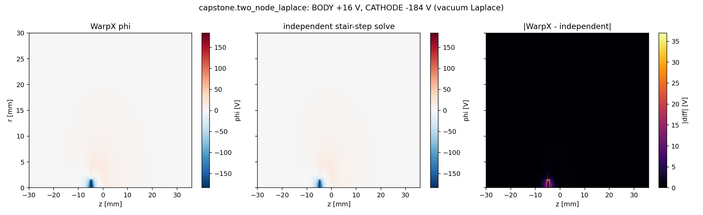

# capstone.two_node_laplace — the can geometry in vacuum


Closes validation gap G1: the piecewise two-node embedded boundary had no ladder step beneath the capstone.

The chipsat's conducting-can geometry, solved in **vacuum** (no particles, no space charge) with both nodes pinned: BODY at +16 V (the capstone's observed equilibrium), CATHODE at −184 V. Uses the same piecewise potential string and the same `set_potential_on_eb` per-step rewrite the capstone's charge pump uses.

## Setup

- **Grid**: the capstone's exact grid (200 × 440, dx = 0.15 mm)
- **Particles**: none
- **Solver**: every solve is Laplace's equation (no charge → exact mathematical properties available as gates)

## What this step tests

| Check | Target |
|---|---|
| Body surface potential vs assigned value | ≤ 1 V error |
| Cathode surface potential vs assigned value | ≤ 1 V error |
| Maximum principle (all vacuum φ within boundary values) | ≤ 0.1 V violation |
| Match with independent RZ finite-difference solver | ≤ 4 V (away from surface skin) |
| Per-step rewrite idempotency (re-imposing same potential) | ≤ 1 mV drift |

Reported, not gated: full-domain solver difference (dominated by cathode-edge stair-step skin), first-solve convergence settling (~6.4 mV), on-axis gap voltage.

### What the independent solver is

A scipy sparse direct factorization with stair-step EB representation — different EB representation and different linear solver than WarpX. The comparison excludes the 3-cell skin near surfaces (the stair-step reference is not accurate there).

## What this step does NOT test

- Plasma, beam, scraping, or the charge pump's dQ accounting (that is `collector.floating` and the capstone)
- Cut-cell field accuracy at the surface (stair-step reference is not accurate there)
- Time-dependent behavior of `set_potential_on_eb` under changing potential (here the values are static)

### Calibration note

The first run was judged under policy v1, which gated the solver comparison at ≥ 3 cells and defined rewrite drift as first-vs-last dump. It failed both, exposing two methodology errors in the analysis (cathode-edge singularity dominates within ~20 cells; first-vs-last captures first-solve convergence, not rewrite drift). v2 fixed the methodology — no tolerance was loosened.

## Dependencies

None (a leaf step). The capstone requires this stage.

## Cost

Seconds — five Laplace solves on a 200 × 440 grid, no particles.

## Commands

```bash
python simulation.py
python analyze.py --run outputs/<run-id> --policy acceptance.yaml
```

## Gates

From `acceptance.yaml` (policy: `capstone.two_node_laplace.v2`):

| Gate | Bound | Why |
|---|---|---|
| `body_surface_potential_error_V` | ≤ 1.0 V | Dirichlet value; 0.5% of scale for cut cells |
| `cathode_surface_potential_error_V` | ≤ 1.0 V | Dirichlet value |
| `laplace_bounds_violation_V` | ≤ 0.1 V | maximum principle (exact for Laplace) |
| `independent_solver_max_diff_V` | ≤ 4.0 V | stair-step error ~ΔV·(dx/2)/gap |
| `per_step_rewrite_drift_V` | ≤ 1 mV | consecutive solves should be identical |

## Reference figures

| | |
|---|---|
|  |  |

## Limitations

- The independent solver uses stair-step EB, so the WarpX-vs-reference comparison is only meaningful a few cells away from surfaces
- The `emit_radius` config key is unused here (no beam) but kept so the geometry hash matches the capstone's exactly
