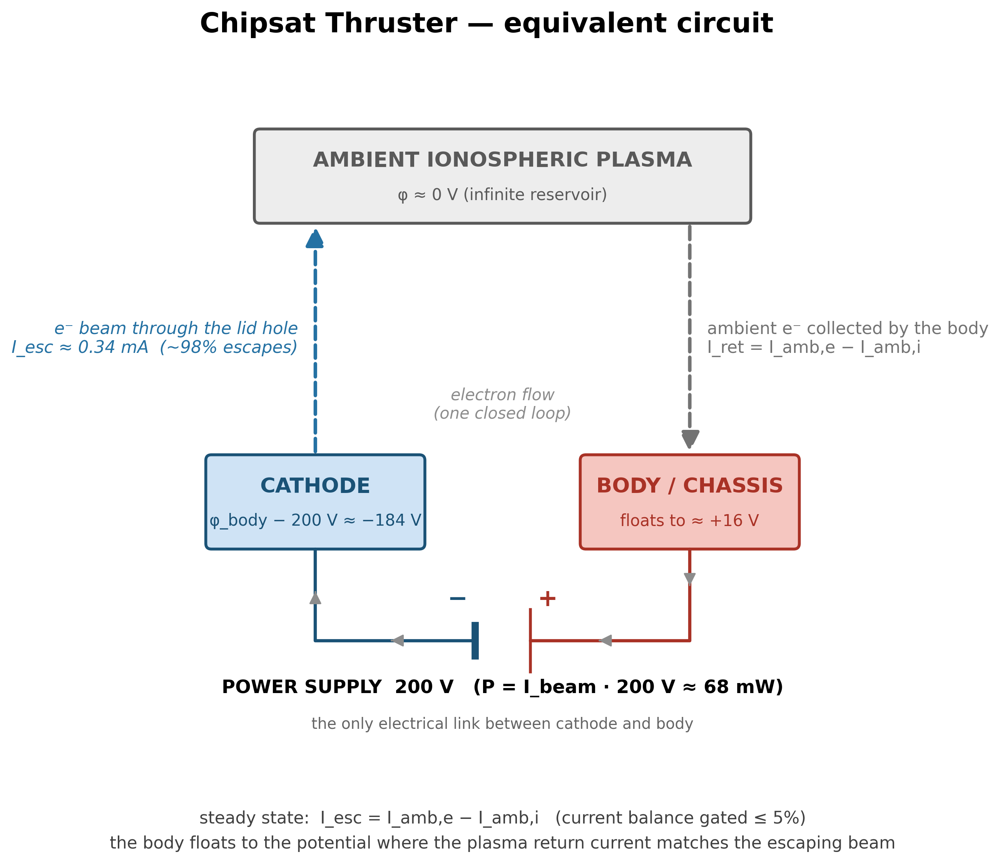

# capstone.floating_body — the chipsat electron thruster


The top step — the thruster test itself. Emitter + collector physics in one self-consistent system. The body floats while the gun fires; the thruster only works if it floats to a benign potential. Thrust is gated directly.

Migrated from the validated float200 baseline of the `electron_contactor` project (see `MIGRATION_PLAN.md`; validation audit in `VALIDATION_GAPS.md`).

## Setup

```
      r=0 (axis)                         r_probe = 5 mm
  z=+0.5 +---hole----+------------------+   <- lid (BODY): washer r in [2.0, 5.0] mm
         |  r_slit   |                  |
         |           ^ beam (+z)        |   <- can wall (BODY)
  z=-5.0 +--CATHODE--+  gap  +----------+   <- floor: cathode disk r < 1.5 mm
         | phi_body - 200 V  |  BODY    |      + body floor annulus,
         +-----------+---+---+----------+      >= 2-cell insulating gap between nodes
```

- **Can**: conducting body that floats electrically in the capstone ionospheric plasma
- **Plasma**: same as collector steps (n0 = 1.627e12 m⁻³, kTe = 113.6 meV, dx = 0.15 mm, ppc = 16)
- **Beam**: prescribed 0.342 mA, spot r < 0.5 mm, turns on at 150 ns
- **Cathode**: held 200 V below the body (turns on at 100 ns)
- **Grid**: 200 × 440 cells

### How the floating-body charge pump works

1. Self-capacitance C measured once from the uniform-1 V init solve (Gauss' law on domain faces; C ≈ 0.5–1 pF, analytic scale 4πε₀r_p = 0.556 pF)
2. Every step: net scraped charge → dQ = e·(dW_beam + beam_escape) − e·amb_e_coll + e·amb_i_coll, then φ_body = φ0 + Q/C
3. The two-node EB potential (BODY = φ_body, CATHODE = φ_body − 200 V) is rewritten every step via `set_potential_on_eb`



*The current loop as a circuit: the supply lifts electrons out of the cathode, the beam carries them to space, and the ionosphere returns them to the floating body. Regenerate with `python viz/circuit.py`.*

A **reservoir** re-injects every EB-collected ambient particle into the outer radial shell (r > 22.5 mm, every 25 steps) to maintain the plasma supply.

### What's included

RZ electrostatic, three species, EB scraping, plume — all self-consistent.

### What's excluded

Ram drift, applied Bz, exit shroud, pinned-probe mode, checkpoint/restart, real-mass O⁺ (mi = 400 mₑ ladder-wide).

## What this step tests

| Check | Target | Type |
|---|---|---|
| Escape fraction | ≥ 95% (anchor 98.5%) | regression |
| Beam thrust | 13.6 ± 2.04 nN | regression |
| Body floating potential | +16 ± 4 V | regression |
| Current balance | ≤ 5% | theory (steady-state identity) |
| Momentum sanity | \|F_net\| ≤ F_beam | theory |
| Edge potential | ≤ 1 V | containment |
| Charge cross-check (ambient) | ≤ 2% | ledger vs openPMD |
| Charge cross-check (beam escape) | ≤ 2% | ledger vs openPMD |

Reported, not gated: mean exhaust KE (~146 eV), energy ledger, late dφ/dt, far-shell density.

### About the regression anchors

The escape, thrust, and float targets were read from the validated float200 run — disclosed calibration, not independent predictions. See `VALIDATION_GAPS.md`.

## What this step does NOT test

- The regression anchors themselves (they come from the same system)
- Stationarity of the 800 ns plateau (finite-time equilibrium on the ion clock — Phase 5)
- Grid/PPC/seed convergence (Phase 5)
- Real O⁺ physics

## Dependencies

`emitter.holed_anode` and `collector.biased_10v` (the two branch tips). Cross-stage check `capstone_inherits_validated_configuration` verifies plasma/dx/ppc hash-match with `collector.thermal`.

## Cost

~6 h. 159 160 steps at dt ≈ 5.0 ps (t_end 800 ns), 200 × 440 grid, ~3 M ambient macroparticles. The deck is callback-bound: the per-step Python observer forces a host-device round-trip every step.

## Commands

```bash
python simulation.py
python analyze.py --run outputs/<run-id> --policy acceptance.yaml
python animate.py --run outputs/<run-id>

# figures (all take --dpi and --format png|pdf|svg)
python viz/schematic.py        # color cutaway with circuit + thrust vector
python viz/circuit.py          # equivalent-circuit diagram
python viz/potential_map.py    # phi(r,z) map from outputs/LATEST (or --run)
```

A CHOKED run (φ_body > 100 V sustained 50 ns) or non-finite φ_body aborts as FAILED. No checkpoint/restart — interrupted runs are rerun from scratch.

## Gates

From `acceptance.yaml` (policy: `capstone.floating_body.v2`):

| Gate | Bound | Why |
|---|---|---|
| `escape_fraction_pct` | ≥ 95% | float200 regression (anchor 98.5%) |
| `f_beam_nN` | 13.6 ± 2.04 nN | float200 regression |
| `phi_body_V` | +16 ± 4 V | float200 regression |
| `current_balance` | ≤ 0.05 | steady-state identity |
| `f_net_over_f_beam` | ≤ 1.0 | momentum bound |
| `edge_phi_max_V` | ≤ 1.0 V | sheath/plume containment |
| `scrape_charge_consistency` | ≤ 0.02 | ambient-e ledger vs dump (gap G5) |
| `scrape_charge_consistency_beam_escape` | ≤ 0.02 | beam-escape ledger vs dump (gap G5) |

## Dashboard

[](viz/20260806T011847Z_5670e54c_dashboard.mp4)

*Animated dashboard — click for the full video.*

### Potential map


*Self-consistent φ(r,z) from the last field dump — an illustration of three gated/claimed facts, not a gate itself: (1) φ decays to ≈0 well inside the domain (the containment gate — escapes are genuine, not a clipped sheath); (2) the two-node charge pump is really applied (body at φ_body, cathode exactly 200 V below); (3) the craft floats benignly, perturbing the plasma by only a few volts, while the full 200 V drops inside the can's acceleration gap (right panel). Rendered from `20260805T045954Z_b87fbefc` (baseline deck at ppc = 32; φ_body tail ≈ +17.5 V, inside the +16 ± 4 V gate). Regenerate with `python viz/potential_map.py --run outputs/<run-id>` (defaults to `outputs/LATEST`, which may be an exploratory variant — the run id and geometry in the figure are the ground truth).*

## Results

Reference run `20260801T142601Z_2f822a95` (~6 h), all 8 gates PASS:

| Metric | Measured | Anchor |
|---|---|---|
| Escape | 98.44% | ~98.5% |
| Thrust | 13.65 nN | 13.6 nN |
| φ_body | +16.98 V | +16 V |
| Exhaust KE | 147.5 eV | ~146 eV |
| Current balance | 3.2% | — |
| Edge |φ| | 38 mV | — |
| Ledger consistency | 3e-9 | — |

## Limitations

- 800 ns is a finite-time equilibrium: the ion-clock tail is still moving (late dφ/dt reported; Phase 5 adds stationarity gating)
- ppc_beam = 16 (the emitter steps validated emission at 128) — gap G3
- Single grid/PPC/seed; EB staircase at 0.15 mm; reduced ion mass 400 mₑ
- `max_steps` is floored to a diag-period multiple (−11 steps vs contactor baseline ≈ −0.06 ns of 800 ns)
