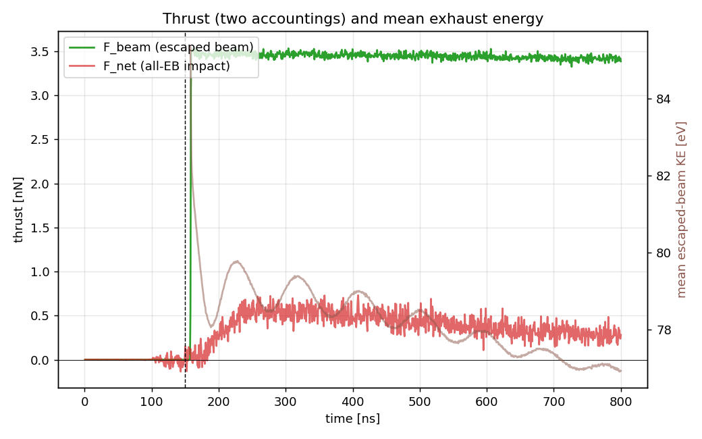
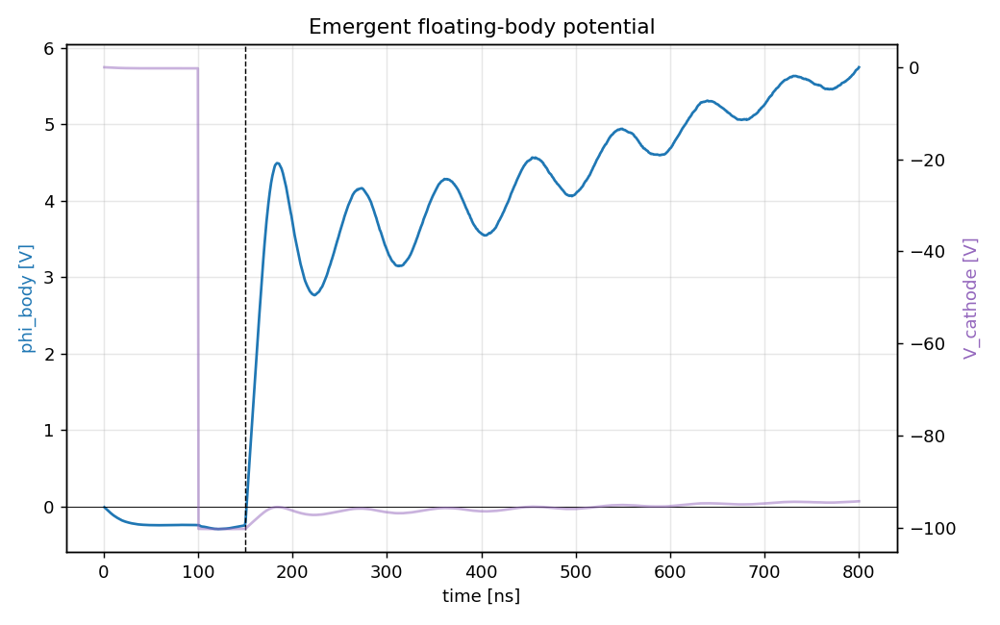
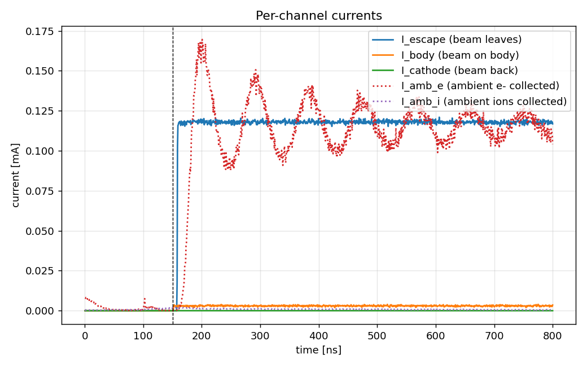
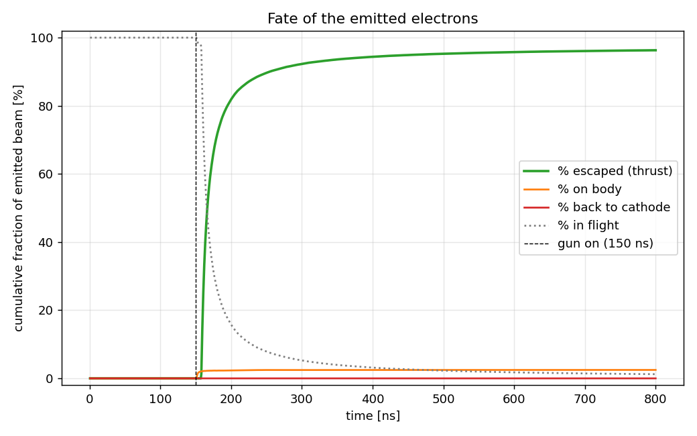

# capstone.low_power — the thruster at the 100 V hardware floor


The same physical system as [`capstone.floating_body`](../2_chipsat_thruster/README.md)
— identical can geometry, plasma row, grid, reservoir, and floating-body
charge pump — driven at the **100 V hardware floor** with the beam current
scaled to the same emission-ceiling ratio the validated run demonstrated:

```
I_CL(100 V, 4.7 mm gap, 0.5 mm spot) = 0.083 mA
I / I_CL = 1.46 (the measured float200 ratio)   ->   i_beam = 0.121 mA
```

## The question

**What does thrust cost at the cheap end of the throttle curve?** At a fixed
thrust target, supply power scales as `P ∝ F·V/√(V−φ)` — roughly `√V` — so
the lowest feasible voltage is always the power-optimal operating point (see
`SCALING_LAWS.md` at the repo root). What caps how low you can go is the
space-charge emission ceiling `I_CL ∝ V^1.5`: at 100 V the spot can only
source ~0.12 mA, which is why this point trades thrust magnitude for
thrust-per-watt.

Together with the committed 200 V reference and the 300 V ceiling run, this
completes a **three-point measured P–F frontier** across the full hardware
voltage range:

| stage | V | I | F (nN) | P (mW) | F/P (µN/W) | status |
|---|---|---|---|---|---|---|
| `capstone.low_power` | 100 | 0.121 mA | **3.42** | 12.1 | **0.283** | measured, committed |
| `capstone.floating_body` | 200 | 0.342 mA | **13.65** | 68.4 | **0.200** | measured, committed |
| `capstone.high_thrust` | 300 | 0.63 mA | **30.13** | 189 | **0.159** | measured, committed |

**The frontier is complete and all three points are gated PASS.** The
predicted float here was **lower** than the 200 V reference (~+6 V vs +17 V)
because the smaller emitted current needs less ambient return collection, so
the `(1+χ)` balance settles earlier — measured **5.40 V**, exhaust KE
**77.19 eV** against a 77.10 eV prediction.

F/P ∝ 1/√V is confirmed across the range: 0.283 / 0.200 / 0.159 µN/W. At low
χ the candidate collection laws converge, so this point confirms the anchor
rather than discriminating between them; the 300 V run carries the
discrimination (`SCALING_LAWS.md` §4 VERDICT).

## What is gated

Same structure as `capstone.high_thrust`: the **required** gates are only
the theory-anchored invariants (escape ≥ 95 %, float ≤ 50 V, current
balance, momentum sanity, containment, ledger cross-checks). The mission
bar — holding 600 km mean station keeping, 2.01 nN — is **reported, not
required**.

## What is different from the baseline, exactly

| | floating_body (baseline) | low_power (this stage) |
|---|---|---|
| `cathode_offset` | −200 V | **−100 V** |
| `i_beam` | 0.342 mA | **0.121 mA** |
| everything else | — | identical (CFL dt grows to ~6.93 ps; ~115k steps for 800 ns) |

## Reference figures

| | |
|---|---|
|  |  |
|  |  |

[Dashboard animation](viz/20260804T230218Z_0adb478f_dashboard.mp4)

## Usage

```bash
python simulation.py                                   # ~5 h (115k steps)
python analyze.py --run outputs/<run-id> --policy acceptance.yaml
```

Caveats travel with the ladder: reduced ion mass (400 mₑ, not O⁺),
electrostatic (no B, no ram drift), single grid/PPC/seed, finite-time
equilibrium on the ion clock.
