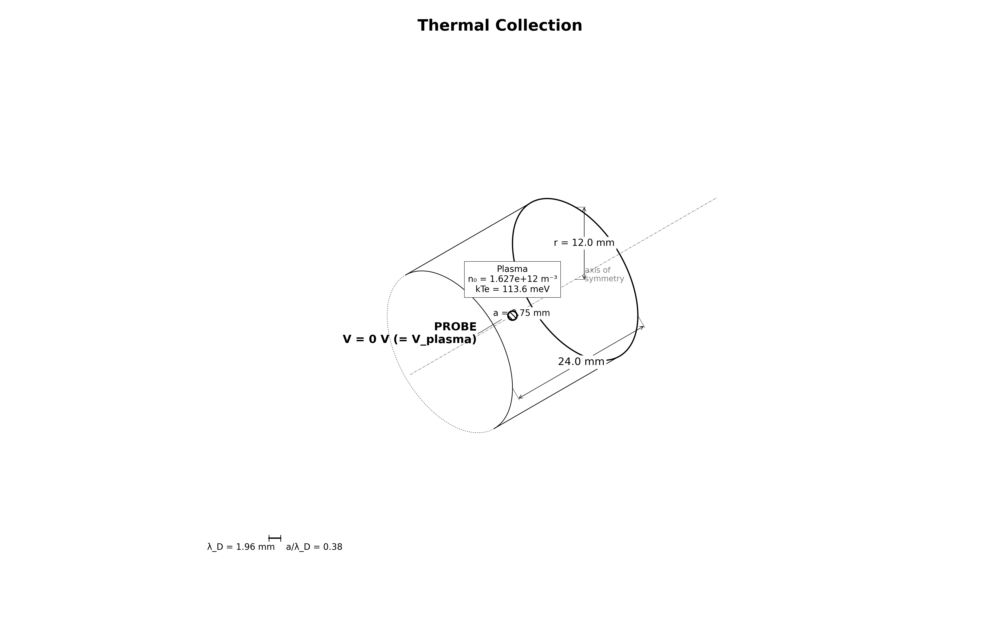

# collector.thermal — sphere at plasma potential (0 V)



The one probe problem with an **exact, assumption-free** answer, and the first
rung of the collector branch.

## Physical system

A conducting **sphere** (embedded boundary, radius 0.75 mm) at 0 V sits at the
origin of an RZ domain filled with the electron_contactor **chipsat capstone**
plasma (n0 = 1.627e12 m⁻³, kTe = 113.6 meV, kTi from Ti = 936.2 K, reduced ion
mass 400 mₑ). The ambient plasma is maintained by one-sided Maxwellian **flux
injection** from the three open faces on top of a bulk fill at t = 0.

At plasma potential the sphere creates **no field**, so every orbit is a
straight line and the collected current of each species is exactly the one-sided
thermal flux times the sphere area:

```
I_th = n0 · e · <v>/4 · 4πa²      (exact for ANY convex probe)
I_th_e = 0.10393 µA, I_th_i = 4.379 nA, I_e/I_i = √((mi/me)(Te/Ti)) = 23.74
```

### Included / excluded physics

Two-species (electrons + reduced-mass ions) RZ electrostatics with an EB probe
and flux-reservoir injection. No magnetic field, no collisions, no emission.

### Boundary conditions

Three open faces (r = r_max, z = ±z_half): Dirichlet 0 V, particle-absorbing,
with Maxwellian flux injection. Axis (r = 0): none. Probe: EB at 0 V, absorbing.

## Why this also validates the chipsat configuration

Every numerical choice the chipsat case rides on is used here unchanged and
gated against closed-form theory: plasma row, **dx = 0.15 mm = 13.1
cells/λ_De**, **ppc = 16**, flux-reservoir injection, domain sizing. The sphere
radius puts **a/λ_De = 0.382** — the sub-Debye point where the contactor OML
study measured 93% of the ceiling (the cross-reference the biased rungs use).

## What this stage proves / does not prove

**Proves**: the exact thermal-flux law for electrons (≤5%) and ions (≤10%), the
area/density-free species ratio (≤8%), an intact far-field density and
quasineutrality (the flux reservoir), and no spurious wall sheath. This is an
**analytic verification** (`evidence_kind: analytic_verification`).

**Does not prove**: any sheath/OML physics (0 V has no sheath), or grid
convergence (single grid/PPC/seed — Phase 5).

## Upstream dependencies

None — a root stage of the collector branch.

## Run cost

~25–50 min on an RTX 3060 GPU. 50000 steps × 60 ps = 3.0 µs: the **electron**
current equilibrates on the electron clock (~0.06 µs) but the **ion** current
fills in on the slow ion transit clock (~2 µs) — "steady on whose clock?".

## Commands

```bash
python simulation.py
python analyze.py --run outputs/<run-id> --policy acceptance.yaml
python animate.py --run outputs/<run-id>               # optional
```

## Gate definitions and tolerance rationale

`acceptance.yaml` (`policy_id: collector.thermal.v1`):

| Gate (metric) | Bound | Rationale |
|---|---|---|
| `electron_current_over_th` | \|·−1\| ≤ 0.05 | exact law; shot noise ~2%, EB facet ~1–2% |
| `ion_current_over_th` | \|·−1\| ≤ 0.10 | ions ~24× noisier and ion-clock slow |
| `species_ratio_over_theory` | \|·−1\| ≤ 0.08 | area/density-free ratio 23.74 |
| `far_density_e_over_n0` | \|·−1\| ≤ 0.05 | flux reservoir; 13.1 cells/λ_De |
| `quasineutrality` | ≤ 0.02 | far-shell \|n_e−n_i\|/n0 |
| `edge_phi_max_V` | ≤ 0.2 V | no spurious wall sheath |

## Dashboard

<video src="viz/20260806T084611Z_ebb0fae8_dashboard.mp4" controls width="100%"></video>

## Known numerical limitations

- **EB faceting**: at 5 cells/radius the staircased EB area sits ~1–2% below
  4πa², biasing ratios slightly **low** (inside the 5% gate).
- **RZ radial-face flux**: the r = r_max injection face has a known WarpX
  over-emission quirk; the far-field density gate is the arbiter.
- **t = 0 spike**: bulk particles born inside the sphere are scraped in the
  first steps; the last-40% steady window excludes the transient.
- Single grid/PPC/seed — no convergence evidence yet (Phase 5).
