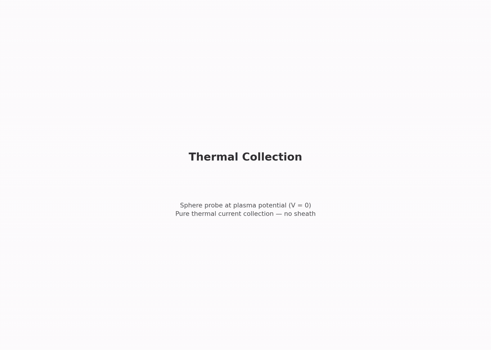

# collector.thermal — sphere at plasma potential


First rung of the collector branch. A sphere at 0 V in the capstone plasma — the one probe problem with an exact answer.

## Setup

- **Sphere**: embedded boundary, radius 0.75 mm, held at 0 V (plasma potential)
- **Domain**: axisymmetric RZ, filled with the capstone plasma
- **Plasma**: n0 = 1.627e12 m⁻³, kTe = 113.6 meV, Ti = 936.2 K, ion mass 400 mₑ
- **Injection**: one-sided Maxwellian flux from three open faces, plus bulk fill at t = 0

### The exact answer

At plasma potential there is no electric field, so every orbit is a straight line. The collected current of each species is just the one-sided thermal flux times the sphere area:

```
I_th = n0 · e · <v>/4 · 4πa²     (exact for any convex probe)

I_th_e = 0.10393 µA
I_th_i = 4.379 nA
I_e/I_i = √((mi/me)(Te/Ti)) = 23.74
```

### What's included

Two-species (electrons + ions) RZ electrostatics, EB probe, flux-reservoir injection.

### What's excluded

Magnetic fields, collisions, emission.

| Boundary | Potential | Particles |
|---|---|---|
| r_max, z = ±z_half | 0 V Dirichlet | absorbing + flux injection |
| r = 0 (axis) | — | — |
| Probe (EB) | 0 V | absorbing |

## Why this also validates the chipsat configuration

Every numerical choice the chipsat capstone uses is tested here against an exact theory: plasma parameters, dx = 0.15 mm (13.1 cells/λ_De), ppc = 16, flux-reservoir injection, domain sizing. The sphere is at a/λ_De = 0.382.

## What this rung tests

| Check | Target |
|---|---|
| Electron current vs exact I_th | ≤ 5% error |
| Ion current vs exact I_th | ≤ 10% error |
| Species ratio I_e/I_i vs 23.74 | ≤ 8% error |
| Far-field electron density vs n0 | ≤ 5% error |
| Quasineutrality (far shell) | \|n_e − n_i\|/n0 ≤ 2% |
| Edge potential | ≤ 0.2 V (no spurious wall sheath) |

## What this rung does NOT test

- Sheath or OML physics (0 V means no sheath)
- Grid convergence (single resolution/PPC/seed — Phase 5)

## Dependencies

None — root stage of the collector branch.

## Cost

~16 min. 50 000 steps × 60 ps = 3.0 µs. Electron current settles fast (~0.06 µs) but ion current fills in on the ion clock (~2 µs).

## Commands

```bash
python simulation.py
python analyze.py --run outputs/<run-id> --policy acceptance.yaml
python animate.py --run outputs/<run-id>               # optional
```

## Gates

From `acceptance.yaml` (policy: `collector.thermal.v1`):

| Gate | Bound | Why |
|---|---|---|
| `electron_current_over_th` | ≤ 5% off | exact law; shot noise ~2%, EB facet ~1–2% |
| `ion_current_over_th` | ≤ 10% off | ions are ~24x noisier and settle slower |
| `species_ratio_over_theory` | ≤ 8% off | area/density-free ratio 23.74 |
| `far_density_e_over_n0` | ≤ 5% off | flux reservoir check |
| `quasineutrality` | ≤ 0.02 | far-shell \|n_e − n_i\|/n0 |
| `edge_phi_max_V` | ≤ 0.2 V | no wall sheath |

## Dashboard

[](viz/20260806T084611Z_ebb0fae8_dashboard.mp4)

*Animated dashboard — click for the full video.*

## Limitations

- **EB faceting**: at 5 cells/radius the staircased EB area is ~1–2% below 4πa², biasing ratios slightly low (within the 5% gate)
- **RZ radial-face flux**: r_max injection face has a known WarpX over-emission quirk; the far-density gate is the check
- **t = 0 spike**: bulk particles born inside the sphere are scraped in the first steps; the last-40% steady window excludes this
- Single grid/PPC/seed (Phase 5)
