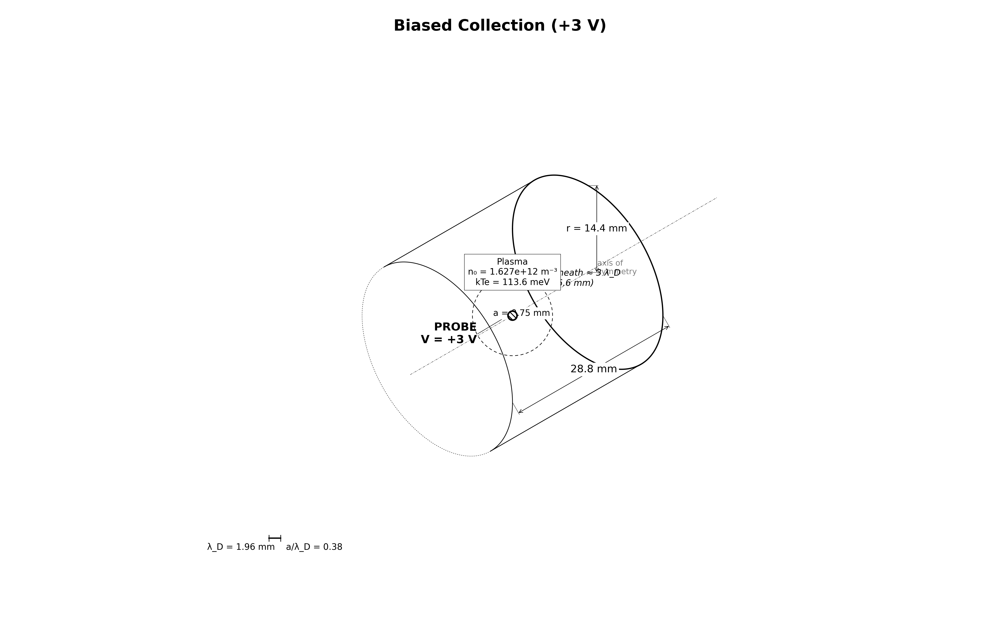

# collector.biased_3v — sphere at +3 V (χ = eV/kTe = 26.4)



A small attracting bias on the same sphere and plasma as `collector.thermal`.

## Physical system

The 0.75 mm sphere (a/λ_De = 0.38) is held at **+3 V** in the chipsat capstone
plasma. For a sub-Debye sphere the **Orbit-Motion-Limited (OML)** ceiling
applies:

```
I_OML = I_th · (1 + χ) = 0.10393 µA · 27.40 = 2.847 µA
```

OML is an **upper bound** approached only as a/λ_De → 0. At 0.38 the
electron_contactor OML study measured **93%** of the ceiling, so the electron
gate is a band `[0.85, 1.05]`, not an equality. Ions are Boltzmann-repelled by
exp(−eV/kTi) ≈ 1e-16; the measured ion trickle is start-up bias (ions already
inside the domain at t = 0 never had to climb the barrier) — **reported, not
gated**. The domain is enlarged to 7.3 λ_De to hold the sheath.

### Physics / boundary conditions

Same as `collector.thermal` (two-species RZ electrostatics, EB probe, flux
reservoir) with the probe at +3 V, so a sheath now forms.

## What this stage proves / does not prove

**Proves** (`evidence_kind: numerical_sanity`): the electron current sits within
`[0.85, 1.05]` of the OML ceiling (a cross-code sanity band, **not** an exact
analytic validation — above 1 beyond noise = injection bug, well below 0.85 =
resolution/containment problem), the flux reservoir stays intact (far density,
quasineutrality), and no sheath-scale |φ| reaches the open boundaries.  As in
the +10 V stage, the containment gate uses the max |φ| a few cells inside the
boundary — a connected-sheath-edge + clearance metric is a Phase 5 refinement
(plan §10.5), so "contained" here means the boundary strip stays quiet, not a
measured sheath-edge clearance.

**Does not prove**: an exact collected-current value (OML is a ceiling, not an
identity here), ion collection physics (repelled, start-up biased), or grid
convergence (Phase 5).

## Upstream dependencies

Requires **`collector.thermal`** (the 0 V exact-law rung; this stage adds the
attracting sheath).

## Run cost

~1–2 h on an RTX 3060 GPU (100000 steps × 30 ps = 3.0 µs; the sheath's ion
response is on the slow ion clock).

## Commands

```bash
python simulation.py
python analyze.py --run outputs/<run-id> --policy acceptance.yaml
python animate.py --run outputs/<run-id>               # optional
```

## Gate definitions and tolerance rationale

`acceptance.yaml` (`policy_id: collector.biased_3v.v1`):

| Gate (metric) | Bound | Rationale |
|---|---|---|
| `electron_current_over_oml` | [0.85, 1.05] | contactor cross-ref (93% at a/λ=0.38); OML is a ceiling |
| `far_density_e_over_n0` | \|·−1\| ≤ 0.05 | flux reservoir intact |
| `quasineutrality` | ≤ 0.02 | far-shell \|n_e−n_i\|/n0 |
| `edge_phi_max_V` | ≤ 0.5 V | sheath must not touch the open boundaries |

## Dashboard

<video src="viz/20260806T142605Z_1a87cbce_dashboard.mp4" controls width="100%"></video>

## Known numerical limitations

- OML is only a **ceiling**; the band is a numerical-sanity check, not an
  identity. Distinguishing OML from the exact sub-Debye theory would need a
  convergence/geometry study (Phase 5).
- Ion start-up bias decays on the slow ion clock — the ion current is reported,
  never gated.
- EB faceting, RZ radial-face flux quirk, and t = 0 spike as in
  `collector.thermal`; single grid/PPC/seed (Phase 5).
