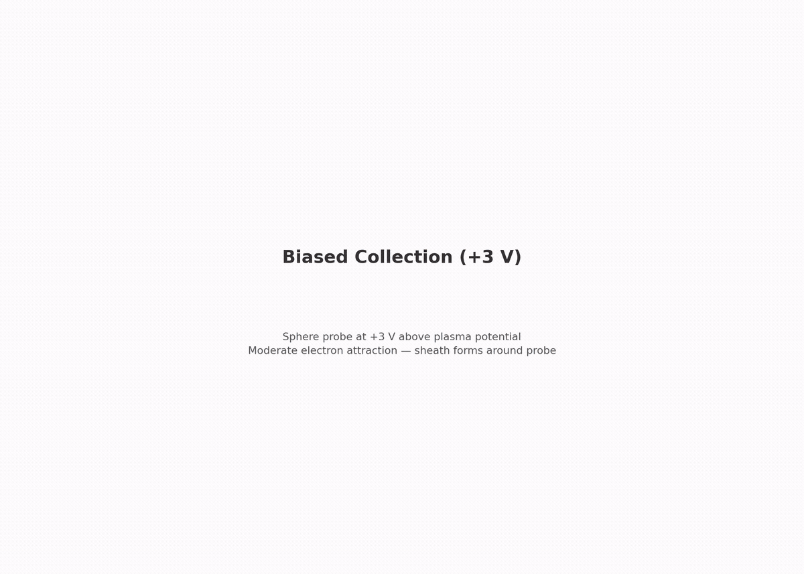

# collector.biased_3v — sphere at +3 V


Second step of the collector branch. Same sphere and plasma as `collector.thermal`, now biased to attract electrons.

## Setup

- **Sphere**: 0.75 mm radius (a/λ_De = 0.38), held at +3 V
- **Plasma**: same capstone plasma as `collector.thermal`
- **Domain**: enlarged to 7.3 λ_De to hold the sheath

### OML theory

For a sub-Debye sphere, the Orbit-Motion-Limited (OML) current is an upper bound:

```
I_OML = I_th · (1 + χ)     where χ = eV/kTe = 26.4
I_OML = 0.10393 µA × 27.40 = 2.847 µA
```

OML is a ceiling attained only as a/λ_De → 0 (Mott-Smith & Langmuir 1926); at finite radius the collected fraction falls below it, the reduction growing with a/λ_De and χ (Laframboise 1966). At this step's a/λ_De = 0.38 and χ = 26.4 an ~10% reduction is expected physics: the committed run measured 85% of the ceiling. The gate is a band [0.85, 1.05], not an equality.

Ions are Boltzmann-repelled by exp(−eV/kTi) ≈ 1e-16. The measured ion trickle comes from ions already inside the domain at t = 0 — reported, not gated.

### What's included / excluded

Same as `collector.thermal` (two-species RZ electrostatics, EB probe, flux reservoir), with the probe at +3 V so a sheath now forms.

## What this step tests

| Check | Target |
|---|---|
| Electron current vs OML ceiling | within [0.85, 1.05] of I_OML |
| Far-field density | ≤ 5% off n0 |
| Quasineutrality | ≤ 2% |
| Edge potential | ≤ 0.5 V (sheath must not reach the boundaries) |

## What this step does NOT test

- An exact collected-current value (OML is a ceiling, not an equality at this a/λ_De)
- Ion collection (repelled; start-up biased)
- Grid convergence (Phase 5)

## Dependencies

Requires `collector.thermal` (this step adds the attracting sheath).

## Cost

~1–2 h. 100 000 steps × 30 ps = 3.0 µs (the sheath's ion response is on the slow ion clock).

## Commands

```bash
python simulation.py
python analyze.py --run outputs/<run-id> --policy acceptance.yaml
python animate.py --run outputs/<run-id>               # optional
```

## Gates

From `acceptance.yaml` (policy: `collector.biased_3v.v1`):

| Gate | Bound | Why |
|---|---|---|
| `electron_current_over_oml` | [0.85, 1.05] | OML is a ceiling; finite-radius reduction expected (measured 85%) |
| `far_density_e_over_n0` | ≤ 5% off | flux reservoir intact |
| `quasineutrality` | ≤ 0.02 | far-shell check |
| `edge_phi_max_V` | ≤ 0.5 V | sheath containment |

## Dashboard

[](viz/20260806T142605Z_1a87cbce_dashboard.mp4)

*Animated dashboard — click for the full video.*

## Limitations

- OML is a ceiling; the band is a sanity check, not an identity. Distinguishing OML from the exact sub-Debye theory would need a convergence/geometry study (Phase 5)
- Ion start-up bias decays on the slow ion clock — ion current is reported, never gated
- EB faceting, RZ radial-face flux quirk, t = 0 spike same as `collector.thermal`; single grid/PPC/seed (Phase 5)
