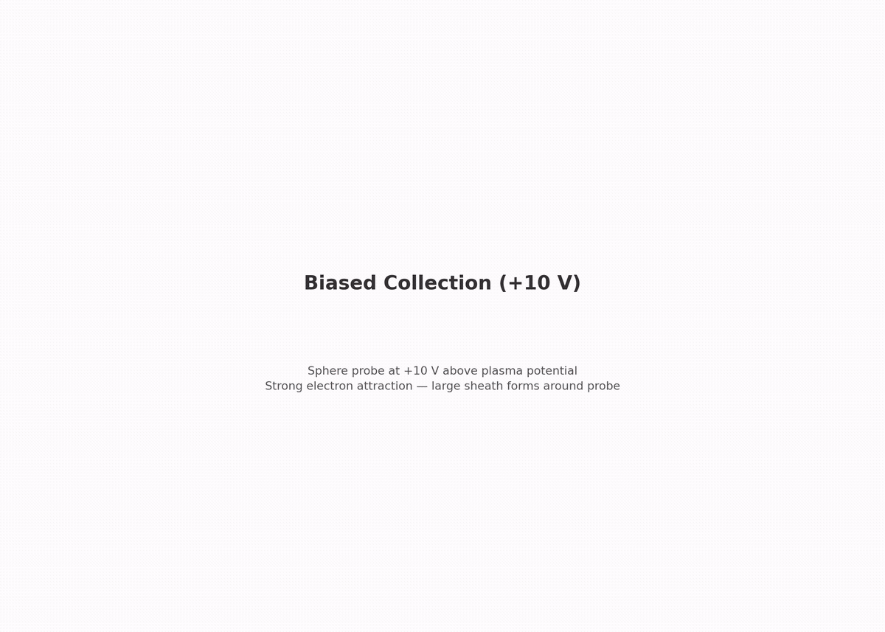

# collector.biased_10v — sphere at +10 V (sheath stress test)


Third step of the collector branch. Same sphere and plasma, now at a strong attracting bias. The main point here is **sheath containment** — can the domain hold the thick sheath without clipping it?

## Setup

- **Sphere**: 0.75 mm radius, held at +10 V (χ = eV/kTe = 88.0)
- **Plasma**: same capstone plasma
- **Domain**: largest of the three collector steps (11 λ_De), because a sheath clipped by the boundary fakes extra current

### OML theory

```
I_OML = I_th · (1 + χ) = 0.10393 µA × 89.0 = 9.249 µA
```

The collected current sits below the +3 V case's OML fraction — barrier deepening grows with χ.

### What's included / excluded

Same as `collector.biased_3v`, with the probe at +10 V and a larger domain.

## What this step tests

| Check | Target |
|---|---|
| Electron current vs OML ceiling | within [0.80, 1.05] of I_OML (floor relaxed vs +3 V) |
| Far-field density | ≤ 6% off n0 |
| Quasineutrality | ≤ 2% |
| Edge potential | ≤ 0.5 V (**the gate to watch** — thick sheath must stay inside the domain) |

## What this step does NOT test

- A quantitative sheath-collection law
- Ion physics (repelled)
- Grid/domain convergence (Phase 5)

## Dependencies

Requires `collector.biased_3v` (this step deepens the bias and enlarges the domain).

## Cost

~2–4.5 h. 150 000 steps × 20 ps = 3.0 µs. The heaviest collector step.

## Commands

```bash
python simulation.py
python analyze.py --run outputs/<run-id> --policy acceptance.yaml
python animate.py --run outputs/<run-id>               # optional
```

## Gates

From `acceptance.yaml` (policy: `collector.biased_10v.v1`):

| Gate | Bound | Why |
|---|---|---|
| `electron_current_over_oml` | [0.80, 1.05] | deeper barrier → wider floor than +3 V |
| `far_density_e_over_n0` | ≤ 6% off | looser at this domain size |
| `quasineutrality` | ≤ 0.02 | far-shell check |
| `edge_phi_max_V` | ≤ 0.5 V | thick sheath containment |

## Dashboard

[](viz/20260806T150359Z_503c1220_dashboard.mp4)

*Animated dashboard — click for the full video.*

## Limitations

- The current shows a **+4% drift** through its declared steady window, not yet caught by a stationarity gate (Phase 5, plan C6)
- Connected-sheath-edge containment metric is a Phase 5 refinement (plan §10.5); currently just checking max |φ| near the boundary
- OML is a ceiling; the band is a sanity check
- EB faceting, RZ radial-face flux quirk, t = 0 spike same as other collector steps; single grid/PPC/seed (Phase 5)
