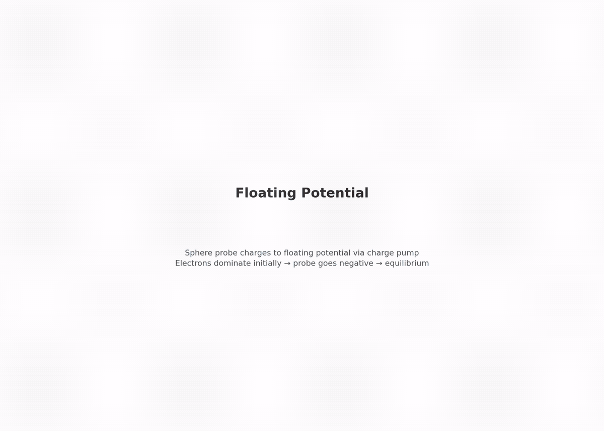

# collector.floating — sphere on the capstone's charge pump


Fourth rung of the collector branch. Closes validation gap G2: the floating charge pump had no ladder rung with an analytic anchor beneath the capstone.

Same sphere (a = 0.75 mm) and plasma as the other collector rungs, but the EB potential is **not prescribed** — it floats using the chipsat capstone's charge-pump mechanism (copied from `capstone/2_chipsat_thruster/simulation.py`).

## Setup

The charge pump works like this:

1. EB starts at a uniform 1 V → the init solve calibrates self-capacitance C by Gauss' law on the domain faces
2. Every step, scraped weights of both species are read from the particle boundary buffers → dQ = e·(w_i − w_e)
3. `set_potential_on_eb` rewrites φ = φ_init + Q/C before the next solve

With no beam, the pump drives the sphere to the **floating potential** — the bias where electron and ion collection balance.

### Analytic references

Let R = I_th_e/I_th_i = √((mi/me)(Te/Ti)) = 23.74 for this plasma.

| Ion-collection model | Balance equation | φ_f |
|---|---|---|
| Thermal-ion (ions unaffected by φ) | exp(φ/kTe)·R = 1 | **−0.360 V** |
| OML-ion (attracted ions at OML ceiling) | exp(φ/kTe)·R = 1 − φ/kTi | **−0.213 V** |

The truth lies between the two models. φ_f is independent of C (C only sets the charging timescale), so the bracket gate isolates the pump's accounting from the capacitance calibration.

## What this rung tests

| Check | Target |
|---|---|
| Floating potential φ_f | within [−0.40, −0.19] V (two-model bracket ± noise) |
| Current balance at equilibrium | ≤ 15% |
| Capacitance vs analytic 4πε₀a | within [0.8, 1.4] (measured 89.1 fF vs 83.4 fF) |
| Ledger vs openPMD dumps | ≤ 2% |
| Far-field density | ≤ 5% off n0 |
| Quasineutrality | ≤ 2% |
| Edge potential | ≤ 0.2 V |

Reported, not gated: Boltzmann-retardation cross-check, individual species currents vs I_th, late dφ/dt.

## What this rung does NOT test

- The beam, the two-node EB, or the supply offset (those are `capstone.two_node_laplace` and the capstone itself)
- The exact φ_f value (the gate is a two-model bracket, not a single-model identity)
- Long-term drift beyond 6 µs

## Run-length note

The pump's RC clock slows as it settles: near equilibrium τ = C·kTe/(e·I_eq) ≈ 89 fF × 0.114 V / 6 nA ≈ 1.7 µs. A 6 µs run puts the last-40% window (3.6–6 µs) within a few percent of balance.

## Dependencies

Requires `collector.thermal` (same sphere/plasma/grid — hash-verified by `floating_shares_thermal_configuration`). The capstone requires this stage.

## Cost

~35 min. 100k steps at ~20 ms/step including the per-step pump callback.

## Commands

```bash
python simulation.py
python analyze.py --run outputs/<run-id> --policy acceptance.yaml
```

## Gates

From `acceptance.yaml` (policy: `collector.floating.v1`):

| Gate | Bound | Why |
|---|---|---|
| `phi_float_V` | [−0.40, −0.19] V | two-model theory bracket ± noise margin |
| `current_balance` | ≤ 0.15 | equilibrium identity; ion shot-noise allowance |
| `capacitance_over_analytic` | [0.8, 1.4] | 4πε₀a + box correction; catches big mechanism errors |
| `scrape_charge_consistency` | ≤ 0.02 | ledger vs openPMD dumps |
| `far_density_e_over_n0` | 1.0 ± 0.05 | carried from collector.thermal |
| `quasineutrality` | ≤ 0.02 | carried from collector.thermal |
| `edge_phi_max_V` | ≤ 0.2 V | φ_f is Debye-shielded to ~1e-4 V at the wall |

## Dashboard

[](viz/20260806T162656Z_40e77ecd_dashboard.mp4)

*Animated dashboard — click for the full video.*

## Limitations

- Single grid/PPC/seed (Phase 5)
- Ion-collection physics is validated only as a bracket; the biased rungs pin the electron-side OML fractions
- Reduced ion mass (400 mₑ), not real O⁺
