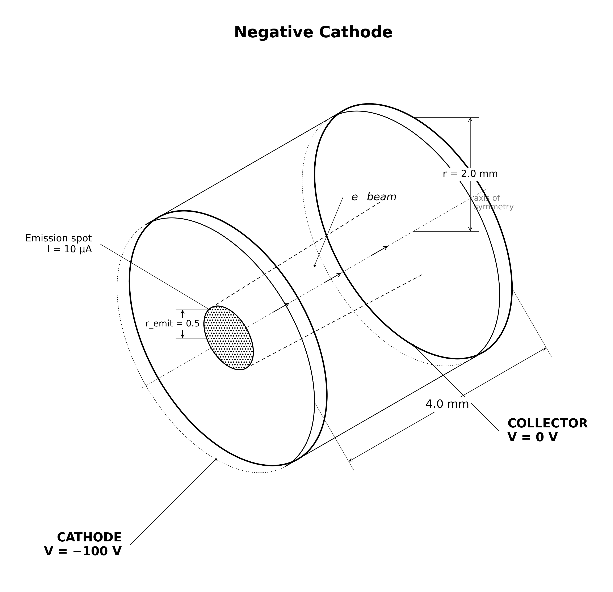

# emitter.negative_cathode



Two-plate RZ plane diode: the first rung of the emitter branch.

## Physical system

A **-100 V full-width cathode** on the left boundary (z = -2 mm) emits a
prescribed **10 µA electron beam** one cell inside the boundary, firing +z
toward a **grounded collector** on the right boundary (z = +2 mm). The domain is
axisymmetric (RZ), 2 mm in radius, 40 × 80 cells (dr = dz = 0.05 mm).

### Included physics

- Self-consistent electron space charge (electrostatic Poisson solve each step).
- Prescribed-current, z-normal flux emission over a 0.5 mm disc spot, with a
  flux-Maxwellian launch (u_th = 7e-4 · c ≈ 0.25 eV per axis).

### Excluded physics

- No thermionic or field-emission model — the current is prescribed. RZ z-normal
  flux injection reproduces the requested current to ≈0.01% (measured in the
  parent `electron_two_plate` study), so no calibration factor is applied.
- No embedded boundaries, no magnetic field, no collisions, no ions.

### Boundary conditions

| Face | Potential | Particles |
|---|---|---|
| z = z_min (cathode) | Dirichlet -100 V | absorbing |
| z = z_max (collector) | Dirichlet 0 V | absorbing |
| r = r_max (radial wall) | Neumann | absorbing |
| r = 0 (axis) | none (axis) | none |

## What this stage proves / does not prove

**Proves** (against closed-form or explicitly-labelled references):

- The vacuum (t = 0) on-axis potential is the analytic **Laplace ramp** to
  ≤ 10 mV, checked at the *sampled cell centres* (a half-cell on this steep ramp
  dwarfs the signal).
- Arrival energy equals **energy conservation from the emission plane**:
  `e·[φ(collector) − φ_ramp(emit_z)] + 2kT_launch ≈ 99.25 eV`.
- **~100%** of the prescribed beam reaches the collector; cathode and radial
  wall collect ≈ 0 (gated as fractions of emitted weight — one tail
  macroparticle must not break an exact zero).
- **Particle-budget closure**: emitted = absorbed + still-in-domain to ≤ 0.1%.

**Does not prove**: any emission physics (current is prescribed), any aperture or
sheath physics (later rungs), or grid convergence (single grid/PPC/seed — a
Phase 5 concern).

The **space-charge depression** gate (φ dip at z ≈ 0) is a **regression anchor**,
not an independent prediction: its target (0.092 V) was read off the validated
baseline run. A 1-D estimate only brackets it at 0.04–0.09 V. This is
calibration, disclosed here per the plan's policy discipline; an independent
claim would need a fresh run judged under this pre-existing policy.

## Upstream dependencies

None — this is a root stage of the ladder.

## Run cost

~3 min. 4000 steps × 1.5 ps = 6.0 ns; beam transit ≈ 1.3 ns, so steady state
is reached well before the end.

## Commands

```bash
python simulation.py
python analyze.py --run outputs/<run-id> --policy acceptance.yaml
python animate.py --run outputs/<run-id>
```

## Gate definitions and tolerance rationale

Defined in `acceptance.yaml` (`policy_id: emitter.negative_cathode.v1`):

| Gate (metric) | Bound | Rationale |
|---|---|---|
| `collector_current_over_emitted` | [0.995, 1.005] | prescribed current; ±0.5% covers scrape-window noise |
| `collector_ke_error_eV` | \|·\| ≤ 0.5 eV | analytic 99.25 eV; 0.5 eV ≈ the 2kT launch spread |
| `cathode_return_fraction` | ≤ 1e-4 | no reflection expected; fraction of emitted weight |
| `radial_wall_fraction` | ≤ 1e-4 | stiff on-axis beam; negligible radial loss |
| `vacuum_ramp_max_abs_error_V` | ≤ 1e-2 V | Laplace solve accuracy at sampled z |
| `space_charge_depression_V` | \|· − 0.092\| ≤ 0.04 V | **regression** anchor (see above) |
| `budget_closure_pct` | \|·\| ≤ 0.1% | conservation check |

## Dashboard


## Known numerical limitations

- Single grid resolution, PPC, domain, and seed — no convergence evidence yet
  (deferred to Phase 5 of the refactor). Quantitative claims here are provisional.
- The energy prediction interpolates φ at the emission plane, which sits between
  cell centres; on the ~50 V/mm gap gradient the nearest-cell ambiguity is
  worth a fraction of an eV, inside the 0.5 eV gate.

