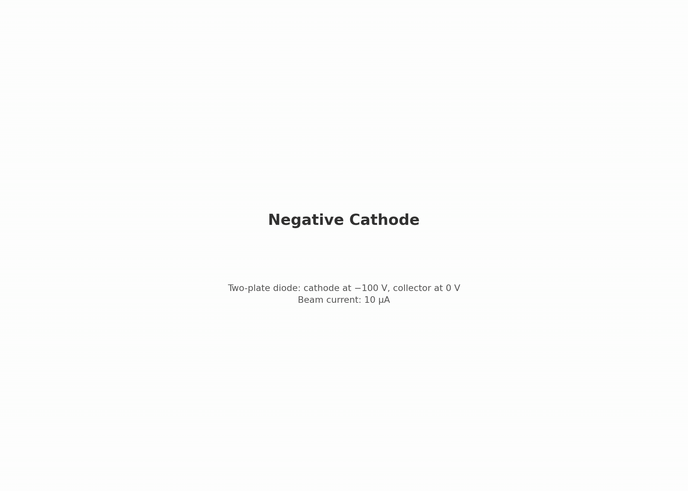

# emitter.negative_cathode — two-plate diode


First rung of the emitter branch. A simple two-plate RZ diode with no embedded boundaries.

## Setup

- **Cathode** (z = −2 mm): held at −100 V, emits a prescribed 10 µA electron beam
- **Collector** (z = +2 mm): grounded (0 V), absorbs arriving electrons
- **Domain**: axisymmetric RZ, radius 2 mm, 40 × 80 cells (dr = dz = 0.05 mm)
- **Beam**: flux-Maxwellian emission from a 0.5 mm disc, thermal spread ~0.25 eV per axis

| Boundary | Potential | Particles |
|---|---|---|
| z_min (cathode) | −100 V Dirichlet | absorbing |
| z_max (collector) | 0 V Dirichlet | absorbing |
| r_max (wall) | Neumann | absorbing |
| r = 0 (axis) | — | — |

### What's included

- Electrostatic Poisson solve every step (self-consistent space charge)
- Prescribed-current flux emission (no thermionic/field-emission model)

### What's excluded

- Embedded boundaries, magnetic fields, collisions, ions

## What this rung tests

| Check | How | Target |
|---|---|---|
| Vacuum potential | on-axis φ vs analytic Laplace ramp | ≤ 10 mV error |
| Arrival energy | energy conservation from emission plane | ~99.25 eV (≤ 0.5 eV error) |
| Beam transmission | fraction reaching collector | ~100% |
| Cathode return | fraction reflected back | ~0 |
| Radial loss | fraction hitting the wall | ~0 |
| Particle budget | emitted = absorbed + in-domain | ≤ 0.1% |
| Space-charge dip | φ dip near z ≈ 0 | 0.092 ± 0.04 V (regression*) |

*The space-charge dip target (0.092 V) was measured from the validated baseline run, not predicted from theory. A 1D estimate only brackets it at 0.04–0.09 V.

## What this rung does NOT test

- Emission physics (current is prescribed, not self-limiting)
- Apertures, sheaths, or embedded boundaries (later rungs)
- Grid convergence (single resolution/PPC/seed — deferred to Phase 5)

## Dependencies

None — this is a root stage.

## Cost

~3 min. 4000 steps × 1.5 ps = 6.0 ns. Beam transit ~1.3 ns, so steady state is reached well before the end.

## Commands

```bash
python simulation.py
python analyze.py --run outputs/<run-id> --policy acceptance.yaml
python animate.py --run outputs/<run-id>
```

## Gates

From `acceptance.yaml` (policy: `emitter.negative_cathode.v1`):

| Gate | Bound | Why |
|---|---|---|
| `collector_current_over_emitted` | [0.995, 1.005] | prescribed current; ±0.5% covers scrape noise |
| `collector_ke_error_eV` | ≤ 0.5 eV | analytic is 99.25 eV; 0.5 eV ≈ the 2kT launch spread |
| `cathode_return_fraction` | ≤ 1e-4 | no reflection expected |
| `radial_wall_fraction` | ≤ 1e-4 | beam stays on axis |
| `vacuum_ramp_max_abs_error_V` | ≤ 0.01 V | Laplace solve accuracy |
| `space_charge_depression_V` | 0.092 ± 0.04 V | regression anchor (not a prediction) |
| `budget_closure_pct` | ≤ 0.1% | conservation check |

## Dashboard

[](viz/20260806T073653Z_52a474f6_dashboard.mp4)

*Animated dashboard — click for the full video.*

## Limitations

- Single grid resolution, PPC, and seed — no convergence study yet (Phase 5)
- Energy prediction interpolates φ at the emission plane between cell centers; on the ~50 V/mm gradient this adds a fraction of an eV uncertainty, within the 0.5 eV gate
