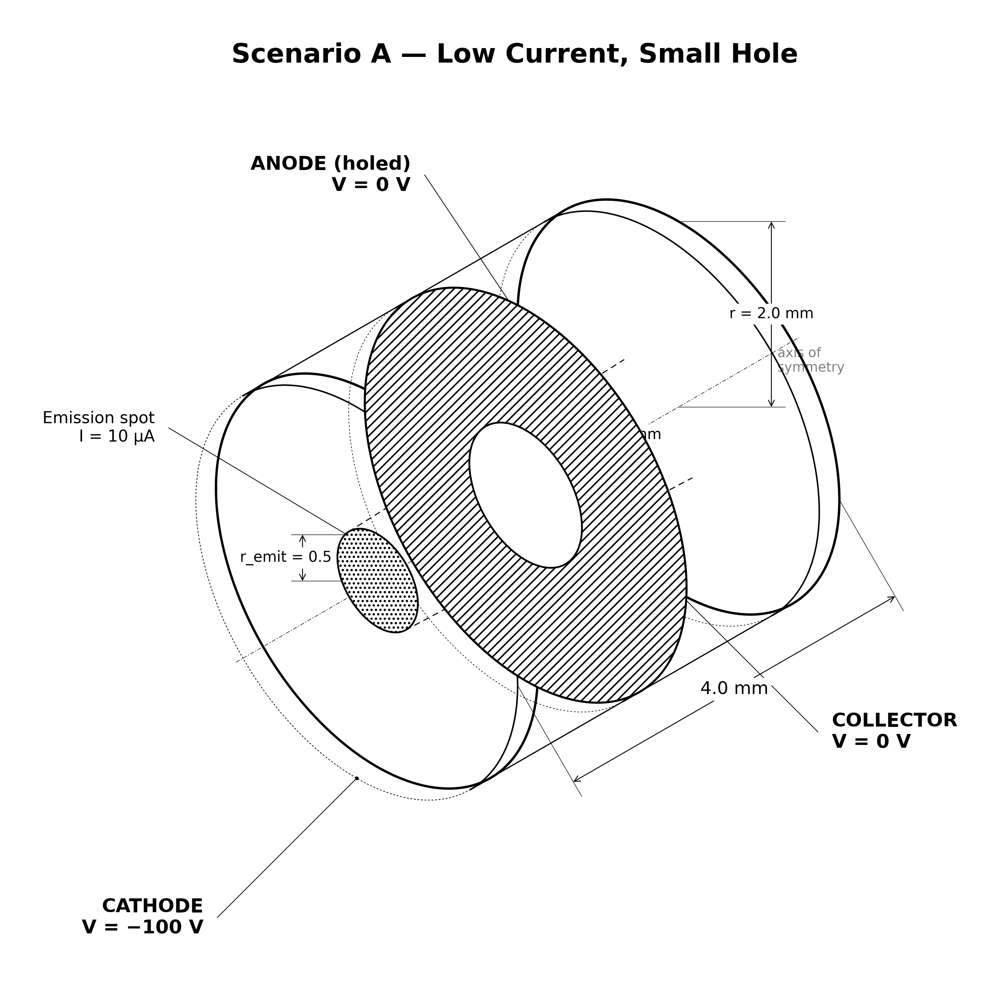

# emitter.holed_anode

| Scenario A | Scenario B | Scenario C |
|---|---|---|
|  |  |  |

Holed-anode RZ gun: `emitter.negative_cathode` plus **one** new element — a
grounded plate across the midplane with a hole on axis, modelled as an embedded
boundary (EB).

## Physical system

The -100 V cathode at z_min emits a prescribed beam; a grounded plate
(z ∈ [-0.1, +0.1] mm, r > hole) intercepts whatever misses the aperture, and the
rest drifts to the grounded collector at z_max. Three scenarios demonstrate
aperture transmission vs radial space charge:

| Scenario | Current | Hole radius | Expected behaviour |
|---|---|---|---|
| `A_low_current_small_hole` | 10 µA | 0.7 mm | stiff beam, ~all transmits; only the transverse **thermal tail** (~2–3%) clips on the plate |
| `B_high_current_small_hole` | 400 µA | 0.7 mm | radial space charge blows the beam up; loss lands **on the plate** |
| `C_high_current_big_hole` | 400 µA | 1.4 mm | widening the hole **restores** transmission |

Each scenario runs in its **own WarpX process** (libwarpx cannot re-initialize),
and is a **separate immutable run** whose `config_used.yaml` holds only that
scenario's effective physics. Every run records the SHA-256 of this shared
source study, so the cohort analysis can reject mixed configuration generations.

### Included / excluded physics

Same as `emitter.negative_cathode` (self-consistent electron space charge,
prescribed flux emission, RZ electrostatics) plus the **embedded-boundary anode
plate**. Excluded: emission physics, magnetic fields, collisions, ions.

### Boundary conditions

Cathode (Dirichlet -100 V) / collector (Dirichlet 0 V) / radial wall (Neumann),
all particle-absorbing, plus the **grounded EB anode plate** (`potential = 0 V`,
particles saved at EB).

## What this stage proves / does not prove

**Proves** (as a mechanism regression):

- The three-scenario transmission story: A transmits (≥96%, plate clip ≤4%); B
  loses ≥3 pp of collector current with the loss **on the plate** (≥4%); C
  restores transmission (≥98%) with an anode clip below B's.
- Per-scenario **energy conservation** from the emission plane, using the
  self-consistent end-state φ interpolated to emit_z (≤1.5 eV).
- Per-scenario **particle-budget closure** (≤0.1%).

**Does not prove**: a quantitative aperture-transmission law, virtual-cathode
onset, or grid convergence. In particular the **planar Child-Langmuir** current
(≈507 µA for the 1.9 mm gap over the 0.5 mm spot) is printed as a rough **scale
only** — the geometry is non-planar, so it is *not* gated (plan issue C8; a true
planar-anode sweep to locate reflection onset is deferred to Phase 5).

### The thermal-tail story (disclosed calibration)

Scenario A's `≤4%` plate-clip bound is not cold-beam-tight: the first run used a
cold-beam `≥99%` gate, **failed**, and taught us the beam carries a ~0.25 eV
transverse temperature (σ_r ≈ 0.135 mm at the plate). The gate was then widened
to admit that analytic thermal tail. This is disclosed calibration, not an
independent prediction.

## Upstream dependencies

Requires **`emitter.negative_cathode`** (this stage adds only the EB plate to
that validated diode).

## Run cost

Scenario A ≈ 3 min; B and C are heavier (40× current → many more
macroparticles). Budget ~10 min for all three.

## Commands

```bash
python simulation.py --scenario A_low_current_small_hole
python simulation.py --scenario B_high_current_small_hole
python simulation.py --scenario C_high_current_big_hole

python analyze.py --runs outputs/<A-run> outputs/<B-run> outputs/<C-run> \
    --policy acceptance.yaml
```

## Gate definitions and tolerance rationale

`acceptance.yaml` (`policy_id: emitter.holed_anode.v1`), 12 required gates:

- `A_collector_transmits` ≥ 0.96, `A_anode_clip_is_thermal_tail_only` ≤ 0.04 —
  stiff beam; the 4% admits the analytic thermal tail (see above).
- `B_collector_drops_vs_A` ≥ 0.03, `B_loss_lands_on_anode` ≥ 0.04 — space-charge
  loss shows up on the plate, not as cathode reflection.
- `C_big_hole_restores_transmission` ≥ 0.98, `C_anode_clip_below_B` ≥ 0 — the
  aperture, not reflection, was the limiter.
- `{A,B,C}_collector_ke_conserved` |·| ≤ 1.5 eV — energy conservation.
- `{A,B,C}_budget_closure` |·| ≤ 0.1% — conservation.

## Dashboard


## Known numerical limitations

- Single grid / PPC / seed; no convergence evidence (Phase 5).
- The plate is a staircased EB at 0.05 mm resolution; sub-cell aperture-edge
  effects are not resolved.
- The KE prediction interpolates φ at the emission plane between cell centres
  (±~1 eV on the gap gradient), inside the 1.5 eV gate.

