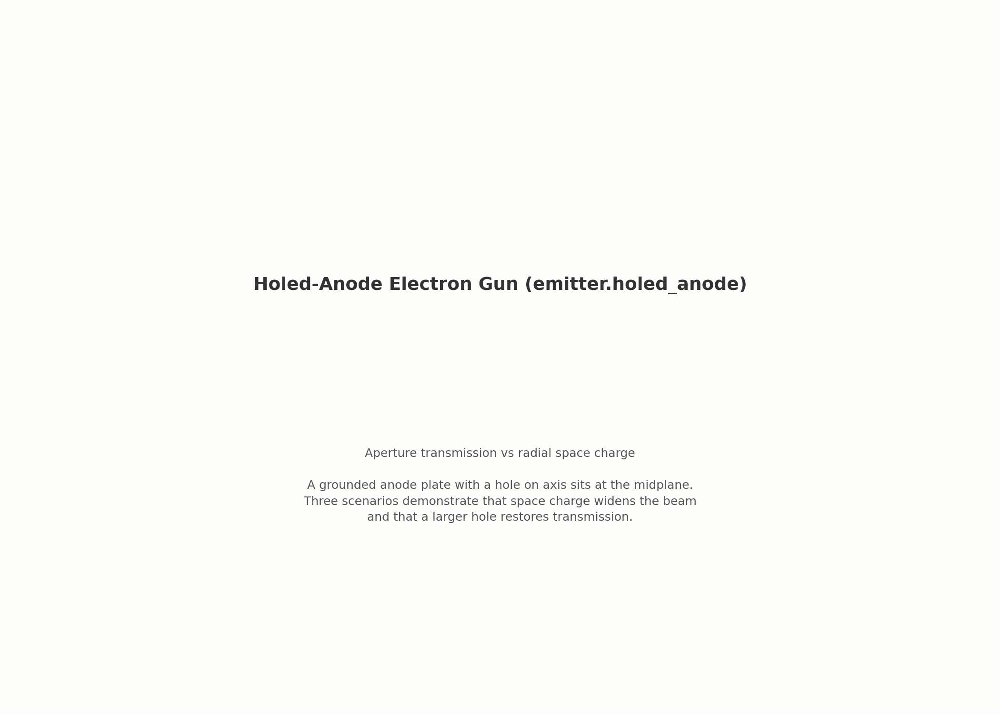

# emitter.holed_anode — electron gun with aperture

same diode as `negative_cathode`, plus a grounded plate with a hole (embedded boundary). three scenarios show: (A) small hole transmits a low-current beam, (B) space charge at 40× current blows the beam into the plate, (C) a wider hole restores transmission — proving the aperture, not the physics, was the limiter.

[](viz/20260806_20260806_20260806_dashboard.mp4)

*animated dashboard — click for the full video.*

## setup

| scenario A | scenario B | scenario C |
|---|---|---|
|  |  |  |

- **cathode** (z_min): −100 V, prescribed beam
- **anode plate** (z ∈ [−0.1, +0.1] mm, r > hole radius): grounded EB
- **collector** (z_max): grounded
- three scenarios run as separate warpx processes

| scenario | current | hole radius | what happens |
|---|---|---|---|
| A — low current, small hole | 10 µA | 0.7 mm | beam narrow, ~97% transmits; thermal tail clips |
| B — high current, small hole | 400 µA | 0.7 mm | space charge blows beam, significant plate loss |
| C — high current, big hole | 400 µA | 1.4 mm | wider hole restores transmission |

## how the pic works

- **emission**: prescribed flux-maxwellian from 0.5 mm disc, ~0.25 eV/axis, 128 macroparticles/cell/step
- **anode plate**: implicit-function EB ($z_a < z < z_a + t_a$, $r > r_h$), held at 0 V — electrode and absorber
- **field solve**: electrostatic poisson (multigrid) every step, self-consistent space charge with dirichlet plates and EB
- **push**: shape-1 gather/deposit, dt = 1.5 ps
- **scraping**: per-surface counts (cathode, collector, wall, anode plate) dumped every 80 steps

## what this step tests

| check | target |
|---|---|
| A transmits most of the beam | ≥ 96% to collector, ≤ 4% plate clip |
| B loses current on the plate | ≥ 3 pp drop vs A, ≥ 4% on anode |
| C restores transmission | ≥ 98% to collector, plate clip < B's |
| energy conservation (each) | ≤ 1.5 eV error |
| particle budget (each) | ≤ 0.1% |

## results

reference run `joint_5e72702e`, all gates PASS:

| metric | A | B | C |
|---|---|---|---|
| collector fraction | 97.3% | 90.0% | 100.0% |
| anode clip | 2.7% | 10.0% | ~0 |
| KE error (eV) | −0.025 | −0.025 | 0.022 |
| budget closure (%) | 7.5e-4 | 7.5e-4 | 7.5e-4 |

B→A collector drop: 7.3 pp (gate ≥ 3 pp). B→C anode reduction: 10.0 pp.

## dependencies

requires `emitter.negative_cathode`.

## cost

A ~3 min, B and C heavier (40× more particles). total ~10 min.

## commands

```bash
python simulation.py --scenario A_low_current_small_hole
python simulation.py --scenario B_high_current_small_hole
python simulation.py --scenario C_high_current_big_hole

python analyze.py --runs outputs/<A-run> outputs/<B-run> outputs/<C-run> \
    --policy acceptance.yaml
```

## validates for capstone

embedded-boundary aperture and beam transmission through a hole — the capstone's can lid has the same geometry.

## limitations

- single grid/PPC/seed (phase 5)
- anode plate is staircased EB at 0.05 mm; sub-cell aperture-edge effects not resolved
- A's plate clip is thermal tail (~2–3%), not a cold-beam prediction — gate calibrated from first run
